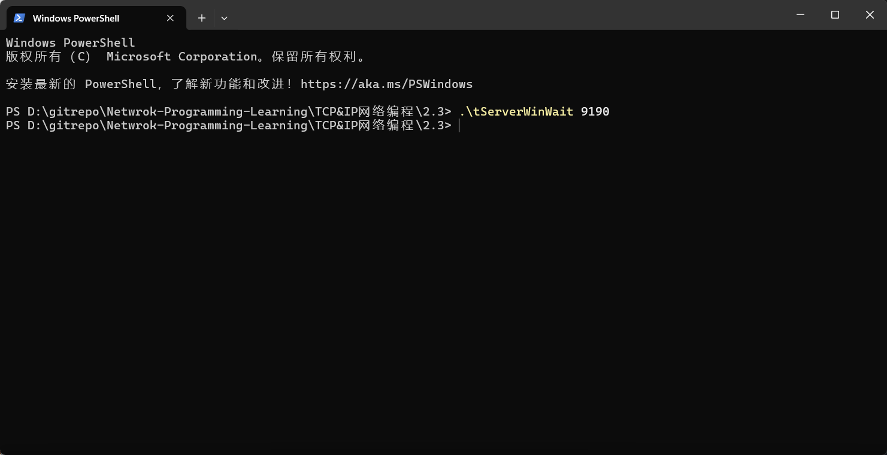

# TCP&IP网络编程笔记
[TOC]

## Part01 开始网络编程

### 第1章 理解网络编程和套接字

#### 1.1 理解网络编程和套接字

**网络编程中接收连接请求的套接字过程**：

1. 调用`socket()`创建套接字
2. 调用`bind()`函数分配IP地址和端口号
3. 调用`listen()`函数转为可接受请求状态
4. 调用`accept()`函数受理连接请求

##### socket()

 **函数原型**

 ```c
#include <sys/socket.h>
 
 int socket(int domain, int type, int protocol);
 ```

 **参数说明**

 1. **`int domain`（协议域）**
     指定套接字使用的协议族（地址族），常见值包括：

    - `AF_INET`：IPv4 协议（用于互联网通信）。

    - `AF_INET6`：IPv6 协议。                                                                

    - `AF_UNIX` 或 `AF_LOCAL`：本地通信（Unix 域套接字）。

    - `AF_PACKET`：底层数据包接口（用于抓包或自定义协议）。

 2. **`int type`（套接字类型）**
     指定套接字的类型，常见值包括：

    - `SOCK_STREAM`：面向连接的流式套接字（如 TCP）。

    - `SOCK_DGRAM`：无连接的数据报套接字（如 UDP）。

    - `SOCK_RAW`：原始套接字（用于自定义协议或访问底层网络层）。

 3. **`int protocol`（协议）**
     指定套接字使用的具体协议，通常设为 `0`，表示根据 `domain` 和 `type` 自动选择默认协议。例如：

    - `domain=AF_INET, type=SOCK_STREAM` 时，默认协议是 TCP。

    - `domain=AF_INET, type=SOCK_DGRAM` 时，默认协议是 UDP。


   如果需要显式指定协议，可以使用：

    - `IPPROTO_TCP`：TCP 协议。
    
    - `IPPROTO_UDP`：UDP 协议。

 **返回值**

 - **成功**：返回一个 **文件描述符**（非负整数），用于后续操作（如 `bind()`、`connect()`、`send()` 等）。
- **失败**：返回 `-1`，并设置 `errno` 以指示错误原因。

 **功能描述**

 - `socket` 函数创建一个套接字，套接字是网络通信的端点，用于实现进程间通信（IPC）或网络通信。
- 套接字描述符类似于文件描述符，可以用于后续的 I/O 操作。
---
##### bind()

 **函数原型**

 ```c
#include <sys/socket.h>
 
 int bind(int sockfd, struct sockaddr *myaddr, socklen_t addrlen);
 ```

 **参数说明**

 1. **`int sockfd`**
   - 要绑定的套接字文件描述符，通常由 `socket()` 函数创建。


2. **`struct sockaddr myaddr`**
   - 指向 `struct sockaddr` 的指针，包含了要绑定的地址和端口信息。

    - 实际使用时，通常使用 `struct sockaddr_in`（IPv4）或 `struct sockaddr_in6`（IPv6）结构体，然后强制转换为 `struct sockaddr*`。


3. **`socklen_t addrlen`**
   - `myaddr` 结构体的长度，通常使用 `sizeof(struct sockaddr_in)` 或 `sizeof(struct sockaddr_in6)`。
    - `socklen_t`是`unsigned int`类型


**返回值**

 - **成功**：返回 `0`。
- **失败**：返回 `-1`，并设置 `errno` 以指示错误原因。

 **功能描述**

 - `bind` 函数将套接字绑定到本地地址（IP 地址和端口号），以便其他进程可以通过该地址与套接字通信。
- 对于服务器程序，绑定地址是必须的，以便客户端能够连接到服务器。
 - 对于客户端程序，通常不需要显式绑定地址，系统会自动分配一个临时端口。
---
##### listen()

 **函数原型**

 ```c
#include <sys/socket.h>
 
 int listen(int sockfd, int backlog);
 ```

 **参数说明**

 1. **`sockfd`**
   - 要设置为监听状态的套接字文件描述符，通常由 `socket()` 创建并通过 `bind()` 绑定到本地地址和端口。


2. **`backlog`**

    - 等待连接队列的最大长度。

    - 当多个客户端同时请求连接时，未处理的连接请求会被放入队列，`backlog` 指定了队列的最大长度。

    - 如果队列已满，新的连接请求会被拒绝。

    - 通常设置为 `5` 到 `10`，具体值取决于服务器的负载能力。


**返回值**

 - **成功**：返回 `0`。
- **失败**：返回 `-1`，并设置 `errno` 以指示错误原因。

 **功能描述**

 - `listen` 函数将套接字设置为监听状态，使其能够接受客户端的连接请求。
- 当客户端发起连接请求时，请求会被放入等待连接队列。
 - 如果队列已满，新的连接请求会被拒绝。
---
##### accept()
 **函数原型**

 ```c
#include <sys/socket.h>
 
 int accept(int sockfd, struct sockaddr *addr, socklen_t *addrlen);
 ```

 **参数说明**

 1. **`sockfd`**
   - 监听套接字的文件描述符，通常由 `socket()` 创建并通过 `bind()` 和 `listen()` 设置为监听状态。


2. **`addr`**

    - 指向 `struct sockaddr` 的指针，用于存储客户端的地址信息（如 IP 地址和端口）。

    - 如果不需要客户端的地址信息，可以设置为 `NULL`。


3. **`addrlen`**

    - 指向 `socklen_t` 的指针，用于存储客户端地址结构体的长度。

    - 调用 `accept()` 前，需要将其初始化为 `sizeof(struct sockaddr)`。

    - 如果 `addr` 为 `NULL`，可以设置为 `NULL`。


**返回值**

 - **成功**：返回一个新的套接字文件描述符，用于与客户端通信。
- **失败**：返回 `-1`，并设置 `errno` 以指示错误原因。

 **功能描述**

 - `accept` 函数从等待连接队列中取出一个客户端连接请求，并创建一个新的套接字用于与客户端通信。
- 新的套接字描述符与原始的监听套接字不同，原始的监听套接字继续等待其他客户端连接。
 - 如果等待连接队列为空，`accept` 会阻塞（默认情况下），直到有新的连接请求到达。
---
##### 网络字节序转换函数

```c
#include <netinet/in.h>
unsigned long int htonl ( unsigned long int hostlong );
htonl 把unsigned long int类型从主机序转换到网络序
 
unsigned short int htons ( unsigned short int hostlong );
htons把unsigned short int类型从主机序转换到网络序
 
unsigned long int ntohl ( unsigned long int netlong );
ntohl 把unsigned long int类型从网络序转换到主机序　
 
unsigned short int ntohs ( unsigned short int netshort ); 
ntohs 把unsigned short int类型从网络序转换到主机序
```
---
#### 1.2 基于Linux的文件操作

**底层文件访问和文件描述符**

 此处的文件描述符是系统分配给文件或套接字的整数。

 <center>表1-1 分配给标准输出及标准错误的文件描述符</center>

| 文件描述符 | 对象                   |
| ----- | -------------------- |
| 0     | 标准输入：Standard Input  |
| 1     | 标准输出：Standard Output |
| 2     | 标准错误：Standard Error  |


 文件和套接字一般经过创建过程才会分配文件描述符。而表1-1中的3中输入输出对象即使未经过特殊的创建过程，程序开始运行后也会被自动分配文件描述符。

##### open()

 **`open()`-打开文件**

 **函数原型**

 ```c
 #include <sys/types.h>
 #include <sys/stat.h>
 #include <fcntl.h>
 
 int open(const char *path, int flag);
 ```

 **参数解释**

 1. **`const char *path`**
    - 这是一个字符串，表示要打开或创建的文件的路径。
    - 路径可以是绝对路径（如 `/home/user/file.txt`）或相对路径（如 `./file.txt`）。
 2. **`int flag`**
    - 这是一个整数值，用于指定文件的打开方式。它由以下标志（flags）按位或（`|`）组合而成：

 <center>表1-2 文件打开模式</center>

| 打开模式       | 含义            |
| ---------- | ------------- |
| `O_CREAT`  | 必要时创建文件       |
| `O_TRUNC`  | 删除全部现有数据      |
| `O_APPEND` | 维持现有数据，保存到其后面 |
| `O_RDONLY` | 只读打开          |
| `O_WRONLY` | 只写打开          |
| `O_RDWR`   | 读写打开          |


 3. **`mode_t mode`（可选）**

 - 当使用 `O_CREAT` 标志时，需要指定文件的权限模式（`mode`）。
 - 权限模式是一个八进制数，例如 `0644` 表示文件所有者有读写权限，其他用户只有读权限。

 **返回值**

 - 成功时，`open` 返回一个文件描述符（`file descriptor`），这是一个非负整数，用于后续的文件操作（如 `read`、`write`、`close` 等）。
 - 失败时，返回 `-1`，并设置 `errno` 以指示错误类型。

 **功能描述**

 - `open` 函数根据指定的路径和标志打开或创建一个文件，并返回一个文件描述符。
 - 文件描述符是一个用于标识打开文件的整数，后续的文件操作（如读写、关闭）都通过该描述符进行。

##### close()

 **`close()`-关闭文件**

 **函数原型**

 ```c
 #include <unistd.h>
 
 int close(int fd);
 ```

 **参数解释**

 1. **`int fd`**
    - 这是要关闭的文件描述符，通常是由 `open`、`pipe`、`socket` 等函数返回的。
    - 文件描述符是一个非负整数，用于标识打开的文件、管道、套接字等。

 **返回值**

 - **成功时**，`close` 返回 `0`。
 - **失败时**，返回 `-1`，并设置 `errno` 以指示错误类型。

 **功能描述**

 - `close` 函数用于关闭一个文件描述符，释放与之相关的系统资源。
 - 关闭文件描述符后，该描述符不再有效，后续尝试使用该描述符的操作会失败。
 - 如果文件描述符是最后一个引用某个文件的描述符，文件会被真正关闭，所有未写入的数据会被刷新到磁盘。

##### write()

 **`write()`-将数据写入文件**

 **函数原型**

 ```c
 #include <unistd.h>
 
 ssize_t write(int fd, const void *buf, size_t nbytes);
 ```

 **参数解释**

 1. **`int fd`**
    - 这是文件描述符，通常是由 `open`、`pipe`、`socket` 等函数返回的。
    - 文件描述符是一个非负整数，用于标识打开的文件、管道、套接字等。
 2. **`const void *buf`**
    - 这是一个指向要写入数据的缓冲区的指针。
    - 数据从该缓冲区中读取并写入到文件描述符指定的目标。
 3. **`size_t nbytes`**
    - 这是要写入的字节数。
    - 指定从 `buf` 中读取并写入的字节数量。

 **返回值**

 - 成功时，返回实际写入的字节数（`ssize_t`类型）。
   - 如果返回值小于 `nbytes`，可能是因为磁盘空间不足、文件大小限制或信号中断等原因。
 - **失败时**，返回 `-1`，并设置 `errno` 以指示错误类型。

 **类型说明**

 `size_t`是通过typedef声明的`unsigned int`类型。

 对于`ssize_t`来说，`size_t`前面多加的s代表signed，即`ssize_t`是通过typedef声明的`signed int`类型。

 **功能描述**

 - `write` 函数将数据从缓冲区 `buf` 写入到文件描述符 `fd` 指定的目标。
 - 写入的数据量可能小于 `nbytes`，具体取决于文件描述符的当前状态和可用空间。
 - 对于普通文件，`write` 会从当前文件位置指针处开始写入，写入完成后文件位置指针会更新。

##### read()

 **`read()`-读取文件数据**

 **函数原型**

 ```c
 #include <unistd.h>
 
 ssize_t read(int __fd, void *__buf, size_t __nbytes);
 ```

 **参数解释**

 1. **`int __fd`**
    - 这是文件描述符（File Descriptor），通常由 `open`、`pipe`、`socket` 等函数返回。
    - 文件描述符是一个非负整数，用于标识打开的文件、管道、套接字等。
 2. **`void *__buf`**
    - 这是一个指向缓冲区的指针，用于存储从文件描述符读取的数据。
    - 缓冲区的大小必须足够容纳读取的数据。
 3. **`size_t __nbytes`**
    - 这是要读取的字节数。
    - 指定从文件描述符中读取的最大字节数。

 **返回值**

 - 成功时：
   - 返回实际读取的字节数（`ssize_t` 类型）。
   - 如果返回值为 0，表示已到达文件末尾（EOF）。
 - 失败时：
   - 返回 `-1`，并设置 `errno` 以指示错误类型。

 **功能描述**

 - `read` 函数从文件描述符 `__fd` 中读取最多 `__nbytes` 字节的数据，并将其存储到缓冲区 `__buf` 中。
 - 读取的数据量可能小于 `__nbytes`，具体取决于文件描述符的当前状态和可用数据量。
 - 对于普通文件，`read` 会从当前文件位置指针处开始读取，读取完成后文件位置指针会更新。

#### 1.3 基于Windows平台的实现

##### WSAStartup()

 **Winsock的初始化**

 **函数原型**

 ```c
 #include <winsock2.h>
 
 int WSAStartup(WORD wVersionRequested, LPWSADATA lpWSAData);
 ```

 **参数解释**

 1. **`WORD wVersionRequested`**
    - 这是一个 16 位的整数，用于指定请求的 Winsock 版本。
    - 通常使用 `MAKEWORD(major, minor)` 宏来指定版本号，例如 `MAKEWORD(2, 2)` 表示请求 Winsock 2.2 版本。
 2. **`LPWSADATA lpWSAData`**
    - 这是一个指向 `WSADATA` 结构体的指针，用于接收 Winsock 库的详细信息。
    - `WSADATA` 结构体包含 Winsock 库的版本信息、实现细节等。

 **返回值**

 - **成功时**，返回 `0`。
 - **失败时**，返回非零值，表示错误代码。

 **功能描述**

 - `WSAStartup` 函数用于初始化 Winsock 库，必须在调用其他 Winsock 函数之前调用。
 - 它加载 Winsock 库并检查请求的版本是否可用。
 - 如果请求的版本不可用，`WSAStartup` 会返回错误代码，并且不会初始化 Winsock 库。

##### WSACleanup()

 **Winsock的注销**

 **函数原型**

 ```c
 #include <winsock2.h>
 
 int WSACleanup(void);
 ```

 **参数**

 - 无参数。

 **返回值**

 - **成功时**，返回 `0`。
 - **失败时**，返回 `SOCKET_ERROR`，并可以通过 `WSAGetLastError` 获取错误代码。

 **功能描述**

 - `WSACleanup` 函数用于清理和卸载 Winsock 库，释放 Winsock 库占用的系统资源。
 - 在调用 `WSAStartup` 初始化 Winsock 库后，必须在程序结束前调用 `WSACleanup`，以确保资源被正确释放。
 - 如果程序中有多个 `WSAStartup` 调用，`WSACleanup` 只有在最后一个 `WSAStartup` 对应的调用时才会真正卸载 Winsock 库。

#### 1.4 基于Windows的套接字相关函数及示例

##### socket()

 **函数原型**

 ```c
 #include <winsock2.h>
 
 SOCKET socket(int af, int type, int protocol);
 ```

 **参数解释**

 1. **`int af`**
    - 指定套接字的地址族（Address Family），常用的地址族包括：
      - **`AF_INET`**：IPv4 地址族。
      - **`AF_INET6`**：IPv6 地址族。
      - **`AF_UNIX`**：本地套接字（Unix 域套接字）。
      - **`AF_PACKET`**：底层数据包接口（用于网络数据包捕获）。
 2. **`int type`**
    - 指定套接字的类型，常用的类型包括：
      - **`SOCK_STREAM`**：面向连接的流套接字（如 TCP）。
      - **`SOCK_DGRAM`**：无连接的数据报套接字（如 UDP）。
      - **`SOCK_RAW`**：原始套接字（用于直接访问底层协议）。
 3. **`int protocol`**
    - 指定套接字使用的协议，通常设置为 `0`，表示使用默认协议。例如：
      - 对于 `AF_INET` 和 `SOCK_STREAM`，默认协议是 TCP。
      - 对于 `AF_INET` 和 `SOCK_DGRAM`，默认协议是 UDP。
      - 对于 `SOCK_RAW`，需要明确指定协议（如 `IPPROTO_ICMP`）。

 **返回值**

 - **成功时**，返回一个套接字描述符（`SOCKET` 类型），这是一个非负整数，用于后续的套接字操作（如 `bind`、`listen`、`accept`、`send`、`recv` 等）。
 - **失败时**，返回 `INVALID_SOCKET`，并可以通过 `WSAGetLastError` 获取错误代码。

 **功能描述**

 - `socket` 函数创建一个套接字，套接字是网络通信的端点，用于实现进程间通信（IPC）或网络通信。
 - 套接字描述符类似于文件描述符，可以用于后续的 I/O 操作。

##### bind()

 **函数原型**

 ```c
 #include <winsock2.h>
 
 int bind(SOCKET s, const struct sockaddr * name, int namelen);
 ```

 **参数解释**

 1. **`SOCKET s`**
    - 这是套接字描述符，通常由 `socket` 函数创建。
 2. **`const struct sockaddr *name`**
    - 这是一个指向 `sockaddr` 结构体的指针，包含要绑定的本地地址信息。
    - 通常使用 `struct sockaddr_in`（IPv4）或 `struct sockaddr_in6`（IPv6）来填充地址信息。
 3. **`int namelen`**
    - 这是地址结构体的长度，通常使用 `sizeof(struct sockaddr_in)` 或 `sizeof(struct sockaddr_in6)`。

 **地址结构体**

 - 对于 IPv4，使用`struct sockaddr_in`

   ```c
   struct sockaddr_in {
       short          sin_family;   // 地址族（如 AF_INET）
       unsigned short sin_port;     // 端口号（网络字节序）
       struct in_addr sin_addr;     // IP 地址（网络字节序）
       char           sin_zero[8];  // 填充字段
   };
   ```

 - 对于 IPv6，使用`struct sockaddr_in6`

   ```c
   struct sockaddr_in6 {
       short          sin6_family;   // 地址族（如 AF_INET6）
       unsigned short sin6_port;     // 端口号（网络字节序）
       unsigned long  sin6_flowinfo; // 流信息
       struct in6_addr sin6_addr;    // IPv6 地址（网络字节序）
       unsigned long  sin6_scope_id; // 范围 ID
   };
   ```

 **返回值**

 - **成功时**，返回 `0`。
 - **失败时**，返回 `SOCKET_ERROR`，并可以通过 `WSAGetLastError` 获取错误代码。

 **功能描述**

 - `bind` 函数将套接字绑定到本地地址（IP 地址和端口号），以便其他进程可以通过该地址与套接字通信。
 - 对于服务器程序，绑定地址是必须的，以便客户端能够连接到服务器。
 - 对于客户端程序，通常不需要显式绑定地址，系统会自动分配一个临时端口。

##### listen()

 **函数原型**

 ```c
 #include <winsock2.h>
 
 int listen(SOCKET s, int backlog);
 ```

 **参数解释**

 1. **`SOCKET s`**
    - 这是套接字描述符，通常由 `socket` 函数创建，并已通过 `bind` 函数绑定到本地地址。
 2. **`int backlog`**
    - 这是等待连接队列的最大长度，表示同时可以处理的未完成连接请求的数量。
    - 通常设置为一个正整数，例如 `5` 或 `10`，具体值取决于服务器的负载能力和需求。

 **返回值**

 - **成功时**，返回 `0`。
 - **失败时**，返回 `SOCKET_ERROR`，并可以通过 `WSAGetLastError` 获取错误代码。

 **功能描述**

 - `listen` 函数将套接字设置为监听状态，使其能够接受客户端的连接请求。
 - 当客户端发起连接请求时，请求会被放入等待连接队列。
 - 如果队列已满，新的连接请求会被拒绝。

 **等待连接队列**

 - **未完成连接队列（Incomplete Connection Queue）**：
    存储尚未完成三次握手的连接请求。
 - **已完成连接队列（Completed Connection Queue）**：
    存储已完成三次握手的连接请求，等待 `accept` 函数处理。

 `backlog` 参数通常指定已完成连接队列的最大长度，但具体实现可能有所不同。

##### accept()

 **函数原型**

 ```c
 #include <winsock2.h>
 
 int accept(SOCKET s, struct sockaddr *addr, int *addrlen);
 ```

 **参数解释**

 1. **`SOCKET s`**
    - 这是处于监听状态的套接字描述符，通常由 `socket` 函数创建，并通过 `bind` 和 `listen` 函数设置为监听状态。
 2. **`struct sockaddr *addr`**
    - 这是一个指向 `sockaddr` 结构体的指针，用于存储客户端的地址信息。
    - 通常使用 `struct sockaddr_in`（IPv4）或 `struct sockaddr_in6`（IPv6）来存储地址信息。
 3. **`int *addrlen`**
    - 这是一个指向整数的指针，用于指定地址结构体的长度。
    - 在调用 `accept` 之前，需要将 `*addrlen` 设置为地址结构体的长度（如 `sizeof(struct sockaddr_in)`）。
    - 在 `accept` 返回后，`*addrlen` 会被设置为实际存储的地址长度。

 **返回值**

 - **成功时**，返回一个新的套接字描述符，用于与客户端通信。
 - **失败时**，返回 `INVALID_SOCKET`，并可以通过 `WSAGetLastError` 获取错误代码。

 **功能描述**

 - `accept` 函数从等待连接队列中取出一个客户端连接请求，并创建一个新的套接字用于与客户端通信。
 - 新的套接字描述符与原始的监听套接字不同，原始的监听套接字继续等待其他客户端连接。
 - 如果等待连接队列为空，`accept` 会阻塞（默认情况下），直到有新的连接请求到达。

##### connect()

 **函数原型**

 ```c
 #include <winsock2.h>
 
 int connect(SOCKET s, const struct sockaddr *name, int namelen);
 ```

 **参数解释**

 1. **`SOCKET s`**
    - 这是套接字描述符，通常由 `socket` 函数创建。
 2. **`const struct sockaddr *name`**
    - 这是一个指向 `sockaddr` 结构体的指针，包含远程服务器的地址信息。
    - 通常使用 `struct sockaddr_in`（IPv4）或 `struct sockaddr_in6`（IPv6）来填充地址信息。
 3. **`int namelen`**
    - 这是地址结构体的长度，通常使用 `sizeof(struct sockaddr_in)` 或 `sizeof(struct sockaddr_in6)`。

 **返回值**

 - **成功时**，返回 `0`。
 - **失败时**，返回 `SOCKET_ERROR`，并可以通过 `WSAGetLastError` 获取错误代码。

 **功能描述**

 - `connect` 函数用于将套接字连接到指定的远程服务器地址。
 - 对于 TCP 套接字，`connect` 会发起三次握手，建立与服务器的连接。
 - 对于 UDP 套接字，`connect` 仅设置默认的目标地址，不会实际建立连接。

 **地址结构体**

 - 对于 IPv4，使用`struct sockaddr_in`

   ```c
   struct sockaddr_in {
       short          sin_family;   // 地址族（如 AF_INET）
       unsigned short sin_port;     // 端口号（网络字节序）
       struct in_addr sin_addr;     // IP 地址（网络字节序）
       char           sin_zero[8]; // 填充字段
   };
   ```

 - 对于 IPv6，使用`struct sockaddr_in6`

   ```c
   struct sockaddr_in6 {
       short          sin6_family;   // 地址族（如 AF_INET6）
       unsigned short sin6_port;     // 端口号（网络字节序）
       unsigned long  sin6_flowinfo; // 流信息
       struct in6_addr sin6_addr;    // IPv6 地址（网络字节序）
       unsigned long  sin6_scope_id; // 范围 ID
   };
   ```

##### closesocket()

 **函数原型**

 ```c
 #include <winsock2.h>
 
 int closesocket(SOCKET s);
 ```

 ### **参数解释**

 1. **`SOCKET s`**
    - 这是要关闭的套接字描述符，通常由 `socket`、`accept` 等函数创建。

 **返回值**

 - **成功时**，返回 `0`。
 - **失败时**，返回 `SOCKET_ERROR`，并可以通过 `WSAGetLastError` 获取错误代码。

 **功能描述**

 - `closesocket` 函数用于关闭套接字，释放套接字占用的系统资源。
 - 关闭套接字后，该套接字描述符不再有效，后续尝试使用该描述符的操作会失败。
 - 如果套接字是最后一个引用某个连接的描述符，连接会被真正关闭，所有未发送的数据会被丢弃。

#### 1.5 习题

(1) 套接字在网络编程中的作用是什么?为何称它为套接字?

套接字的作用

1. 网络通信的端点
   - 套接字是网络通信的端点，用于标识通信的两端（客户端和服务器）。
   - 它封装了IP地址和端口号，唯一标识一个网络连接。
2. 数据传输的通道
   - 套接字提供了数据传输的通道，应用程序可以通过套接字发送和接收数据。
   - 它支持多种协议，如TCP（面向连接）和UDP（无连接）
3. 抽象网络细节
   - 套接字隐藏了底层网络协议的复杂性（如数据报的分片、重组、路由等），使得开发者可以专注于应用程序的逻辑。
4. 支持多种通信模式
   - 套接字支持点对点通信（如TCP）、广播通信（如UDP）和多播通信。
5. 跨平台性
   - 套接字是跨平台的，基于套接字的程序可以在不同操作系统上运行

为何称它为套接字

1. 插头和插座的隐喻
   - 在电话系统中，插头（Plug）插入插座（Socket）后，双方才能建立连接并进行通信。
   - 在网络编程中，套接字就像插座，客户端和服务器通过套接字“插入”网络，建立连接并交换数据。
2. 端点的抽象
   - 套接字是网络通信的端点，类似于插座是电路的端点。
   - 它抽象了网络连接的细节，使得通信双方可以通过套接字进行交互。
3. 连接的建立
   - 套接字通过绑定IP地址和端口号，建立网络连接，类似于插座通过物理接口建立电路连接。

(2) 在服务器端创建套接字后，会依次调用listen函数和accept函数 。请比较并说明二者作用。

- `listen`负责将套接字设置为监听状态，并管理等待连接队列。
- `accept`负责接受客户端连接，并创建新的套接字用于通信。
- 二者共同协作，使服务器能够高效地处理多个客户端连接。

(3) Linux中，对套接字数据进行I/O时可以直接使用文件I/O相关函数;而在Windows中则不可以。原因为何?

Linux中可以直接使用I/O函数的原因

1. 一切皆文件
   - Linux遵循“一切皆文件”的设计哲学，套接字、管道、设备等都被抽象为文件描述符。
   - 套接字创建后，会返回一个文件描述符（如 `int sockfd = socket(...)`），这个描述符可以像普通文件一样被操作。
2. 统一的I/O接口
   - Linux提供了统一的I/O函数（如 `read`、`write`、`close`），这些函数可以用于文件、套接字、管道等多种类型的描述符。
   - 例如，可以使用`read(sockfd,buf,len)`从套接字读取数据，或使用`write(sockfd,buf,len)`向套接字写入数据。
3. 文件描述符的通用性
   - 在Linux中，文件描述符是一个通用的抽象，所有I/O操作都通过文件描述符进行，因此套接字I/O操作与文件I/O操作完全一致。

Windows中不能直接使用文件I/O函数的原因

1. 不同的设计理念
   - Windows没有“一切皆文件”的设计理念，套接字和文件是两种不同的对象，分别由不同的API管理。
   - 套接字在Windows中是通过`SOCKET`类型（本质上是一个句柄，`HANDLE`）表示的，而不是文件描述符。
2. 独立的套接字API
   - Windows提供专门的套接字API（如`recv`、`send`、`closesocket`），这些API与文件I/O函数（如`ReadFile`、`WriteFile`）是分离的。
3. 句柄的差异性
   - 在Windows中，文件句柄（`HANDLE`）和套接字句柄(`SOCKET`)是两种不同的类型，不能混用。
   - 文件I/O函数(如`ReadFile`、`WriteFile`)只能操作文件句柄，而不能操作套接字句柄。
4. 历史原因
   - Windows的套接字API是基于BSD套接字实现的，但与文件I/O系统是独立的，这种设计在早期Windows版本中就已经确立，并一直沿用至今。

(4) 创建套接字后一般会给它分配地址，为什么?为了完成地址分配需要调用哪个函数?

为什么分配地址

- 给套接字分配地址是为了标识通信端点、指定通信范围并确保端口可用。

完成地址分配调用的函数

- 调用`bind`函数可以将套接字与本地地址绑定。

(5) Linux中的文件描述符与Windows的句柄实际上非常类似。请以套接字为对象说明它们的含义 。

- Linux文件描述符和Windows句柄都是用于标识和操作资源的抽象概念，但在实现和使用方式上有所不同。
- Linux的文件描述符更加统一，可以用于操作多种资源,而Windows的句柄则根据资源类型使用不同的API。
- 在套接字编程中，Linux使用文件描述符，Windows使用句柄，开发者需要根据操作系统选择合适的API和操作方式。

(6) 底层文件I/O函数与ANSI标准定义的文件I/O函数之间有何区别?

- 底层函数性能更高、功能更丰富，但可移植性差。
- ANSI标准函数可移植性好、易用性高，但性能较低、功能有限。

(7) 参考本书给出的示例low_open.c和low_read-c，分别利用底层文件I/O和ANSI标准I/O编写文件复制程序。可任意指定复制程序的使用方法。

**底层文件I/O文件复制程序**

```c
/*low_copy.c*/
#include <stdio.h>
#include <stdlib.h>
#include <fcntl.h>
#include <unistd.h>
#define BUF_SIZE 1024
void error_handling(char* message);

int main(int argc, char *argv[])
{
    int src_fd, dst_fd;
    ssize_t num_read;
    char buf[BUF_SIZE];

    // 检查参数是否正确
    if (argc != 3) {
        fprintf(stderr, "Usage: %s <source> <destionation>\n", argv[0]);
        exit(1);
    }

    // 打开源文件
    src_fd = open(argv[1], O_RDONLY);
    if (src_fd == -1)
        error_handling("open() error for source file!");
    
    // 创建目标文件
    dst_fd = open(argv[2], O_WRONLY | O_CREAT | O_TRUNC, 0644);
    if (dst_fd == -1)
    error_handling("open() error for destination file!");

    while ((num_read = read(src_fd, buf, BUF_SIZE)) > 0) {
        if (write(dst_fd, buf, num_read) != num_read)
            error_handling("write() error!");
    }

    if (num_read == -1)
        error_handling("read() error!");

    // 关闭文件
    close(src_fd);
    close(dst_fd);

    printf("File copied successfully.\n");
    return 0;
}

void error_handling(char *message)
{
    fputs(message, stderr);
    fputc('\n', stderr);
    exit(1);
}
```

**使用示例**


---

**ANSI标准I/O编写文件复制程序**

```c
/*std_copy.c*/
#include <stdio.h>
#include <stdlib.h>

#define BUF_SIZE 1024

void error_handling(char *message);

int main(int argc, char *argv[])
{
    FILE *src_fp, *dst_fp;
    char buf[BUF_SIZE];
    size_t num_read;

    if (argc != 3) {
        fprintf(stderr, "Usage: %s <source> <destination>\n", argv[0]);
        exit(1);
    }

    src_fp = fopen(argv[1],"r");
    if (src_fp == NULL)
        error_handling("fopen() error for source file!");
    
    dst_fp = fopen(argv[2], "w");
    if (dst_fp == NULL)
        error_handling("fopen() error for destination file!");
    
    while ((num_read = fread(buf,1,BUF_SIZE,src_fp)) > 0) {
        if (fwrite(buf,1,num_read,dst_fp) != num_read)
            error_handling("fwrite() error!");
    }

    if (ferror(src_fp))
        error_handling("fread() error!");
    
    fclose(src_fp);
    fclose(dst_fp);

    printf("File copied successfully.\n");
    return 0;
}

void error_handling(char *message)
{
    fputs(message, stderr);
    fputc('\n', stderr);
    exit(1);
}
```

使用与底层的类似

---

### 第2章 套接字类型与协议设置

#### 2.1 套接字协议以及其数据传输特性

:small_orange_diamond:**关于协议(Protocol)**

  如果相隔很远的两人想展开对话，必须先决定说话方式。如果一方使用电话，那么另一方也只能使用电话，而不是书信。可以说，电话就是两人对话的协议。协议是对话中使用的通信规则，把上述概念拓展到计算机领域可整理为“计算机间对话必备通信规则”。

:small_orange_diamond:**创建套接字**

```c
#include <sys/socket.h>

int socket(int domain, int type. int protocol);
```

:small_orange_diamond:**协议族(Protocol Family)**

协议分类信息称为协议族，可分为如下几类：

 <center>表2-1 头文件sys/socket.h中声明的协议族</center>

| 名称          | 协议族            |
| ----------- | -------------- |
| `PF_INET`   | IPv4互联网协议族     |
| `PF_INET6`  | IPv6互联网协议族     |
| `PF_LOCAL`  | 本地通信的UNIX协议族   |
| `PF_PACKET` | 底层套接字的协议族      |
| `PF_IPX`    |  IPX Novell协议族 |


:small_orange_diamond:**套接字类型(Type)**

  套接字类型指的是套接字的数据传输方式，通过socket函数的第二个参数传递，只有这样才能决定创建的套接字的数据传输方式。尽管第一个参数决定了协议族，但无法同时决定数据传输方式，例如socket函数的第一个参数PF_INET协议族中也存在多种数据传输方式。

  以下是两种具有代表性的数据传输方式。

##### SOCK_STREAM

 **套接字类型1：面向连接的套接字(`SOCK_STREAM`)**

   如果向socket函数的第二个参数传递`SOCK_STREAM`，将创建面向连接的套接字。

   面向连接的套接字的传输方式特征：

 - 传输过程中数据不会消失。
 - 按序传输数据。
 - 传输的数据不存在数据边界（例如传输数据的计算机通过3次调用write函数传递了100字节的数据，但接受数据的计算机仅通过1次read函数调用就接受了全部100个字节）。

   收发数据的套接字内部有缓冲(buffer)，简言之就是字节数组。通过套接字传输的数据将保存到该数组。因此，收到数据不意味着马上调用read函数。只要不超过数组容量（就算缓冲区满了也不会丢失数据，因为传输端套接字将停止传输），则有可能在数据填充满缓冲后通过1次read函数调用读取全部，也有可能分成多次read函数调用进行读取。也就是说，在面向连接的套接字中，read函数和write函数的调用次数并无太大意义。

   并且，面向连接的套接字只能与另外一个同样特性的套接字连接。

   面向连接的套接字特性可总结为：“可靠的、按序传递的、基于字节的面向连接的数据传输方式的套接字。”

##### SOCK_DGRAM

 **套接字类型2：面向消息的套接字(`SOCK_DGRAM`)**

   如果向socket函数的第二个参数传递`SOCK_DGRAM`，则将创建面向消息的套接字。

   面向消息的套接字的传输方式特征：

 - 强调快速传输而非传输顺序。
 - 传输的数据可能丢失也可能损毁。
 - 传输的数据有数据边界。
 - 限制每次传输的数据大小。

   面向消息的套接字比面向连接的套接字具有更快的传输速度，但无法避免数据丢失或损毁。另外，每次传输的数据大小具有一定限制，并存在数据边界。存在数据边界意味着接收数据的次数应和传输次数相同。

   面向消息的套接字特性可总结为：“不可靠的、不按顺序传递的、以数据的高速传输为目的的套接字”

**协议的最终选择**

  socket函数中的第三个参数决定最终采用的协议。

  大部分情况下，传递前两个参数即可创建所需套接字，此时可以向第三个参数传递0，除非遇到同一协议族中存在多个数据传输方式相同的协议的情况。

  数据传输方式相同，但协议不同。此时需要通过第三个参数具体指定协议信息。

  参数`PF_INET`指IPv4网络协议族，`SOCK_STREAM`是面向连接的数据传输。满足这2个条件的协议只有`IPPROTO_TCP`。

  而`PF_INET`和`SOCK_DGRAM`唯一指定的套接字是UDP套接字。

#### 2.2 Windows平台下的实现及验证

**Windows操作系统的socket函数​**

```c
#include <winsock2.h>

SOCKET socket(int af, int type, int protocol);
```

  返回值类型为`SOCKET`，此结构体用来保存整数型套接字句柄值。实际上，socket函数返回整数型数据，因此可以通过int型变量接受，就像在Linux中一样。但考虑到以后的扩展性，定义为SOCKET数据类型。

  发生错误值返回`INVALID_SOCKET`，只需理解为提示错误的常数即可。其实际值为-1.

  应尽量使用`SOCKET`，`INVALID_SOCKET`而不是常数。

#### 2.3 习题

(1) 什么时协议？在收发数据中定义协议有何意义？

(2) 面向连接的TCP套接字传输特性有3点，请分别说明。

- 传输过程中数据不会消失，面向连接的TCP套接字是可靠的连接，会保证数据不丢失。
- 按序传输数据，数据按顺序传输。
- 传输的数据没有数据边界，即不会限制每次传递数据的大小，并且调用一次`read()`即可读取所有缓冲区中的数据。

(3) 下列哪些是面向消息的套接字的特性？

​    a. 传输数据可能丢失

​    b. 没有数据边界

​    c. 以快速传递为目标

​    d. 不限制每次传递数据的大小

​    e. 与面向连接的套接字不同，不存在连接的概念

​    a,b,c,e

(4) 下列数据适合用哪类套接字传输？并给出原因。

​    a. 演唱会现场直播的多媒体数据（面向消息的套接字，传输快，可保证数据实时传输，同时丢失较少）

​    b. 某人压缩过的文本文件（面向连接的套接字，传输可靠，可保证数据不丢失）

​    c. 网上银行用户与银行之间的数据传递（面向连接的套接字，传输可靠，可保证数据不丢失）

(5) 何种类型的套接字不存在数据边界？这类套接字接收数据时需要注意什么？

​    面向连接的套接字不存在数据边界。

(6) tcp_server.c和 tcp_client.c中需多次调用read函数读取服务器端调用1次write函数传递的字符串。更改程序，使服务器端多次调用(次数自拟)write函数传输数据，客户端调用1次read函数进行读取。为达到这一目的，客户端需延迟调用read函数，因为客户端要等待服务器端传输所有数据。Windows和Linux都通过下列代码延迟read或recv函数的调用。

```c
for(i=0; i<3000; i++)
	printf("Wait time %d \n" , i);
```

让CPU执行多余任务以延迟代码运行的方式称为"Busy Waiting"。使用得当即可推迟函数调用。

**Windows**

服务端



客户端


**Linux**

服务端


客户端


### 第3章 地址族与数据序列

#### 3.1 分配给套接字的IP地址与端口号

  IP时Internet Protocol（网络协议）的简写，是为收发完了过数据而分配给计算机的值。端口号并非赋予计算机的值，而是为区分程序中创建的套接字而分配给套接字的序号。

**网络地址（Internet Address）**

  为使计算机连接到完了过并收发数据，必须向其分配IP地址。IP地址分为两类。

- IPv4（Internet Protocol version 4） 4字节地址族
- IPv6（Internet Protocol Protocol version6） 16字节地址族

  IPv4与IPv6的差别主要是标识IP地址所用的字节数。

##### IPV4

   IPv4标准的4字节IP地址分为网络地址和主机（指计算机）地址，且分为A、B、C、D、E等类型。图3-1展示了IPv4地址族，一般不会使用已被预约了的E类地址，故省略。

 

 <center>图 3-1 IPv4地址族</center>

   网络地址（网络ID）是为区分网络而设置的一部分IP地址。假设向WWW.SEMI.COM公司传输数据，该公司内部构建了局域网，把所有计算机连接起来。因此，首先应向SEMI.COM网络传输数据，也就是说，并非一开始就浏览所有4字节IP地址，进而找到目标主机；而是仅浏览4字节IP地址的网络地址，先把数据传到SEMI.COM的网络（构成网络的路由器）接收到数据后，浏览传输数据的主机地址（主机ID）并将数据传给目标计算机。图3-2展示了数据传输过程。

 

 <center>图3-2 基于IP地址的数据传输过程</center>

   某主机向203.211.172.103和203.211.217.202传输数据，其中203.211.172和203.211.217为该网络的网络地址。所以，“向相应网络传输数据”实际上是向构成网络的路由器（Router）或交换机（Switch）传递数据，由接收数据的路由器根据数据中的主机地址向目标主机传递数据。

**用于区分套接字的端口号**

 IP用于区分计算机，只要由IP地址就能向目标主机传输数据，但仅凭这些无法传输给最终的应用程序。

 计算机中一般配有NIC（Network Interface Card，网络接口卡）数据传输设备。通过NIC向计算机内部传输数据时会用到IP。操作系统负责把传递到内部的数据适当分配给套接字，这时参考的就是NIC接收的数据内的端口号。

   

   <center>图3-3 数据分配过程</center>

 端口号就是在统一操作系统内为区分不同套接字而设置的，因此无法将1个端口号分配给不同套接字。端口号由16位组成，可分配的端口号范围时0-65535。但0-1023是知名端口（Well-known PORT），一般分配给特定应用程序，所以应当分配此范围之外的值。另外，虽然端口号不能重复，但TCP套接字和UDP套接字不会共用的端口号，诉讼一允许重复。例如：如果某TCP套接字使用9190号端口，则其它TCP套接字就无法使用该端口号，但UDP套接字可以使用。

#### 3.2 地址信息的表示

表示IPv4地址的结构体

##### sturct sockaddr_in

```c
struct sockaddr_in
{
    sa_family_t sin_family; // 地址族
    uint16_t    sin_port; // 16位TCP/UDP端口号
    struct      in_addr sin_addr; // 32位IP地址
    char        sin_zero[8]; // 不使用
}
```

##### sturct in_addr

```c
struct in_addr
{
    in_addr_t s_addr; // 32位IPv4地址
}
```

##### POSIX

 Portable Operating System Interface，可移植操作系统接口

 POSIX是位UNIX系列操作系统设立的标准，它定义了一些其他数据类型，如表3-1所示。

 <center>表3-1 POSIX中定义的数据类型</center>

| 数据类型名称        | 数据类型说明                              | 声明的头文件       |
| ------------- | ----------------------------------- | ------------ |
| `int8_t`      | signed 8-bit int                    | sys/types.h  |
| `uint8_t`     | unsigned 8-bit int(unsigned char)   | sys/types.h  |
| `int16_t`     | signed 16-bit int                   | sys/types.h  |
| `uint16_t`    | unsigned 16-bit int(unsigned short) | sys/types.h  |
| `int32_t`     | signed 32-bit int                   | sys/types.h  |
| `uint32_t`    | unsigned 32-bit int(unsigned long)  | sys/types.h  |
| `sa_family_t` | 地址族（address）                        | sys/socket.h |
| `socklen_t`   | 长度（length of struct）                | sys/socket.h |
| `in_addr_t`   | IP地址，声明为uint32_t                    | netinet/in.h |
| `in_port_t`   | 端口号，声明位uint16_t                     | netinet/in.h |


额外定义这些数据类型是为了未来的扩展。如果使用`int32_t`类型的数据，就能保证在任何时候都占用4字节，即使将来用64为表示int类型也是如此。

**结构体`sockaddr_in`的成员分析**
- 成员`sin_family`
  每种协议族使用的地址族均不同。比如，IPv4使用4字节地址族，IPv6使用16字节地址族。
<center>表3-2 地址族</center>

| 地址族        | 含义                 |
| ---------- | ------------------ |
| `AF_INET`  | IPv4网络协议中使用的地址族    |
| `AF_INET6` | IPv6网络协议中使用的地址族    |
| `AF_LOCAL` | 本地通信中采用的UNIX协议的地址族 |

- 成员`sin_port`
  该成员保留16位端口号，并以网络字节序保存。
- 成员`sin_addr`
  该成员保存32为IP地址信息，且也以网络字节序保存。
- 成员`sin_zero`
  无特殊含义。只是为使结构体`sockaddr_in`的大小与`sockaddr`结构体保持一致而插入的成员。必须填充为0，否则无法得到想要的结果。

#### 3.3 网络字节序与地址变换
  不同CPU中，4字节整数型值1在内存空间的保存方式是不同的。4字节整数型可用2进制表示如下。
  00000000 00000000 00000000 00000001
  有些CPU以这种顺序保存到内存，另外一些CPU则以倒序保存。
  00000001 00000000 00000000 00000000
  若不考虑这些就收发数据会发生问题，因为保存顺序的不同意味着对接受数据的解析顺序也不同。
**字节序（Order）与网络字节序**
  CPU向内存保存数据的方式有2种，这意味着CPU解析数据的方式也分2种。
  - 大端序（Big Endian）：高位字节存放到低位地址。
  - 小端序（Little Endian）：高位字节存放到高位地址。

  例：
  假设在0x20号开始的地址中保存4字节int类型数0x12345678。打断CPU保存方式如图3-4所示。
  
  <center>图3-4 大端序字节表示</center>

整数0x12345678中，0x12是最高位字节，0x78是最低位字节。因此，大端序中先保存最高位字
0x12（最高位字节0x12存放到低位地址）。小端序保存方式如图3-5所示。
  
   <center>图3-5 小端序字节表示</center>

 先保存的是最低为字节0x78。

> [!NOTE] 记忆技巧
> 可以把端理解为（分区上的）最低位字节，大端说明端上的是数据中的最高位字节，小端说明端上的是最低位字节。这样就可以判断CPU的字节序。

通过网络传输数据时采用网络字节序——统一为大端序。计算机在上传数据时需要先将数据转换为大端序，然后再发送， 在接收数据时会自动转为主机字节序。

**字节序转换（Endian Conversions）**
上面讲述了在填充`sockaddr_in`结构体前将数据转换成网络字节序的原因。接下来介绍帮助转换字节序的函数。
``` c
  unsigned short htons(unsigned short);
  unsigned short ntohs(unsigned short);
  unsigned long htonl(unsigned long);
  unsigned long ntohl(unsigned long);
```
通过函数名应该能掌握其功能，只需了解以下细节。
- htons中的h代表主机（host）字节序。
- htons中的n代表网络（network）字节序。
另外，s指的是`short`，l指的是`long`（Linux中long类型占用4个字节这很关键）。因此，htons是h、to、n、s的组合，也可以解释为“把short型数据从主机字节序转化为网络字节序”；ntohs可以解释为“把short型数据从主机字节序转化为主机字节序”。
通常，以s作为后缀的函数中，s代表2个字节short，因此用于端口号转换；以l作为后缀的函数中，l代表4个字节，因此用于IP地址转换。
注意：即使确认自己系统的主机序是大端序，最好也经过主机字节序转换为网络字节序的过程。

#### 3.4 网络地址的初始化与分配
对于IP地址的表示，我们熟悉的是淀粉十进制表示法，而非整数型数据表示法。幸运的是，有个函数会帮我们将字符串形式的IP地址转换成32为整数型数据。此函数在转换类型的同时进行完了过字节序转换。
``` c
#include <arpa/inet.h>

in_addr_t inet_addr(const char *string);
// 成功时返回32位大端序整数型值，失败时返回INADDR_NONE
```
如果向该函数传递类似“211.214.107.99”的点分十进制格式的字符串，它会将其转换成32位整数型数据（满足网络字节序）并返回。该函数的返回值类型in_addr_t在内部声明为32位整数型。
`inet_aton`函数与`inet_addr`函数在功能上完全相同，也将字符串形式IP地址转换成32位网络字节序整数返回。只不过该函数利用了`in_addr`结构体，且其使用频率更高。
``` c
#include <arpa/inet.h>

int inet_aton(const char *string, struct in_addr *addr);
// 成功时返回1（true），失败时返回0（false）。
// string：含有需要转换的IP地址信息和字符串地址值
// addr：将保存转换结果的in_addr结构体变量的地址值
```
实际编程中使用`inet_addr`函数时，需将转换后的IP地址信息代入`sockaddr_in`结构体中声明的`in_addr`结构体变量。而`inet_aton`函数不需要。原因在于，若传递`in_addr`结构体变量地址值。函数会自动把结果填入该结构体变量。
`inet_ntoa`与`inet_aton`的作用相反，此函数可以把网络字节序整数型IP地址转换成我们熟悉的字符串形式。
``` c
#include <arpa/inet.h>

char *inet_ntoa(struct in_addr adr);
```
该函数将通过参数传入的整数型IP地址转换位字符串格式并返回。但调用时需小心，返回值类型为char指针。返回字符串地址意味着已保存到内存空间，但该函数未向成需要要求分配内存，而是在内部申请了内存并保存了字符串。调用完该函数后，应立即将字符串信息复制到其他内存空间。因为，若再次调用`inet_ntoa`函数，则有可能覆盖之前保存到字符串信息。总之，再次调用`inet_ntoa`函数前返回的字符串地址值是有效的。若需要长期保存，则应将字符串复制到其他内存空间。

**网络地址初始化**
套接字创建过程中常见的网络地址信息初始化方法：
``` c
struct sockaddr_in addr; 
char *serv_ip = "211.217.168.13"; // 声明IP地址字符串
char *serv_port  = "9190";        // 声明端口号字符串
memset(&addr, 0, sizeof(addr));   // 结构体变量addr的所有成员初始化为0
addr.sin_family = AF_INET;        // 指定地址族
addr.sin_addr.s_addr = inet_addr(serv_ip); // 基于字符串的IP地址初始化
addr.sin_port = htos(atoi(serv_port));     // 基于字符串的端口号初始化
```
上述代码中，`memset`函数将每个字节初始化为同一值：第一个参数为结构体变量`addr`的地址值，即初始化对象`addr`；第二个参数为0，因此初始化为0；最后一个参数中传入`addr`的长度，因此`addr`的所有字节均初始化为0.这么做是为了将`sockaddr_in`结构体的成员`sin_zero`初始化为0.另外，最后一行代码调用的`atoi`函数把字符串类型转换成整数型。
代码中对IP地址和端口号进行了硬编码，一旦运行环境改变就得改变代码，这并不明智。
**客户端地址信息初始化**
服务端声明`sockaddr_in`结构体变量，将其初始化为赋予服务器端IP和套接字的端口号，然后调用`bind`函数；而客户端则声明`sockaddr_in`结构体，并初始化为要与之链接的服务器端套接字的IP和端口号，然后i盗用`connect`函数。
##### INADDR_ANY
每次创建服务器端套接字都要输入IP地址会有些繁琐，此时可如下初始化地址信息。
``` c
struct sockaddr_in addr; 
char *serv_port  = "9190";
memset(&addr, 0, sizeof(addr));
addr.sin_family = AF_INET;
addr.sin_addr.s_addr = inet_addrINADDR_ANY);
addr.sin_port = htos(atoi(serv_port));
```
与之前方式最大的区别在于，利用常数`INADDR_ANY`分配服务器端的IP地址。若采用这种方式，则可自动获取运行服务器端的计算机IP地址，不必亲自输入。而且，若同一计算机中已分配多个IP地址（多宿主（Multi-homed）计算机，一般路由器属于这一类），则只要端口号一致，就可以从不同IP地址接受数据。因此，服务器端中优先考虑这种方式。而客户端中除非带有一部分服务器端功能，否则不会采用。
**向套接字分配网络地址**
接下来把初始化的地址信息分配给套接字。`bind`函数负责这项操作。
``` c
#include <sys/socket.h>

int bind(int sockfd, struct sockaddr *myaddr, socklen_t addrlen);
// 成功时返回0，失败时返回1
// sockfd 要分配地址信息（IP地址和端口号）的套接字文件描述符
// myaddr 存有地址信息的结构体变量地址值
// addrlen 第二个结构体变量的长度
```
如果此函数调用成功，则将第二个参数指定的地址信息分配给第一个参数中的相应套接字。下面给出服务器端常见套接字初始化过程。
``` c
int serv_sock;
struct sockaddr_in serv_addr;
char *serv_port = "9190";

/* 创建服务器端套接字（监听套接字）*/
serv_sock = socket(PF_INET, SOCK_STREAM, 0);

/* 地址信息初始化 */
memset(&serv_addr, 0, sizeof(serv_addr));
serv_addr.sin_family = AF_INET;
serv_addr.sin_addr.s_addr = htonl(INADDR_ANY);
serv_addr.sin_port = htons(atoi(serv_port));

/* 分配地址信息 */
bind(serv_sock, (struct sockaddr *)&serv_addr, sizeof(serv_addr));
......
```
服务端的结构默认如上，当然还有未显示的异常处理代码。
#### 3.5 基于Windows的实现

**在Windows环境下向套接字分配网络地址**
Windows中向套接字分配网络地址的过程与Linux中完全相同，因为bind函数的含义、参数及返回类型完全一致。
``` c
SOCKET servSock;
struct sockaddr_in servAddr;
char *servPort = "9190";

/* 创建服务器端套接字 */
servSock = socket(PF_INET, SOCK_STREAM, 0);

/* 地址信息初始化 */
memset(&servAddr, 0, sizeof(servAddr));
servAddr.sin_family = AF_INET;
servAddr.sin_addr.s_addr = htonl(INADDR_ANY);
servAddr.sin_port = htons(atoi(serv_port));

/* 分配地址信息 */
bind(servSock, (struct sockaddr*)&servAddr, sizeof(servAddr));
......
```
#### WSAStringToAddress & WSAAddressToString
下面介绍Winsock2中增加的2个转换函数。它们在功能上与`inet_addr`和`inet_ntoa`完全相同，但优点在与支持多种协议，在IPv4和IPv6中均可适用。缺点就是这两个函数无法在Windows和Linux中切换，仅用于Windows。
##### WSAStringToAddress
``` c
#include <winsock2.h>

INT WSAStringToAddress (LPSTR AddressString, INT AddressFamily, LPWSAPROTOCOL_INFO lpProtocolInfo, LPSOCKADDR lpAddress, LPINT lpAddressLength);
// 成功时返回0，失败时返回SOCKET_ERROR。
// AddressString   含有IP和端口号的字符串地址值。
// AddressFamily   第一个参数中地址所属的地址族信息。
// lpProtocolInfo  设置协议提供者（Provider），默认为NULL。
// lpAddressLength 第四个参数中传递的结构体长度所在的变量地址值。
```
##### WSAAddressToString
``` c
#include <winsock2.h>

INT WSAAddressToString(LPSOCKADDR lpsaAddress, DWORD dwAddressLength, LPWSAPROTOCOL_INFO lpProtocolInfo, LPSTR lpszAddressString, LPDWORD lpdwAddressStringLength);
// 成功时返回0，失败时返回SOCKET_ERROR。
// lpsaAddress             需要转换的地址信息结构体变量地址值。
// dwAddressLength         第一个参数中结构体的长度。
// lpProtocolInfo          设置协议提供者（Provider），默认为NULL。
// lpszAddressString       保存转换结果的字符串地址值。
// lpdwAddressStringLength 第四个参数中存有地址信息的字符串长度
```
#### 3.6 习题
(1) IP地址族IPv4和IPv6有何区别？在何种背景下诞生了IPv6？
IPv4的地址长度为4字节，IPv6为16字节。
IPv6是为了应对2010年前后IP地址好景的问题而提出的标准。
(2) 通过IPv4网络ID、主机ID及路由器的关系说明向公司局域网中的计算机传输数据的过程。
- **网络ID**用于确定数据包应该发送到哪个网络。
- **主机ID**用于确定数据包应该发送到网络中的哪台设备。
- **路由器**用于在不同网络之间转发数据包，确保数据能够跨越多个网络到达目标设备。
假设有两台计算机，计算机A（IP地址为192.168.1.10）要向计算机B（IP地址为192.168.1.20）发送数据。
1. 计算机A首先通过子网掩码计算目标IP地址的网络ID，确认目标设备与自己在一个网络中，然后封装数据包，其中包含源IP地址和目标IP地址。
2. 计算机A通过ARP广播请求，询问IP地址为192.168.1.20的设备的MAC地址。
3. 计算机B收到ARP请求后，将自己的MAC地址发送给计算机A。
4. 计算机A将数据包封装成以太网帧，目标MAC地址为计算机B的MAC地址，然后通过路由器将数据包发送到计算机B。

(3) 套接字地址分为IP地址和端口号。为什么需要IP地址和端口号？或者说，通过IP可以区分哪些对象？通过端口号可以区分哪些对象？
IP地址是网络层的逻辑地址，用于唯一标识网络中的设备。通过IP地址可以区分网络中的设备，同时IP地址中的网络ID部分用于区分不同的网络。
端口号是传输层的逻辑标识符，用于标识设备上的具体应用程序或服务。通过端口号可以区分同一设备上的不同应用程序，同时还可以区分多线程或多进程的应用程序中的不同的连接。
总结如下：
- IP地址：用于找到目标设备。
- 端口号：用于找到目标设备上的具体应用程序。
(4) 请说明IP地址的分类方法，并据此说出下面这些IP地址的分类。
1. A类地址：第一个字节的取值范围是1-126
2. B类地址：第一个字节的取值范围是128-191
3. C类地址：第一个字节的取值范围是192-223
4. D类地址：第一个字节的取值范围是224-239
5. E类地址：第一个字节的取值范围是240-255

- 214.121.212.102 （C类地址）
- 120.101.122.89   （A类地址）
- 129.78.102.211   （B类地址）

(5) 计算机通过路由器或交换机连接到互联网。请说出路由器和交换机的作用。
路由器和交换机用于数据传输时计算目的主机的地址或者下一跳的地址并转发。
(6) 什么是知名端口？其取值范围是多少？知名端口中具有代表性的HTTP和FPT端口号各是多少？
- 知名端口：知名端口是预留给特定网络或服务的端口号。
- 取值范围：0~1023
- HTTP端口号：80
- FPT端口号：22

(7)向套接字分配地址的bind函数原型如下：
``` c
int bind(int sockfd, struct sockaddr *myaddr, socklen_t adrlen);
```
而调用时则用
``` c
bind(serv_sock, (struct sockaddr*)&serv_addr, sizeof(serv_addr));
```
此处serv_addr为sockaddr_in结构体变量。与函数原型不同，传入的是sockaddr_in结构体变量，请说明原因。
因为使用sockaddr_in结构体中声明的IP地址和端口号变量可以更容易的对IP地址和端口号进行绑定，而sockaddr未对这些变量进行声明，不易使用。
(8) 请解释大端序、小端序、网络字节序，并说明为何需要网络字节序。
大端序：大端序就是数据的高位字节存储于计算机时是置于低位地址的。
小端序：小端序就是数据的高位字节存储与计算机时是至于高位地址的。
网络字节序：网络字节序就是大端序。
原因：因为不同的CPU的字节序可能不同，若直接使用主机字节序传输数据可能会导致网络中不同数据的字节序不同，使用网络字节序将所有数据同化为大端序就可以避免这种情况，简化数据的传输转换过程。
(9) 大端序计算机希望把4字节整数型数据12传递到小端序计算机。请说出数据传输过程中发生的字节序变换过程。
1. 大端序计算机将数据发送到网络：数据字节序无变化。
2. 小端序计算机接收数据：数据由大端序变为小端序。

(10) 怎样表示回送地址？其含义是什么？如果向回送地址传输数据将发生什么情况？
回送地址可表示为127.0.0.0到127.255.255.255之间的地址块。
含义：
1. 本地测试：回送地址用于测试本地网络协议栈是否正常工作。
2. 隔离性：向回送地址发送的数据不会离开本地主机，也不会进入外部网络。
3. 通用性：所有支持TCP/IP协议的设备都支持回送地址。

向回送地址发送地址时，会发生以下情况：
1. 数据不离开主机：数据不会通过网络接口卡（NIC）发送到外部网络，而是在本地主机的网络协议栈内部处理。
2. 本地协议栈处理：数据会经过本地主机的TCP/IP协议栈，就好像数据是从外部网络接收到的一样。
3. 应用层接受：如果本地主机上由应用程序监听相应的端口，数据会被传递给应用程序。
4. 无网络延迟：由于数据不经过物理网络，传输速度非常快，几乎没有延迟。

### 第4章 基于TCP的服务器端/客户端（1）
#### 4.1 理解TCP和UDP
根据数据传输方式的不同，基于网络协议的套接字一般分为TCP套接字和UDP套接字。因为TCP套接字是面向连接的，因此又称基于流的套接字。
TCP是Transmission Control Protocol（传输控制协议）的简写，意为“对数据传输过程的控制”。因此，学习控制方法及范围有助于正确理解TCP套接字。

**TCP/IP协议栈**
TCP属于TCP/IP协议栈，如图4-1所示。

<center>图4-1 TCP/IP协议栈</center>
TCP/IP协议栈共分4层，数据收发分成了4个层次化过程。
各层可能通过操作系统等软件实现，也可能通过类似NIC的硬件设备实现。

> [!NOTE] OSI 7 Layer (层)
> 数据通信中使用的协议栈分为7层，此处分4层。一般掌握4层就足够了。
##### 链路层
接下来逐层了解TCP/IP协议栈，先讲解链路层。链路层是物理链接领域标准化的结果，也是最基本的领域，专门定义LAN、WAN、MAN等网络标准。若两台主机通过网络进行数据交换，则需要图4-2所示的物理连接，链路层就负责这些标准。

<center>图4-2 网络连接结构</center>

##### IP层
准备好物理连接后就要传输数据。IP层解决了数据传输的路径选择问题。
IP本身是面向消息的、不可靠的协议。每次传输数据会帮我们选择路径，但并不一致。如果传输中发生路径错误，则选择其他路径；但如果发生数据丢失或错误，则无法解决。换言之，IP协议无法应对数据错误。
##### TCP/UDP层
TCP和UDP层以IP层提供的路径信息为基础完成实际的数据传输，故该层又称传输层。现只解释TCP。
TCP可以保证可靠的数据传输，但它发送数据时以IP层为基础。TCP可以在数据交换过程中确认对方已收到数据，并重传丢失的数据，即便IP层不保证数据传输，这类通信也是可靠的。
##### 应用层
编写软件的过程中，需要根据程序特点决定服务器端和客户端之间的数据传输规则，这便是应用层协议。网络编程的大部分内容就是设计并实现应用层协议。
#### 4.2 实现基于TCP的服务器端/客户端

**TCP服务器端的默认函数调用顺序**
图4-3给出了TCP服务器端默认的函数调用顺序，绝大部分TCP服务器端都按照该顺序调用。

<center>图4-3 TCP服务器端函数调用顺序</center>
调用socket函数创建套接字，声明并初始化地址信息结构体变量，调用bind函数向套接字分配地址。这2个阶段之前都已讨论过，下面讲解之后的几个过程。

**进入等待连接请求状态**
我们已经调用bind函数给套接字分配了地址，接下来就要通过调用listen函数进入等待连接请求状态。只有调用了listen函数，客户端才能进入可发出连接请求的状态。换言之，这是客户端才能调用connect函数（若提前调用将发生错误）。
``` c
#include <sys/socket.h>

int listen(int sock, int backlog);
// 成功时返回0，失败时返回-1.
// sock    希望进入等待连接请求状态的套接字文件描述符，传递的描述符套接字参数成为服务器端套接字（监听套接字）。
// backlog 连接请求等待队列（Queue）的长度，若为5，则队列长度为5，表示最多使5个连接请求进入队列。
```

<center>图4-6 等待连接请求状态</center>

**受理客户端连接请求**
调用listen函数后，若有新的连接请求，则应按序受理。受理请求意味着进入可接受数据的状态。这种状态需要套接字来进行数据交换，此时就可以使用accept函数自动创建套接字。
``` c
#include <sys/socket.h>

int accept(int sock, struct sockaddr *addr, socklen_t *addrlen);
// 成功时返回创建的套接字文件描述符，失败时返回-1.
// sock 服务器套接字的文件描述符
// addr 保存发起连接请求的客户端地址信息的变量地址值，调用函数后传递来的地址变量参数填充客户端地址信息
// 第二个参数addr结构体的长度，但是存有长度的变量地址。函数调用完成后，该变量即被填入客户端地址长度。
```
accept函数受理连接请求等待队列二中待处理的客户端连接请求。 函数调用成功时，accept函数内部将产生用于数据I/O的套接字，并返回其文件描述符。需要强调的是，套接字是自动创建的，并自动与发起连接请求的客户端建立连接。图4-7展示了accept函数调用过程。

<center>图4-7 受理连接请求状态</center>

图4-7展示了“从等待队列中取出1个连接请求，创建套接字并完成连接请求”的过程。服务器端单独创建的套接字与客户端建立连接后进行数据交换。若等待队列为空，则accept函数不会返回，知道等待队列中出现新的客户端连接。

**TCP客户端的默认函数调用顺序**
创建套接字和请求连接就是客户端的全部内容，如图4-8所示。

<center>图4-9 TCP客户端函数调用顺序</center>

与服务器端相比，区别就在于“请求连接”，它是创建客户端套接字后向服务器端发起的连接请求。服务器端调用listen函数后创建连接请求等待队列，之后客户端即可请求连接。可以通过调用connect函数发起连接请求。
``` c
#include <sys/socket.h>

int connect(int sock, struct sockaddr *servaddr, socklen_t addrlen);
// 成功时返回0，失败时返回-1.
// sock 客户端套接字文件描述符
// servaddr 保存目标服务器端地址信息的变量地址值
// addrlen 以字节为单位传递已传递给第二个结构体参数servaddr的地址变量长度
```
客户端调用connect函数后，发生以下情况之一才会返回（完成函数调用）。
- 服务器端接受连接请求。
- 发生断网等异常情况而中断连接请求。

需要注意，所谓的“接受连接”并不意味着服务器端调用accept函数，其实是服务器把连接请求信息记录到等待队列。因此connect函数返回后并不立即进行数据交换。

**基于TCP的服务器端/客户端函数调用关系**
TCP的服务器端和客户端之间的函数调用关系如图4-9所示

<center>图4-10 函数调用关系</center>

图4-10的总体流程整理如下：服务器端创建套接字后连接调用bind、listen函数进入等待状态，客户端通过调用connect函数发起连接请求。需要注意的是，客户端只能等到服务器端调用listen函数后才能调用connect函数。同时要清楚，客户端调用connect函数前，服务器端有可能率先调用accept函数。当然，此时我服务器端在调用accept函数时进入阻塞状态，直到客户端调用connect函数为止。

#### 4.3 实现迭代服务器端/客户端

**实现迭代服务器端**
之前的Hello world服务器端处理完1个客户端连接请求即退出，连接请求等待队列实际没有太大意义。但这并非我们想象的服务器端。设置好等待队列的大小后，应向所有客户端提供服务。如果想继续受理后继的客户端连接请求，应怎样扩展代码？最简单的办法就是插入循环语句反复调用accept函数，如图4-10所示。

<center>图4-10 迭代服务器端的函数调用顺序</center>

在学完进程和线程之前，还无法编写同时服务多个客户端的服务器端。目前只能在close函数结束之后才能服务另一个客户端。

**迭代回升服务器端/客户端**
程序的基本运行方式：
1. 服务器端在同一时刻只与一个客户端相连，并提供回声服务。
2. 服务器端依次向5个客户端提供服务并退出。
3. 客户端接收用户输入的字符串并发送到服务器端。
4. 服务器端将接收的字符串数据传回客户端，即“回声”。
5. 服务器端与客户端之间的字符串回声一致执行到客户端输入Q为止。

**回声客户端存在的问题**
该客户端是基于TCP的，而TCP不存在数据边界，多次调用write函数传递的字符串有可能一次性传递到服务器端。此时客户端可能从服务器端收到多个字符串。
服务端希望通过调用1次write函数传输数据，但如果数据太大，操作系统就有可能把数据分成多个数据包发送到客户端。另外，在此过程中，客户端有可能在尚未收到全部数据包时就调用read函数。

#### 4.4 基于Windows的实现

#### 4.5 习题

### 第5章 基于TCP的服务器你/客户端（2）

#### 5.1 回声客户端的完美实现

#### 5.2 TCP原理
**TCP套接字中的I/O缓冲**
如前所述，TCP套接字的数据收发无边界。服务端即使调用1次write函数传输40字节的数据，客户端也有可能通过4次read函数调用每次读取10字节。但此处也有一些疑问，服务器端一次性传输了40字节，而客户端居然可以缓慢地分批接收。客户端接收10字节后，剩下的30字节在何处等候呢？
实际上，write函数调用后并非立即传输数据，read函数调用后也并非马上接收数据。更准确的说，如图5-1所示，write函数调用瞬间，数据将移至输出缓冲；read函数调用瞬间，从输入缓冲读取数据。

<center>图5-2 TCP套接字的I/O缓冲</center>

如图5-2所示，调用write函数时，数据将移到输出缓冲，在适当的时候（不管是分别传送还是一次性传送）传向对方的输入缓冲。这时对方将调用read函数从输入缓冲读取数据。这些I/O缓冲特性可整理如下。
- I/O缓冲在每个TCP套接字中单独存在。
- I/O缓冲在创建套接字时自动生成。
- 即使关闭套接字也会继续传递输出缓冲中遗留的数据。
- 关闭套接字将丢失输入缓冲中的数据。

**TCP内部工作原理1：与对方套接字的连接**
TCP套接字从创建到小时所经过程分如下3步。
- 与对方套接字建立连接。
- 与对方套接字进行数据交换。
- 断开与对方套接字的连接。

首先讲解与对方套接字建立连接的过程。连接过程中套接字之间的对话如下。
- `[Shake1]`套接字A：“你好，套接字B。我这儿由数据要传给你，建立连接吧。”
- `[Shake2]`套接字B：“好的，我这边已就绪。”
- `[Shake3]`套接字A：“谢谢你受理我的请求。”

TCP在实际通信过程中也会经过3此对话过程，因此，该过程又称Three-way handshaking（三次握手）。接下来给出连接过程中实际交换的信息格式，如图5-3所示。

<center>图5-2 TCP套接字的连接设置过程</center>
套接字是以全双工（Full-duplex）方式工作的。也就是说，它可以双向传递数据。因此，收发数据前需要做一些准备。首先，请求连接的主机A向主机B传递如下信息：
>`[SYN] SEQ: 1000, ACK: -`

该消息中SEQ为1000，ACK为空，而SEQ为1000的含义如下：
>现传递的数据包序号为1000，如果接收无误满清通知我向您传递1001号数据包。

这是首次请求连接时使用的消息，又称SYN。SYN是Synchronization的简写，表示收发数据前传输的同步消息，接下来主机B向A传递如下消息：
>`[SYN+ACK] SEQ: 2000, ACK: 1001`

此时SEQ为2000，ACK为1001，而SEQ为2000的含义如下：
>现传递的数据包序号为2000，如果接收无误，请通知我向您传递2001号数据包。

而ACK 1001的含义如下：
>刚才传输的SEQ为1000的数据包接收无误，现在请传递SEQ为1001的数据包。

对主机A首次传输的数据包的确认消息（ACK 1001）和为主机B传输数据做准备的同步消息（SEQ 2000）捆绑发送，因此，此种类型的消息又称SYN+ACK

收发数据前向数据包分配序号，并向对方通报此序号，这都是为防止数据丢失所做的准备。通过向数据包分配序号并确认，可以在数据丢失时马上查看并重传丢失的数据包。因此，TCP可以保证可靠的数据传输。最后观察主机A向主机B传输的消息：
>`[ACK] SEQ: 1001 ACK: 2001`

之前也讨论过，TCP连接过程中发送数据包时需分配序号。在之前的序号1000的基础上加1，也就是分配1001.此时该数据包传递如下消息：
>已正确收到传输的SEQ为2000的数据包，现在可以传输SEQ为2001的数据包

**TCP内部工作原理2： 与对方主机的数据交换**
通过第一步三次握手过程弯沉了数据交换准备，下面就正式开始收发数据，其默认方式如图5-3所示。

<center>图5-3 TCP套接字的数据交换过程</center>

图5-3给出了主机A分2次（分2个数据包）向主机B传递200字节的过程。首先，主机A通过1个数据包发送100个字节的数据，数据包的SEQ为1200。主机B为了确认这一点，向主机A发送ACK1301消息。
此时的ACK号为1301而非1201，原因在于ACK号的增量为传输的数据字节数。假设每次ACK号不加传输的字节数，这样虽然可以确认数据包的传输，但无法明确100字节全部正确传递还是丢失了一部分，比如只传递了80字节。因此按如下公式传递ACK消息：
>`ACK 号 -> SEQ号 + 成功传递的字节数 + 1`

与3次握手协议相同，最后加1是为了告知对方下次要传递的SEQ号。下面分析传输过程中数据包消失的情况，如图5-4所示。

<center>图5-4 TCP套接字数据传输中发生错误</center>
图5-4表示通过SEQ 1301数据包向主机B传递100字节数据。但中间发生了错误，主机B未收到。经过一段时间后，主机A仍未收到对于SEQ301的ACK确认，因此试着重传该数据包。为了完成数据包重传，TCP套接字启动计时器以等待ACK应答。若相应计时器发生超时（Time-out！）则重传。

**TCP的内部工作原理3：断开与套接字的连接**
TCP套接字的结束过程也非常优雅。如果对方还有数据需要传输时直接断掉连接会出现问题，所以断开连接时需要双方协商。断开连接时双方对话如下。
- 套接字A：“我希望断开连接。”
- 套接字B：“哦，是吗？请稍候。”
- ......
- 套接字B：“我也准备就绪，可以断开连接。”
- 套接字A：“好的，谢谢合作。”
先由套接字A向套接字B传递断开连接的消息，套接字B发出确认收到的消息，然后向套接字A传递可以断开连接的消息，套接字A同样发出确认消息，如图5-5所示。

<center>图5-5 TCP套接字断开连接过程</center>

图5-6数据包内的FIN表示断开连接。也就是说，双方各发送1一次FIN消息后断开连接。此过程经历4个阶段，因此又称四次握手（Four-way handshaking）。SEQ和ACK的含义与之前讲解的内容一致，故省略。图5-5中主机A传递了两次ACK 5001，其中第二次FIN数据包中的ACK 5001只是因为接收ACK消息后未接收到数据而重传的。

#### 5.3 基于Windows的实现

#### 5.4 习题

### 第6章 基于UDP的服务器端/客户端

### 第7章 优雅地断开套接字连接

### 第8章 域名及网络地址

#### 8.1 域名系统

**什么是域名**
类似与www.baidu.com的这类虚拟地址，可以转换为IP地址。

**DNS服务器**
DNS服务器记录着域名对应的IP地址信息，计算机解析域名时需要询问相关的DNS服务器，若询问的DNS服务器无法解析，则会询问其他DNS服务器，如图8-1所示。

<center>图8-1 DNS和请求获取IP地址信息</center>

从图中可以看出，默认DNS服务器收到自己无法解析的请求时，向上级DNS服务器询问。通过这种方式逐级向上传递
信息 ，到达顶级DNS服务器一一根DNS服务器时，它知道该向哪个DNS服务器询问 。向下级DNS传递解析请求，得到UIP地址后原路返回，最后将解析的IP地址.传递到发起请求的主机 。DNS就是这样层次化管理的一种分布式数据库系统 。

#### 8.2 IP地址和域名之间的转换

**程序中有必要使用域名吗**
由于IP地址频繁多变，而域名一旦确认变可能永久不变，因此最好使用域名。

**利用域名获取IP地址**
##### gethostbyname()

``` c
#include <netdb.h>

struct hostent * gethostbyname(const char *hostname);
// 成功时返回hostent结构体地址，失败时返回NULL指针
```
传递域名字符串，就能够得到域名对应的IP地址。返回时，地址信息装入`hostent`结构体。
##### struct hostent
``` c
struct hostent
{
	char * h_name;      // official name
	char ** h_aliases   // alias list
	int h_addrtype      // host address type
	int h_length        // address length
	char ** h_addr_list // address list
}
```
从上述结构体定义中可以看出，不止返回IP信息，同时还连带着其他信息。
- h_name
	- 该变量中存有官方域名（Official domain name）。官方域名代表某一主页，但实际上，一些著名公司的域名并未用官方域名注册。
- h_aliases
	- 可以通过多个域名访问同一主页。同一IP可以绑定多个域名，因此，除官方域名外还可指定其他域名。这些信息可以通过h_aliases获得。
- h_addrtype
	- gethostbyname函数不仅支持IPv4，还支持IPv6。因此可以通过此变量获取保存在h_addr_list的IP地址的地址族信息。若是IPv4，则此变量存有AF_INET。
- h_length
	- 保存IP地址长度。若是IPv4地址，因为是4个字节，则保存4；IPv6时，因为是16个字节，故保存16。
- h_addr_list
	- 这是最重要的成员。通过此变量以整数形式保存域名对应的IP地址。若域名由多个对应的IP地址，同样可以通过此变量获取。

调用gethostbyname函数返回的hostent结构体的变量结构如图8-2所示，该图在实际编程中非常有用。

<center>图8-2 hostent结构体变量</center>

**利用IP地址获取域名**
##### gethostbyaddr()
```c
#include <netdb.h>
struct hostent * gethostbyaddr (const char * addr, socklen_t len, int family);
// 成功时返回hostent结构体变量地址值，失败时返回NULL指针。
// addr：含有IP地址信息的in_addr结构体指针，为了同时传递IPv4地址之外的其他信息，该变量的类型声明为char指针。
// len：向第一个参数传递的地址信息的字节数，IPv4时为4，IPv6时为16。
// 传递地址族信息， IPv4时为AF_INET，IPv6时为AF_INET6。
```


### 第9章 套接字的多种可选项

#### 9.1 套接字可选项和I/O缓冲大小

##### getsockopt()
读取套接字可选项。
``` c
#include <sys/socket.h>

int getsockopt(int sock, int level, int optname, void *optval, socklen_t *optlen);
// 成功时返回0，失败时返回-1
// sock 用于查看选项套接字文件描述符
// level 要查看的可选项的协议层
// optname 要查看的可选项名
// optval 保存查看结果的缓冲地址值
// optlen 向第四个参数optval传递的缓冲大小。调用函数后，该变量中保存通过第四个参数返回的可选项信息的字节数
```

##### setsockopt()
设置套接字可选项。
``` c
#include <sys/socket.h>

int setsockopt(int sock, int level, int optname, const void *optval, socklen_t optlen);
// 成功时返回0，失败时返回-1
// sock 用于更改可选项的套接字文件描述符
// level 要更改的可选项协议层
// optname 要更改的可选项名
// optval 保存要更改的选项信息的缓冲地址值
// optlen 向第四个参数optval传递的可选项信息的字节数
```

##### SO_SNDBUF & SO_RCVBUF
SO_RCVBUF是输入缓冲大小相关可选项，SO_SNDBUF是输出缓冲大小相关可选项。用这2个可选项可以读取当前I/O缓冲大小，也可以进行更改。

#### 9.2 SO_REUSEADDR
SO_REUSEADDR及其相关的Time-wait状态很重要。

**Time-wait状态**

<center>图9-1 Time-wait状态下的套接字</center>

假设图9-1中主机A是服务器端，因为是主机A向B发送FIN消息，故可以想象成服务器端在控制台输入CTRL+C。但是，套接字经过四次握手过程后并非立即消除，而是要经过一段时间的TIme-wait状态。当然，只有先断开连接的（先发送FIN消息的）主机才经过Time-wait状态。因此，若服务器端先断开连接，则无法立即重新运行。套接字处在Time-wait过程时，相应端口是正在使用的状态。因此，就像之前验证过的，bind函数调用过程中当然会发生错误。
为什么会有Time-wait状态呢？图9-1中假设主机A向主机B传输ACK消息（SEQ 5001、ACK 7502）后立即消除套接字。但最后这条ACK消息在传递途中丢失，未能传给主机B。这时会发生什么？主机B会认为之前自己发送的FIN消息（SEQ 7501、ACK 5001）未能抵达主机A，继而试图重传。但此时主机A已经是完全终止的状态，因此主机B永远无法收到从主机A最后传来的ACK消息。相反，若主机A的套接字处在Time-wait状态，则会向主机B重传最后的ACK消息，主机B也可以正常终止。基于这些考虑，先传输FIN消息的主机应经过Time-wait过程。

**地址再分配**
Time-wait在有时候并不必要，甚至可能是阻碍（比如想要重启服务时由于处于Time-wait状态而必须等待几分钟，而若后发送FIN消息的主机未收到四次握手的最后一次握手消息，则会重发FIN消息，这可能会使Time-wait状态延迟），因此必要时可以禁用。
SO_REUSEADDR的默认值为0，这意味着无法分配Time-wait状态下的套接字端口号。将SO_REUSEADDR设置为1即可。

#### 9.3 TCP_NODELAY

**Negle算法**
Negle算法是为了防止数据包过多而发生网络过载而诞生。其使用与否会导致如图9-3所示差异。

<center>图9-3 Nagle算法</center>

>只有收到前一数据的ACK消息是，Nagle算法才发送下一数据。

TCP套接字默认使用Nagle算法交换数据，因此最大限度地进行缓冲（即在ACK消息到达之前，一直将消息填入输出缓冲），直到收到ACK。
但Nagle算法并不是什么时候都适用。根据传输数据的特性，网络流量未受太大影响时，不使用Nagle算法要比使用它时传输速度快。

**禁用Nagle算法**
如果有必要，就应禁用Nagle算法。只需将套接字可选项TCP_NODELAY改为1即可。

### 第10章 多进程服务器端
#### 10.1 进程概念及应用

**理解进程（Process）**
进程就是占用内存空间的正在运行的程序。

**进程 ID**
无论进程是如何创建的，所有进程都会从操作系统分配到ID。此ID称为“进程ID”，其值为大于2的整数。1要分配给操作系统启动后的（用于协助操作系统）首个进程，因此用户进程无法得到ID值1。

**通过调用fork函数创建进程**
创建进程的方法很多，此处只介绍用于创建多进程服务器端的fork函数。
```c
#include <unistd.h>

pid_t fork(void);
// 成功时返回进程ID，失败时返回-1
```
fork函数将创建调用的进程的副本。也就是说，并非根据完全不同的程序创建进程，而是复制正在运行的、调用fork函数的进程。另外，两个进程都将执行fork函数调用后的语句（准确地说是在fork函数返回后）。但因为通过同一个进程、复制相同的内存空间，之后的程序流要根据fork函数的返回值加以区分。即利用fork函数的如下特点区分成迅速执行流程。
- 父进程：fork函数返回子进程ID
- 子进程：fork函数返回0
此处“父进程”指原进程，即调用fork函数的主体，而“子进程”是通过父进程调用fork函数复制出的进程。接下来讲解调用fork函数后的程序运行流程，如图10-1所示。

<center>图10-1 fork函数的调用</center>

由图可知父进程在复制出子进程之前，将全局变量gval增加到11，将局部变量lval增加到25。之后父进程将对gval进行加1，但不会影响子进程gval的值，而子进程会执行fork()函数之后的语句，即对lval进行加1。

#### 10.2 进程和僵尸进程

**僵尸进程**
进程完成工作后（执行完main函数中的程序后）应被销毁，但有时这些进程将变成僵尸进程， 占用系统中的重要资源。这种状态下的进程称作“僵尸进程”。

**产生僵尸进程的原因**
创建子进程的父进程未收到子进程的结束状态值。

**销毁僵尸进程1：利用wait函数**
```c
#include <sys/wait.h>

pid_t wait(int * statloc);
// 成功时返回终止的子进程ID，失败时返回-1
```
调用此函数时如果已由子进程终止，那么子进程终止时传递的返回值（exit函数的参数值、main函数的return返回值）将保存到该函数的参数所指内存空间。但函数参数只想的单元还包含其他信息，因此需要通过下列宏进行分离。
- WIFEXITED     ：子进程正常终止时返回“真”（true）
- WEXITSTATUS：返回子进程的返回值
也就是说，向wait函数传递变量status的地址时，调用wait函数后应编写如下代码。
```c
if(WIFEXITED(status)) // 是正常终止的吗？
{
	puts("Normal termination!");
	printf("Child pass num: %d. WEXITSTATUS(status)"); // 那么返回值是多少？
}
```

**销毁僵尸进程2：使用waitpid函数**
wait函数会引起程序阻塞，还可以考虑用waitpid函数。这是防止僵尸进程的第二种方法，也是防止阻塞的方法。
```c
#include <sys/wait.h>

pid_t waitpid(pid_t pid, int *statloc, int options);
// 成功时返回终止的子进程ID（或0），失败时返回-1
// pid 等待终止的目标子进程的ID，若传递-1，则与wait函数相同，可以等待任意子进程终
// statloc 与wait函数的statloc参数具有相同含义
// options 传递头文件sys/wait.h中声明的常量WNOHANG，即使没有终止的子进程也不会进入阻塞状态，而是返回0并退出函数
```

#### 10.3 信号处理 

**信号与signal函数**
```c
#include <signal.h>

void (*signal(int signo, void (*func)(int)))(int);
// 为了在产生信号时调用，返回之前注册的函数指针
```

**利用sigaction函数进行信号处理**
```c
#include <signal.h>

int sigaction(int signo, const struct sigaaction *act， struct sigaction *oldact);
// 成功时返回0，失败时返回-1
// signo 与signal函数相同，传递信号信息
// act 对应于第一个参数的信号处理函数（信号处理器）信息
// oldact 通过此函数获取之前注册的信号处理函数指针，若不需要则传递0
```
声明并初始化sigaction结构体变量以调用上述函数，该结构体定义如下。
```c
struct sigaction
{
	void(*sa_handler)(int);
	sigset_t sa_mask;
	int sa_flags;
}
```
此结构体的sa_handler成员保存信号处理函数的指针值（地址值）。sa_mask和sa_flags的所有位均初始化为0即可。

**利用信号处理技术消灭僵尸进程**
子进程终止时将产生SIGCHLD信号。利用这个信号可以编写消失僵尸进程的程序。

### 第11章 进程间通信

#### 11.1 进程间通信的基本概念
进程间通信（Inter Process Communication）意味着两个不同进程间可以交换数据，为了完成这一点，操作系统中应提供两个进程可以同时访问的内存空间。

**对进程间通信的基本理解**
只要有两个进程可以同时访问的内存空间，就可以通过此空间交换数据。但是进程具有完全独立的内存结构。就连通过fork函数创建的子进程也不会与父进程共享内存空间。因此，进程间通信只能通过其他特殊方法完成。

**通过管道实现进程间通信**
图11-1表示基于管道（PIPE）的进程间通信结构模型。

<center>图11-1 基于管道的进程间通信模型</center>

从图11-1中可以看到，为了完成进程间的通信，需要创建管道。管道并非属于进程的资源，而是和套接字一样，属于操作系统（也就不是fork函数的复制对象）。所以，两个进程通过操作系统提供的内存空间进行通信。下面是创建管道的函数。
```c
#include <unistd.h>

int pipe(int filedes[2]);
// 成功时返回0，失败时返回-1
// filedes[0] 通过管道接收数据时使用的文件描述符，即管道出口
// filedes[1] 通过管道传输数据时使用的文件描述符，即管道入口
```
如果想要双向通信，则需要创建两个管道（否则可能会死锁或发生系统调度问题）。


<center>图11-2 双向通信模型</center>

### 第12章 I/O复用

#### 12.1 基于I/O复用的服务器端

**多进程服务器端的缺点和解决方法**
I/O复用解决了多个客户端请求创建的进程带来的开销过大的问题。

**理解复用**
> 在1个通信频道中传递多个数据（信号）的技术。

**复用技术在服务器端的应用**
服务器端引入复用技术可以减少所需的进程数，先给出第10章的多进程服务器端模型，如图12-1所示

<center>图12-1 多进程服务器端模型</center>

图12-1的模型引入复用技术，可以减少进程数。重要的是，无论连接多少客户端，提供服务的进程只有1个。

<center>图12-2 I/O复用服务器端模型</center>

#### 12.2 理解select函数并实现服务器端

**select函数的功能和调用顺序**
使用select函数时可以将多个文件描述符集中到一起统一监视，项目如下。
- 是否存在套接字接收数据？
- 无需阻塞传输数据的套接字有哪些？
- 哪些套接字发生了异常？
上述监视称为“事件”。
select函数的使用方法与一般函数区别较大，更准确的说，它很难使用。但为了实现I/O复用服务器端，必须掌握select函数的用法，并运用到套接字编程中。认为“select函数是I/O复用的全部内容”也并不为过。接下来介绍select函数的调用方法和顺序，如图12-5所示。

<center>图12-3 select函数调用过程</center>

图12-5给出了从调用select函数到获取结果所经过程。可以看到，调用select函数前需要一些准备工作，调用后还需查看结果。

##### 设置文件描述符
利用select函数可以同时监视多个文件描述符。当然，监视文件描述符可以视为监视套接字。此时首先需要将要监视的文件描述符集中到一起。集中时也要按照监视项（接收、传输、异常）进行区分，即按照上述3中监视项分成3类。
使用fd_set数组变量执行此项操作，如图12-6所示。该数组是存有0和1的位数组。

<center>图12-4 fd_set结构体</center>

图12-4中最左端的位表示文件描述符0.如果将该位设置为1，则表示该文件描述符是监视对象。
在fd_set变量中注册或更改值的操作都由下列宏完成。
- `FD_ZERO(fd_set *fdset)`：将fd_set变量的所有位初始化为0
- `FD_SET(int fd, fd_set *fdset)`：在参数fdset指向的变量中注册文件描述符fd的信息
- `FD_CLR(int fd, fd_set *fdset)`：从参数fdset指向的变量中清除文件描述符fd的信息
- `FD_ISSET(int fd, fd_set *fdset)`：若参数fdset指向的变量中包含文件描述符fd的信息，则返回“真”。

通过图12-5解释这些函数的功能。

<center>图12-5 fd_set相关函数的功能</center>

##### 设置检查（监视）范围及超时
##### select()
```c
#include <sys/select.h>
#include <sys/time.h>

int select(int maxfd, fd_set *readset, fd_set *writeset, fd_set *exceptset, const struct timeval *timeout);
// 成功时返回大于0的值，失败时返回-1
// maxfd 监视对象文件描述符数量
// readset 将所有关注“是否存在待读取数据”的文件描述符注册到fd_set型变量，并传递其地址值
// writeset 将所有关注“是否可传输无阻塞数据”的文件描述符注册到fd_set型变量，并传递其地址值
// exceptset 将所有关注“是否发生异常”的文件描述符注册到fd_set型变量。并传递其地址值
// timeout 调用select函数后，为防止陷入无限阻塞的状态，传递超时（time-out）信息
// 返回值 发生错误时返回-1，超时时返回0.因发生关注的事件返回时，返回大于0的值，该值是发生事件的文件描述符数
```
如上所属，select函数用来验证3中监视项的变化情况。根据监视项声明3个fd_set型变量，分别向其注册文件描述符信息，并把变量的地址值传递到上述函数的第二到第四给参数。在调用select函数前需要决定以下两件事。
- 文件描述符的监视（检查）范围是？
- 如何设定select函数的超时时间？

文件描述符的监视范围与select函数的第一个参数有关，其值为醉倒的文件描述符值加1
select函数的超时时间与select函数的最后一个参数有关，其中timeval结构体定义如下。
```c
struct timeval
{
	long tv_sec;  // seconds
	long tv_usec; // microseconds
}
```
本来select函数只有在监视的文件描述符发生变化时才返回。如果未发生变化，就会进入阻塞状态。指定超时时间就是为了防止这种情况的发生。若不想设置超时，则传递NULL参数。

##### 调用select函数后查看结果
文件描述符变化是指监视的文件描述符中发生了相应的监视事件。
select函数返回正整数时，怎样获知哪些文件描述符发生了变化？向select函数的第二到第四个参数传递的fd_set变量中将产生如图12-6所示变化。

<center>图12-6 fd_set变量的变化</center>

由图12-6可知，select函数调用完成后，向其传递的fd_set变量中将发生变化。原来为1的所有位均变为0，但发生变化的文件描述符对应位除外。因此，可以认为值仍为1的位置上的文件描述符发生了变化。

#### 12.3 基于Windows的实现

**在Windows平台调用select函数**
Windows同样提供select函数，而且所有参数与Linux的select函数完全相同。只不过Windows平台select函数的第一个参数是为了保持与（包括Linux的）UNIX系列操作系统的兼容性而添加的，并没有特殊意义。
```c
#include <winsock2.h>

int select(int nfds, fd_set *readfds, fd_set *writefds, fd_set *excepfds, const struct timeval *timeout);
// 成功时返回0，失败时返回-1
```
返回值、参数的顺序及含义与之前的Linux中的select函数完全相同，故省略。

```c
typedef struct timeval
{
	long tv_sec;  // seconds
	long tv_usec; // microseconds
} TIMEVAL;
```

```c
typedef struct fd_set
{
	u_int fd_count;
	SOCKET fd_array[FD_SETSIZE];
} fd_set;
```

Windows的fd_set由成员fd_count和fd_array构成，fd_count用于套接字句柄数，fd_array用于保存套接字句柄。这是由于Windows的套接字句柄并非和Linux一样从0开始递增，而且句柄的整数值之间并无规律可循，因此需要直接保存句柄的数组和记录句柄数的变量。

### 第13章 多种I/O函数

#### 13.1 send & recv函数

**Linux中的 send & recv**
Linux平台下的send & recv函数与Windows下的并无差别。

##### send()
```c
#include <sys/socket.h>

ssize_t send(int sockfd, const void * buf, size_t nbytes, int flags);
// 成功时返回发送的字节数，失败时返回-1
// sockfd 表示与数据传输对象的连接的套接字文件描述符
// buf 保存待传输数据的缓冲地址值
// nbytes 待传输的字节数
// flags 传输数据时指定的可选项信息
```

##### recv()
```c
#include <sys/socket.h>

ssize_t recv(int sockfd, void *buf, size_t nbytes, int flags);
// 成功时返回接收的字节数（收到EOF时返回0），失败时返回-1
// sockfd 表示数据接收对象的连接的套接字文件描述符
// buf 保存接收数据的缓冲地址值
// nbytes 可接收的最大字节数
// flags 接收数据时指定的可选项信息
```

send函数和recv函数的最后一个参数是收发数据时的可选项。该可选项可利用位或（bit OR）运算（|运算符）同时传递多个信息。通过表13-1整理可选项的种类及含义。

<center>表13-1 send&recv函数的可选项及含义</center>

| 可选项（Option）   | 含义                                        | send | recv |
| ------------- | ----------------------------------------- | ---- | ---- |
| MSG_OOB       | 用于传输带外数据（Out-of-band data）                | *    | *    |
| MSG_PEEK      | 验证输入缓冲中是否存在接收的数据                          |      | *    |
| MSG_DONTROUTE | 数据传输过程中不参照路由（Routing）表，在本地（Local）网络中寻找目的地 | *    |      |
| MSG_DONTWAIT  | 调用I/O函数时不阻塞，用于使用非阻塞（Non-blocking）I/O      | *    | *    |
| MSG_WAITTALL  | 防止函数返回，直到接收全部请求的字节数                       |      | *    |

##### MSG_OOB：发送紧急消息
MSG_OOB可选项用于发送“带外数据”紧急消息。与医院设立单独的急诊室以处理急诊患者类似，MSG_OOB可选项用于创建特殊发送方法和通道以发送紧急消息。

**紧急模式工作原理**
MSG_OOB的真正意义在于督促数据接收对象尽快处理数据。下面是设置MSG_OOB可选项状态下的数据传输过程，如图13-1所示

<center>图13-1 紧急消息传输阶段的输出缓冲</center>
图13-1给出的是示例oob_send.c中调用如下函数后的输出缓冲状态。此处假设已传输之前的数据。
```c
send(sock, "890", strlen("890"), MSG_BOX);
```
如果将缓冲最左端的位置视作偏移量为0，字符0保存于偏移量为2的位置。另外，字符0右侧偏移量为3的位置存有紧急指针（Urgent Pointer）。紧急指针指向紧急消息的下一个位置（偏移量加1），同时向对方主机传递如下信息：
>紧急指针指向的偏移量为3之前的部分就是紧急消息！

也就是说，实际只用1个字节表示紧急消息信息。这一点可以通过图13-1中用于传输数据的TCP数据包（段）的结构看得更清楚，如图13-2所示。

<center>图13-2 设置URG的数据包</center>
TCP数据包实际包含更多信息，但图13-2只标注了与我们主题相关的内容。TCP头中含有如下两种信息。
- URG=1：载有紧急消息的数据包
- URG指针：紧急指针位于偏移量为3的位置

**检查输入缓冲**
同时设置MSG_PEEK选项和MSG_DONTWAIT选项，以验证输入缓冲中是否存在接收的数据。设置MSG_PEEK选项并调用recv函数时，即使读取了输入缓冲的数据也不会删除。因此，该选项通常与MSG_DONTWAIT合作，用于调用以非阻塞方式验证待读数据存在与否的函数。

#### 13.2 readv & writev函数

**使用readv & writev函数**
readv & writev函数的功能可概括如下：
>对数据进行整合传输及发送的函数

通过writev函数可以将分散保存在多个缓冲中的数据一并发送，通过readv函数可以由多个缓冲分别接收。因此，适当使用这2个函数可以减少I/O函数的调用次数。

##### writev()
```c
#include <sys/uio.h>

ssize_t writev(int filedes, const struct iovec *iov, int iovcnt);
// 成功时返回发送的字节数，失败时返回-1
// filedes 表示数据传输的对象的套接字文件描述符。但该函数并不只限于套接字，因此，可以像read函数一样向其传递文件或标准输出描述符
// iov iovec结构体数组的地址值，结构体iovec中包含待发送数据的位置和大小信息
// iovcnt 向第二个参数传递的数组长度
```
上述函数的第二个参数中出现的数组iovec结构体的声明如下。
```c
struct iovec
{
	void * iov_base; // 缓冲地址
	size_t iov_len;  // 缓冲大小
}
```
可以看到，结构体iovec由保存待发送数据的缓冲（char型数组）地址值和实际发送的数据长度信息构成。给出上述函数的调用示例前，先通过图13-3了解该函数的使用方法。

<center>图13-3 write & iovec</center>

图13-3中writev的第一个参数1是文件描述符，因此向控制台输出数据，ptr是存有待发送数据信息的iovec数组指针。第三个参数为2，因此，从ptr指向的地址开始，共浏览2个iovec结构体变量，发送这些指针指向的缓冲数据。接下来仔细观察途中的iovec结构体数组。`ptr[0]`（数组第一个元素）的iov_base指向以A开头的字符串，同时iov_len为3，故发送ABC。而`ptr[1]`的iov_base指向数字1，同时iov_len为4，故发送1234。

##### readv()
```c
#include <sys/uio.h>

ssize_t readv(int filedes, const struct iovec *iov, int iovcnt);
// 成功时返回接收的字节数，失败时返回-1
// filedes 传递接收数据的文件描述符
// iov 包含数据保存位置的大小信息的iovec结构体数组的地址值
// iovcnt 第二个参数中数组的长度
```

### 第14章 多播与广播

#### 14.1 多播
多播方式的数据传输是基于UDP完成的。因此，与UDP服务器端/客户端的实现方式非常接近。区别在于，UDP数据传输以单一目标进行，而多播数据同时传递到加入（注册）特定组的大量主机。换言之，采用多播方式时，可以同时向多个主机传递数据。

**多播的数据传输方式及流量方面的优点**
多播的数据传输特点可整理如下。
- 多播服务器端针对特定多播组，只发送1次数据。
- 即使只发送1次数据，但该组内所有客户端都会接收数据。
- 多播组数可在IP地址范围内任意增加。
- 加入特定组即可接收发往该多播组的数据。
多播组是D类IP地址（224.0.0.0-239.255.255.255），“加入多播组”可以理解为如下声明：“在D类IP地址中，我希望接收发往目标239.234.218.234的多播数据。”。
多播是基于UDP完成的，也就是说，多播数据报的格式与UDP数据包相同。只是与一般的UDP数据包不同，向网络传递1个多播数据包时，路由器将复制该数据包并传递到多个主机。像这样，多播需要借助路由器完成，如图14-1所示。

<center>图14-1 多播路由</center>

**路由（Routing）和TTL（Time to Live，生存时间）**
为了传递多播数据包，必须设置TTL。TTL是Time to Live的简写，是决定“数据包传递距离”的主要因素。TTL用整数表示，并且每经过1个路由器就减1.TTL变为0时，该数据包无法再被传递，只能销毁。因此，TTL的值设置过大将影响网络流量。当然，设置过小也会无法传递到目标。

<center>图14.2 TTL和多播路由</center>

与设置TTL相关的协议层为IPPROTO_IP，选项名为IP_MULTICAST_TTL。因此，可以用如下代码把TTL设置为64。
```c
int send_sock;
int time_live = 64;
......
send_sock = socket(PF_INET, SOCK_DGRAM, 0);
setsockopt(send_sock, IPPROTO_IP, IP_MULTICAST_TTL, (void*)&time_live, sizeof(time_live));
....
```
另外，加入多播组也通过设置套接字选项完成。加入多播组相关的协议层为IPPROTO_IP，选项名为IP_ADD_MEMBERSHIP。可通过如下代码加入多播组。
```c
int recv_sock;
struct ip_mreq join_addr;
....
recv_sock = socket(PF_INET, SOCK_DGRAM, 0);
....
join_addr.imr_multiaddr.s_addr="多播组地址信息";
join_addr.imr_interface,s_addr="加入多播组的主机地址信息";
setsockopt(recv_sock, IPPROTO_IP, IP_ADD_MEMBERSHIP, (void*) & join_addr, sizeof(join_addr));
....
```
##### struct ip_mreq
```c
struct ip_mreq
{
	struct in_addr imr_multiaddr;
	struct in_addr imr_interface;
}
```
第一个成员imr_multiaddr中写入加入的组IP地址。第二个成员imr_interface是加入该组的套接字所属主机的IP地址，也可使用INADDR_ANY。

**实现多播Sender和Reciver**
多播中用“发送者”（以下称为Sender）和“接受者”（以下称为Receiver）替代服务器端和客户端。此处的Sender是多播数据的发送主体，Receiver是需要多播组加入过程的数据接收主题。

#### 14.2 广播

**广播的理解及实现方法**
广播是向同一网络中的所有主机传输数据的方法。分为如下两种。
- 直接广播（Directed Broadcast）
- 本地广播（Local Broadcast）
差别：
- 直接广播的IP地址中除了网络地址外，其余主机地址全部设置为1.
- 本地广播中使用的IP地址限定为255.255.255.255
数据通信中使用的IP地址是与UDP示例的唯一区别。默认生成的套接字会组织广播，因此，只需通过如下代码更改默认设置。
```c
int send_sock;
int bcast = 1; // 对变量进行初始化以将SO_BROADCAST选项信息改为1
....
send_sock = socket(PF_INET, SOCK_DGRAM, 0);
....
setsockopt(send_sock, SOL_SOCKET, SO_BROADCAST, (void*)&bcast, sizeof(bcast));
....
```
调用setsockopt函数，将SO_BROADCAST选项设置为bcast变量中的值1.这意味着可以进行数据广播。上述套接字选项只需在Sender中更改，Receiver的实现不需要该过程。

## Part02 基于Linux的编程

### 第15章 套接字和标准I/O

#### 15.1 标准I/O函数的优点

**标准I/O函数的两个优点**
- 标准I/O函数具有良好的移植性（Porability）
- 标准I/O函数可以利用缓冲提高性能
主要讨论第二个优点。
创建套接字时，操作系统将生成用于I/O的缓冲。此缓冲在执行TCP协议时发挥着非常重要的作用。此时若使用标准I/O函数，将得到额外的另一缓冲的支持，如图15-1所示。

<center>图15-1 缓冲的关系</center>

从图15-1中可以看到，使用标准I/O函数传输数据时，经过2个缓冲。
设置缓冲的主要目的是为了提高性能，但套接字中的缓冲主要是为了实现TCP协议而设立的。例如TCP传输中丢失数据时将再次传递，而再次发送数据则意味着在某地保存了数据。存在什么地方呢？套接字的输出缓冲。与之相反，使用标准I/O函数缓冲的主要目的是为了提高性能。
缓冲并非在所有情况下都能带来卓越的性能。但需要传输的数据越多，有无缓冲带来的性能差异越大。可以通过如下两种角度说明性能的提高。
- 传输的数据量
- 数据向输出缓冲移动的次数

**标准I/O函数的几个缺点**
- 不容易进行双向通信
- 有时可能频繁调用fflush函数
- 需要以FILE结构体指针的形式返回文件描述符

#### 15.2 使用标准I/O函数
如前所述，创建套接字时返回文件描述符，而为了使用标准I/O函数，只能将其转换为FILE结构体指针。

**利用fdopen函数转换为FILE结构体指针**
可以通过fdopen函数将创建套接字时返回的文件描述符转换为标准I/O函数中使用的FILE结构体指针。
##### fdopen()
```c
#include <stdio.h>

FILE *fdopen(int fildes, const char *mode);
// 成功时返回转换的FILE结构体指针，失败时返回NULL
// fildes 需要转换的文件描述符
// mode 将要创建的FILE结构体指针的模式信息
```

**利用fileno函数转换为文件描述符**
##### fileno()
功能与fdopen函数相反
```c
#include <stdio.h>

int fileno(FILE *stream);
// 成功时返回转换后的文件描述符，失败时返回-1
```


### 第16章 关于I/O流分离的其他内容

#### 16.2 文件描述符的复制和半关闭

**终止“流”时无法半关闭的原因**
图16-1描述的是sep_serv.c示例中的2个FILE指针、文件描述符及套接字之间的关系。

<center>图16-1 FILE指针的关系</center>

从图16-1中可以看到，示例sep_serv.c中的读模式FILE指针和写模式FILE指针都是基于同一文件描述符创建的。因此，针对任意一个FILE指针调用fclose函数时都会关闭文件描述符，也就终止套接字，如图16-2所示。

<center>图16-2 调用fclose函数的结果</center>

从图16-2中可以看到，销毁套接字时再也无法进行数据交换。那如何进入可以输入但无法出书的半关闭状态呢？其实很简单。如图16-3所示，创建FILE指针前先复制文件描述符即可。

<center>图16-3 半关闭模型1</center>

如图16-3所示，复制后另外创建1个文件描述符，然后利用各自的文件描述符生成读模式FILE指针和写模式FILE指针。这就为半关闭准备好了环境，因为套接字和文件描述符之间具有如下关系：
>销毁所有文件描述符后才能销毁套接字。

也就是说，针对写模式FILE指针调用fclose函数时，只能销毁与该FILE指针相关的文件描述符，无法销毁套接字（参考图16-4）

<center>图16-4 半关闭模型2</center>

如图16-4所示，调用fclose函数后还剩1个文件描述符，因此没有销毁套接字。但此时还未进入半关闭状态，只是准备好了半关闭环境。因为还剩1个文件描述符，并且该文件描述符可以同时进行I/O。因此，不但没有发送EOF，而且仍然可以利用文件描述符进行输出。

**复制文件描述符**

<center>图16-5 文件描述符的复制</center>

图16-5给出的是同一进程内存在2个文件描述符可以同时访问文件的情况。当然，文件描述符的值不能重复，因此各自使用5和7的整数值。为了形成这种结构，需要复制文件的描述符。此处所谓的“复制”具有如下含义：
>为了访问同一文件或套接字，创建另一个文件描述符。

此处的“复制”与将包括文件描述符整数值在内的所有内容进行复制不同。

##### dup() & dup2
```c
#include <unistd.h>

int dup(int fildes);
int dup2(int fildes, int fildes2);
// 成功时返回复制的文件描述符，失败时返回-1
// fildes 需要复制的文件描述符
// fildes2明确指定的文件描述符整数值
```
dup2函数明确指定复制的文件描述符的整数值，向其传递大于0且小于进程能生成的最大文件描述符值时，该值将称为复制出的文件描述符值。

### 第17章 优于select的epoll
#### 17.1 epoll理解及应用

**基于select的I/O服用技术速度慢的原因**
- 调用select函数后常见的针对所有文件描述符的循环语句
- 每次调用select函数时都需要向该函数传递监视对象信息
其中每次传递监视对象信息是最大的阻碍，因为应用程序想操作系统传递数据将对程序造成很大负担。
弥补这一缺点的方式：
>仅向操作系统传递1次监视对象，监视范围或内容发生变化时只通知发生变化的事项。

这样就无需每次调用select函数时都向操作系统传递监视对象信息，但前提是操作系统支持这种处理方式。Linux的支持方式是epoll，Windows的支持方式是IOCP

**select也有优点**
select函数在各个平台上的兼容性更强。只要具有以下两个条件，程序也可不适用epoll或者IOCP
- 服务器端接入者少
- 程序应具有兼容性

**实现epoll时必要的函数和结构体**
能够克服select函数缺点的epoll函数具有如下优点，这些优点正好与之前的select函数缺点相反。
- 无需编写以监视状态变化为目的的针对所有文件描述符的循环语句。
- 调用对应于select函数的epoll_wait函数时无需每次传递监视对象信息。
下面介绍epoll服务器端实现中需要的3个函数
- epoll_create：创建保存epoll文件描述符的空间
- epoll_ctl：向空间注册并注销文件描述符
- epoll_wait：与select函数类似，等待文件描述符发生变化
select方式中为了保存监视对象文件描述符，直接声明了fd_set变量。但epoll方式下由操作系统负责保存监视对象文件描述符，因此需要向操作系统请求创建保存文件描述符的空间，此时使用的函数就是epoll_create。
此外，为了添加和删除监视对象文件描述符，select方式中需要FD_SET、FD_CLR函数。但在epoll凡是中，通过epoll_函数请求操作系统完成。还有，select方式中通过fd_set变量查看监视对象的状态变化（事件发生与否），而epoll方式中通过如下结构体epoll_event将发生变化的（发生事件的）文件描述符单独集中到一起。
##### struct epoll_event
``` c
struct epoll_event
{
	__uint32_t events;
	epoll_data_t data;
}
typedef union epoll_data
{
	void *ptr;
	int fd;
	__uint32_t u32;
	__uint64_t u64;
} epoll_data_t;
```
声明足够大的epoll_event结构体数组后，传递给epoll_wait函数时，发生变化的文件描述符信息将被填入该数组。

##### epoll_create()
生成epoll例程。
```c
#include <sys/epoll.h>

int epoll_create(int size);
// 成功时返回epoll文件描述符，失败时返回-1
// size epoll实例的大小
```
调用epoll_create函数时创建的文件描述符保存空间称为“epoll例程”，但有些情况下名称不同，需要稍加注意。通过参数size传递的值决定epoll例程的大小、但该值只是向操作系统提的建议。换言之，size并非用来决定epoll例程的大小，而仅供操作系统参考。
>[!NOTE] 操作系统将完全忽略传递给epoll_create的参数
>Linux 2.6.8之后的内核将完全忽略传入epoll_create函数的size参数，因为内核会根据情况调整epoll例程的大小。

##### epoll_ctl()
生成epoll例程后，应在其内部注册监视对象文件描述符，此时使用epoll_clt函数。
```c
#include <sys/epoll.h>

int epoll_ctl(int epfd, int op, struct epoll_event *event);
// 成功时返回0，失败时返回-1
// epfd 用于注册监视对象的epoll例程的文件描述符
// op 用于指定监视对象的添加、删除或更改等操作
// fd 需要注册的监视对象文件描述符
// event 监视对象的事件类型
```
epoll_ctl第二个参数传递的常量及含义：
- EPOLL_CTL_ADD：将文件描述符注册到epoll例程
- EPOLL_CTL_DEL：从epoll例程中删除文件描述符
- EPOLL_CTL_MOD：更改注册的文件描述符的关注事件发生情况
epoll_event的成员events中可以保存的常量及所指的事件类型
- EPOLLIN：需要读取数据的情况
- EPOLLOUT：输出缓冲为空，可以立即发送数据的情况
- EPOLLPRI：收到OOB数据的情况
- EPOLLRDHUP：断开连接或半关闭的情况，这在边缘触发方式下非常有用
- EPOLLERR：发生错误的情况
- EPOLLET：以边缘触发的方式得到事件通知
- EPOLLONESHOT：发生一次事件后，相应文件描述符不再收到事件通知。因此需要向epoll_ctl函数的第二个参数传递EPOLL_CTL_MOD，再次设置事件
可以通过位或运算同时传递多个上述参数。

##### epoll_wait()
与select函数对应的函数是epoll_wait函数，epoll相关函数中最后调用该函数
```c
#include <sys/epoll.h>

int epoll_wait(int epfd, struct epoll_event *events, int maxevents, int timeout);
// 成功时返回发生事件的文件描述符，失败时返回-1
// epfd 表示事件发生监视范围的epoll例程的文件描述符
// events 保存发生事件的文件描述符集合的结构体地址值
// maxevents 第二个参数中可以保存的最大事件数
// timeout 以1/1000秒为单位的等待事件，传递-1时，一直等待直到发生事件
```
该函数的调用方式如下。需要注意的是，第二个参数所指缓冲需要动态分配。
```c
int event_cnt;
struct epoll_event *ep_events;
.....
ep_events = malloc(sizeof(struct epoll_event)*EPOLL_SIZE); // EPOLL_SIZE是宏常量
.....
event_cnt = epoll_wait(epfd, ep_events, EPOLL_SIZE, -1);
.....
```
调用函数后，返回发生事件的文件描述符数，同时在第二个参数指向的缓冲中保存发生事件的文件描述符集合。

#### 17.2 条件触发和边缘触发
- 条件触发方式中，只要输入缓冲有数据就会一直通知该事件
- 边缘触发方式中，输入缓冲收到数据时仅注册1次该事件。即使输入缓冲中还留有数据，也不会再进行注册。

##### fcntl()
Linux提供的更改或读取文件属性的方法。
```c
#include <fcntl.h>

int fcntl(int filedes, int cmd, ...);
// 成功时返回cmd参数相关值，失败时返回-1
// filedes 属性更改目标的文件描述符
// cmd 表示函数调用的目的
```


### 第18章 多线程服务器端的实现

#### 18.1 理解线程的概念

**引入线程的背景**
多进程模型的缺点
- 创建进程的过程会带来一定的开销
- 为了完成进程间数据交换，需要特殊的IPC技术
但最大的缺点是：“每秒少则数十次、多则数千次的 '上下文切换' （Context Switching）是创建进程时的最大的开销。”
只有1个CPU（准确地说是CPU的运算设备CORE）的系统中不是也可以同时运行多个进程吗？这是因为系统将CPU事件分成多个微笑的块后分配给了多个进程。为了分时使用CPU，需要“上下文切换”过程。下面了解以下“上下文切换”的概念。运行程序前需要将相应进程信息读入内存，如果运行进程A后需要紧接着运行进程B，就应该将进程A相关信息移出内存，并读入进程B相关信息。这就是上下文切换。但此时进程A的数据将被移动到硬盘，所以上下文切换需要很长时间。即使通过优化加快速度，也会存在一定的局限。
>[!NOTE] 上下文切换
>实际上上下文切换的过程应该通过CPU内部的寄存器来解释。

为了保持多进程的优点，同时在一定程度上客服其缺点，人们引入了线程（Thread）。这是为了将进程的各种劣势降至最低限度（不是直接消除）而设计的一种“轻量级进程”。线程相比与进程具有如下优点。
- 线程的创建和上下文切换比进程的创建和上下文切换更快。
- 线程间交换数据时无需特殊技术。

**线程和进程的差异**
每个进程的内存空间都由保存全局变量的“数据区”、向malloc等函数的动态分配提供空间的堆（Heap）、函数运行时使用的栈（Stack）构成。每个进程都拥有这种独立空间，多个进程的内存结构如图18-1所示。

<center>图18-1 进程间独立的内存</center>

但如果以获得多个代码执行流为主要目的，则不应该像18-1那样完全分离内存结构，而只需分离栈区域。通过这种方式可以获得如下优势。
- 上下文切换时不需要切换数据区和堆。
- 可以利用数据区和堆交换数据。
实际上这就是线程。线程为了保持多条代码执行流而隔开了栈区域，因此具有如图18-2所示的内存结构。

<center>图18-2 线程的内存结构</center>

如图18-2所示，多个线程将共享数据区和堆。为了保持这种结构，线程将在进程内创建并运行。也就是说，进程和线程可以定义为如下形式。
- 进程：在操作系统构成单独执行流的单位。
- 线程：在进程构成单独执行流的单位。
如果说进程在操作系统内部生成多个执行流，那么线程就在同一进程内部创建多条执行流。因此，操作系统、进程、线程之间的关系可以通过图18-3表示。

<center>图18-3 操作系统、进程、线程之间的关系</center>

#### 18.2 线程创建及运行
POSIX是Portable Operationg System Interface for Computer Environment（适用于计算机环境的可移植操作系统接口）的简写，是为了提高UNIX系列操作系统间的一致性而指定的API规范。下面要介绍的线程创建方法也是以POSIX标准为依据的。因此，它不仅适用于Linux，也适用于大部分UNIX系列的操作系统。

**线程的创建和执行流程**
线程具有单独的执行流，因此需要单独定义线程的main函数，还需要请求操作系统在单独的执行流中执行该函数，完成该功能的函数如下。
##### pthread_create()
```c
#include <pthread.h>

int pthread_create(pthread_t *restrict thread, const pthread_attr_t *restrict attr, void *(* start_routine)(void*), void *restrict arg);
// 成功时返回0，失败时返回其他值
// thread 保存新创建线程ID的变量地址值。线程与进程相同，也需要用于区分不同线程的ID
// attr 用于传递线程属性的参数，传递NULL时，创建默认属性的线程
// start_routine 相当于线程main函数的、在单独执行流中执行的函数地址值（函数指针）
// arg 通过第三个参数传递调用函数时包含传递参数信息的变量地址值
```
要想理解好上述函数的参数，需要熟练掌握restrict关键字和函数指针相关语法。

##### pthread_join()
调用该函数的进程（或线程）将进入等待状态，直到第一个参数为ID 的线程终止为止。
```c
#include <pthrread.h>

int pthread_join(pthread_t thread, void **status);
// 成功时返回0，失败时返回其他值
// thread 该参数值ID的线程终止后才会从该函数返回
// status 保存线程的main函数返回值的指针变量地址值
```

**可在临界区内调用的函数**
多个线程同时调用函数时（执行时）可能产生问题。这类函数内部存在临界区，也就是说，多个线程同时执行这部分代码时，可能引起问题。临界区中至少存在1条这类代码。
根据临界区是否引起问题，函数可分为以下2类。
- 线程安全函数（Thread-safe function）
- 非线程安全函数（Thread-unsafe function）

大多数标准函数都是线程安全的函数，并且我们不需要自己区分线程安全的函数和非线程安全的函数。因为这些平台在定义废县丞安全函数的同时，提供了具有相同功能的线程安全的函数。
线程安全函数的名称后缀通常为_r（这与Windows平台不同）。
启动_REENTRANT宏可以让某些库自动调用线程安全的函数以替代原来的函数，或者在编译时加上选项-D_REENTRANT，也可以启动_REENTRANT宏。
```
gcc -D_REENTRANT input.c -o output
```

#### 18.3 线程存在的问题和临界区

**多个线程访问同一变量是问题**
在有多个变量访问同一变量时，一个线程对变量做出更改时需要取出变量，作出更改后在放回，但是在 取出-放回前一瞬间 这段时间间隔内，其他线程可能将还未被更改的变量取走，这就导致线程对这个变量进行的操作最终无法得到预期的结果。因此，访问同一变量时要确保线程之间同步。

#### 18.4 线程同步

**同步的两面性**
线程同步用于解决线程访问顺序引发的问题。需要同步的情况可以从如下两方面考虑。
- 同时访问同一内存空间时发生的情况。
- 需要指定访问同一内存空间的线程执行顺序的情况。

**互斥量**
互斥量是“Mutual Exclusion”的简写，表示不允许多个线程同时访问。互斥量主要用于解决线程同步访问的问题。
线程中为了保存临界区需要锁机制，而互斥量就是一把优秀的锁。
##### pthread_mutex_init() & pthread_mutex_destory
```c
#include <pthread.h>

int pthread_mutex_init(pthread_mutex_t *mutex, const pthread_mutexattr_t *attr);
int pthread_mutex_destory(pthread_mutex_t *mutex);
// 成功时返回0，失败时返回其他值
// mutex 创建互斥量时传递保存互斥量的变量的地址值，销毁时传递需要销毁的互斥量地址值
// attr 传递即将创建的互斥量属性，没有特别需要指定的属性时传递NULL
```
为了创建相当于锁系统的互斥量，需要声明如下pthread_mutex_t型变量：
```c
pthread_mutex_t mutex;
```
该变量的地址将传递给pthread_mutex_init函数，用来保存操作系统创建的互斥量（锁系统）。调用pthread_mutex_destory函数时同样需要该信息。如果不需要配置特殊的互斥量属性，则向第二个参数传递NULL时，可以利用PTHREAD_MUTEX_INITIALIZER宏进行如下声明：
```c
pthread_mutex_t mutex = PTHREAD_MUTEX_INITIALIZER;
```
但是应尽可能使用pthread_mutex_init函数进行初始化，因为通过宏进行初始化时很难发现发生的错误。
##### pthread_mutex_lock() & pthread_mutex_unlock()
```c
#include <pthread.h>

int pthread_mutex_lock(pthread_mutex_t *mutex);
int pthread_mutex_unlock(pthread_mutex_t *mutex);
// 成功时返回0，失败时返回其他值
```
创建好互斥量的前提下，可以通过如下结构保护临界区。
```c
pthread_mutex_lock(&mutex);
// 临界区的开始
// ......
// 临界区的结束
pthread_mutex_unlock(&mutex);
```
简言之，就是利用lock和unlock函数围住临界区的两端。

**信号量**
信号量与互斥量极为相似，在互斥量的基础上很容易理解信号量。
##### sem_init() & sem_destory()
```c
#include <semaphore.h>

int sem_init(sem_t *sem, int pshared, unsigned int value);
int sem_destory(sem_t *sem);
// 成功时返回0，失败时返回其他值
// sem 创建信号量时传递保存信号量的变量地址值，销毁时传递需要销毁的信号里昂变量地址值
// pshared 传递其他值时，创建可由多个进程共享的信号量；传递0时，创建只允许1个进程内部使用的信号量
// value 指定新创建的信号里昂初始值
```
##### sem_post() & sem_wait()
```c
#include <semaphore.h>

int sem_post(sem_t *sem);
int sem_wait(sem_t *sem);
// 成功时返回0，失败时返回其他值
// sem 传递保存信号里昂读取值的变量地址值，传递给sem_post时信号里昂增1，传递给sem_wait时，信号量减1
```
调用 sem_init函数时，操作系统将创建信号量对象， 此对象中记录着"信号量值" ( Semaphore
Value) 整数 。该值在调用 sem_post函数时增1，调用sem_wait函数时减1。 但信号量的值不能小于0，因 此，在信号量为0的情况下调用sem_wait函数时 ，调用函数的线程将进入阻塞状态(因为函
数未返回)。当然，此时如果有其他线程调用sem_post函数 ，信号量的值将变为1，而原本阻塞的线程可以将该信号量重新减为0并跳出阻塞状态 。实际上就是通过这种特性完成临界区的同步操作，可以通过如下形式同步临界区(假设信号量的初始值为1)。
```c
sem_wait(&sem); // 信号量变为0
// 临界区的开始
// ......
// 临界区的结束
sem_post(&sem); // 信号量变为1
```
#### 18.5 线程的销毁和多线程并发服务器端的实现

**销毁线程的3中方法**
Linux线程并不是在首次调用线程main函数返回时自动销毁，所以用如下2中方法之一加以明确。否则由线程创建的内存空间将一直存在，
- 调用pthread_join函数
- 调用pthread_detach函数
之前调用过pthread_join函数。调用该函数时，不仅会等待线程终止，还会引导线程销毁。但该函数的问题是，线程终止前，调用该函数的线程将进入阻塞状态。因此，通常通过如下函数调用引导线程销毁。
```c
#include <pthread.h>

int pthread_detach(pthread_t thread);
// 成功时返回0，失败时返回其他值
// thread 终止的同时需要销毁的线程ID
```
调用上述函数不会引起线程终止或进入阻塞状态，可以通过该函数引导销毁线程创建的内存空间。调用该函数后不能再针对相应线程调用pthread_join函数，这需要格外注意。

## Part03 基于Windows的编程
### 第19章 Windows平台下线程的使用
#### 19.1 内核对象

**内核对象的定义**
操作系统创建的资源由很多种。如进程、线程、文件及即将介绍的信号量、互斥量等。其中大部分都是通过程序员的请求创建的，而且请求方式（请求中使用的函数）各不相同。虽然存在一些差异，但它们之间也有如下共同点。

>都是由Windows操作系统创建并管理的资源。

不同资源类型在“管理“方式上也有差异。例如，文件管理中应注册并更新文件相关的数据I/O位置、文件的打开模式等。如果是线程，则应注册并维护线程ID、线程所属进程等信息。操作系统为了以记录相关信息的方式管理各种资源，在其内部生成数据块（亦可是为结构体变量）。当然，每种资源需要维护的信息不同，所以每种资源拥有的数据块格式也有差异。这类数据块称为”内核对象“。

假设在Windows下创建了mydata.txt文件，此时Windows操作系统将生成1个数据块以便管理，该数据块就是内核对象。同理，Windows在创建进程、线程、线程同步信号量时也会生成相应的内核对象，用于管理操作系统资源。

**内核对象归操作系统所有**
线程、文件等资源的创建请求均在进程内部完成，但创建的内核对象所有者不是进程，而是内核（操作系统）。”所有者是内核“具有如下含义：

>内核对象的创建、管理、销毁时机的决定等工作均由操作系统完成

内核对象就是为了管理线程、文件等资源而由操作系统创建的数据块，其创作者和所有者均为操作系统。

#### 19.2 基于Windows的线程创建
在现代操作系统中，​**主线程（Main Thread）​**通常是由进程隐式创建的**内核级线程**，而后续的线程可以由程序显式创建（如通过 `pthread_create`）。

**Windows中线程的创建方法**
##### CreateThread();
```c
#include <windows.h>

HANDLE CreateThread(
	LPSECURITY_ATTRIBUTES lpThreadAttributes,
	SIZE_T dwStackSize,
	LPTHREAD_START_ROUTINE lpStartAddress,
	LPVOID lpParameter,
	DWORD dwCreationFlags,
	LPWORD lpThreadId
);
// 成功时返回线程句柄，失败时返回NULL
// lpThreadAttributes 线程安全相关信息，使用默认设置时传递NULL
// dwStackSize 要分配给线程的栈大小，传递0时生成默认大小的栈
// lpStartAddress 传递线程的main函数信息
// lpParameter 调用main函数时传递的参数信息、
// dwCreationFlags 用于指定线程创建后的行为，传递0时，线程创建后立即进入可执行状态
// lpThreadId 用于保存线程ID 的变量地址值
```
>[!NOTE] Windows线程的销毁时间点
>Windows线程在首次调用的线程main函数返回时销毁。

**创建 ”使用线程安全标准C函数“ 的线程**
如果线程要调用C/C+++标准函数，需要通过如下方法创建线程。因为通过CreateThread函数调用创建出的线程在使用C/C++标准函数时并不稳定。
```c
#include <process.h>

uintptr_t _beginthreadex(
	void *security,
	unsigned stack_size,
	unsigned (*start_address)(void*),
	void *arglist,
	unsigned initflag,
	unsigned *thrdaddr
);
// 成功时返回线程句柄，失败时返回0
```
该函数与CreateThread函数相比，参数个数及参数的含义的顺序均相同，只是变量名和参数类型有所不同。

#### 19.3 内核对象的2种状态
资源类型不同，内核对象也含有不同信息。其中，应用程序实现过程中需要特别关注的信息被赋予某种”状态“。例如，线程内核对象中需要重点关注线程是否已终止，所以终止状态又称 ”signaled状态“，未终止状态称为 ”non-signaled状态“。

**内核对象的状态及状态查看**
内核对象带有1个boolean变量，其初始值为FALSE，此时的状态就是non-signaled状态。如果发生约定的情况，把该变量改为TRUE，此时的状态就是signaled状态，内核对象类型不同，进入signaled状态的情况也有所区别。

##### WaitForSingleObject & WaitForMultipleObjects

首先介绍WaitForSingleObject函数，该函数针对单个内核对象验证signaled状态。
```c
#include <windows.h>

DWORD WaitForSingleObject(HANDLE hHandle, DWORD dwMilliseconds);
// 成功时返回事件信息，失败时返回WAIT_FAILED
// hHandle 查看状态的内核对象句柄
// dwMilliseconds 以1/1000秒未单位指定超时，传递INFINITE时函数不会返回，直到内核对象变成signaled状态
// 返回值 进入signaled状态返回WAIT_OBJECT_0，超时返回WAIT_TIMEOUT
```
该函数由于发生事件（变为signaled状态）返回时，有时会把相应的内核对象再次改为non-signaled状态。这之后可以再次进入non-signaled状态的内核对象称为 ”auto-reset模式“ 的内核对象，而不会自动跳转到non-signaled状态的内核对象称为 ”manual-reset模式“ 的内核对象。即将介绍的函数与上述函数不同，可以验证多个内核对象状态。
```c
#include <windows.h>

DWORD WaitForMultipleObjects(DWORD nCount. const HANDLE *lpHandles, BOOL bWaitAll, DWORD dwMilliseconds);
// 成功时返回事件信息，失败时返回WAIT_FAILED
// nCount 需验证的内核对象数
// lpHandles 存有内核对象句柄的数组地址值
// bWaitAll 如果为TRUE，则所有内核对象全部变为signaled时返回；如果为FALSE，则只要有1个验证对象的状态变为signaled就会返回
// dwMilliseconds 以1/1000秒为单位指定超时，传递INFINITE时函数不会返回，直到内核对象变为signaled状态
```

### 第20章 Windows中的线程同步
#### 20.1 同步方法的分配及CRITICAL_SECTION同步

**用户模式（User mode）和内核模式**
Windows操作系统的运行方式（程序运行方式）是 “双模式操作”（Dual-mode Operation），这意味着Windows在运行过程中存在如下2种模式。
- 用户模式：运行应用程序的基本模式，禁止访问物理设备，而且会限制访问的内存区域。
- 内核模式：操作系统运行时的模式，不仅不会限制访问的内存区域，而且访问的硬件设备也不会受限。

内核是操作系统的核心模块，可以简单定义为如下形式。
- 用户模式：应用程序的运行模式。
- 内核模式：操作系统的运行模式。

实际上，在应用程序运行过程中，Windows操作系统不会一直停留在用户模式，而是在用户模式和内核模式之间切换。模式切换堆系统而言其实是一种负担，频繁的模式切换会影响性能。

**用户模式同步**
用户模式同步时用户模式下进行的同步，即无需操作系统帮助而在应用程序级别进行的同步。用户模式同步的最大优点是——速度快。无需切换到内核模式。

**内核模式同步**
内核同步模式的优点如下。
- 比用户模式同步提供的功能更多。
- 可以指定超时，防止发生死锁。

因为都是通过操作系统的帮助完成同步的，所以提供更多功能。特别是在内核模式同步中，可以跨越进程进行线程同步。与此同时，由于无法避免用户模式和内核模式之间的切换，所以性能上会受到一定影响。

**基于 CRITICAL_SECTION 的同步**
基于CRITICAL_SECTION的同步中将创建并运用 “CRITICAL_SECTION对象”，但这并非内核对象。与其他同步对象相同，它是进入临界区的一把 “钥匙”。因此，为了进入临界区，需要得到CRITICAL_SECTION对象这把 “钥匙”。相反，离开时应上交CRITICAL_SECTION对象（以下简称CS）。下面介绍CS对象的初始化及销毁相关函数。
```c
#include <windows.h>

void InitializeCriticalSection(LPCRITICAL_SECTION lpCriticalSection);
void DeleteCriticalSection(LPCRITICAL_SECTION lpCriticalSection);
// lpCriticalSection Init...函数中传入需要初始化的CRITICAL_SECTION对象的地址值，反之，Del...函数中传入需要接触的CRITICAL_SECTION对象的地址值。
```
上述函数丶参数类型LPCRITICAL_SECTION是CRITICAL_SECTION指针类型。另外DeleteCriticalSection并不是销毁CRITICAL_SECTION对象的函数。该函数的作用是销毁CRITICAL_SECTION对象使用过的（CRITICAL_SECTION对象相关的）资源。接下来介绍获取（拥有）及释放CS对象的函数，可以简单理解为获取和释放 “钥匙” 的函数。
```c
#include <windows.h>

void EnterCriticalSection(LPCRITICAL_SECTION lpCriticalSection);
void LeaveCriticalSection(LPCRITICAL_SECTION lpCriticalSection);
// lpCriticalSection 获取（拥有）和释放的CRITICAL_SECTION对象的地址值
```
#### 20.2 内核模式的同步方法
典型的内核模式同步方法与基于CS对象的同步方法类似，因此，互斥量对象同样可以理解为 “钥匙”。首先介绍创建互斥量对象的函数。
##### CreateMutex()
```c
#include <windows.h>

HANDLE CreateMutex(LPSECURITY_ATTRIBUTES lpMutexAttributes, BOOL bInitialOwner, LPCTSTR lpName);
// 成功时返回创建的互斥量对象句柄，失败时返回NULL
// lpMutexAttributes 传递安全相关的配置信息，使用默认安全设置可以传递NULL
// bInitialOwner 如果为True，则创建出的互斥量对象属于调用该函数的线程，同时进入non-signaled状态；如果为FALSE，则创建出的互斥量对象不属于任何线程，此时状态为signaled
// lpName 用于命名互斥量对象。传入NULL时创建无名的互斥量对象
```
从上述参数说明中可以看到，如果互斥量对象不属于任何拥有者，则将进入signaled状态。利用该特点进行同步。另外，互斥量属于内核对象，所以通过如下函数销毁。
##### CloseHandle(HANDLE hObject)
```c
#include <windows.h>

BOOL CloseHandle(HANDLE hObject);
// 成功时返回TRUE，失败时返回FALSE
// hObject 要销毁的内核对象的句柄
```
上述函数是销毁内核对象的函数，所以同样可以销毁即将介绍的信号量及事件。下面介绍获取和释放互斥量的函数，获取使用的是WaitForSingleObject函数。
```c
#include <windows.h>

BOOL ReleaseMutex(HANDLE hMutex);
// 成功时返回TRUE，失败时返回FALSE
// hMutex 需要释放（解除所有）的互斥量独享句柄
```
互斥量被某一线程获取时（拥有时）为signaled状态，释放时（未拥有时）进入signaled状态。因此，可以使用WaitForSingleObject函数验证互斥量是否已分配。该函数的调用结果有如下2种。
- 调用后进入阻塞状态：互斥量对象已被其他线程获取， 现处于non-signaled状态。
- 调用后直接返回：其他线程未占用互斥量对象，现处于signaled状态。
互斥量在WaitForSingleObject函数返回时自动进入non-signaled状态，因为它是 “auto-reset” 模式的内核对象。基于互斥量的临界区保护代码如下。
```c
WaitForSingleObject(hMutex, INFINITE);
// 临界区的开始
// ......
// 临界区的结束
ReleaseMutex(hMutex);
```

**基于信号量对象的同步**
Windows中基于信号量对象的同步也与Linux下的信号量类似，二者都是利用名为 “信号量值”（Semaphore Value）的整数值完成同步的，而且该值都不能小于0。当然，Windows的信号量值注册于内核对象。
下面介绍创建信号量对象的函数，当然，其销毁同样是利用CloseHandle函数进行的。
##### CreateSemaphore()
```c
#include <windows.h>

HANDLER CreateSemaphore(LPSECURITY_ATTRIBUTES lpSemaphoreAttributes, LONG lInitialCount, LONG lMaximumCount, LPCTSTR lpName);
// 成功时返回创建的信号量对象的句柄，失败时返回NULL
// lpSemaphoreAttributes 安全配置信息，采用默认安全设置时传递NULL
// lInitialCount 指定信号量的初始值，应大于0小于lMaximumCount
// lMaximumCount 信号量的最大值。该值为1时，信号量变为只能表示0和1的二进制信号量
// lpName 用于命名信号量对象。传递NULL时创建无名的信号量对象
```
可以利用 “信号量值为0时进入non-signaled状态，大于0时进入signaled状态” 的特性进行同步。向lInitialCount参数传递0时，创建non-signaled状态的信号量对象。而向lMaximumCount传入3时，信号量最大值为3，因此可以实现3个线程同时访问临界区时的同步。下面介绍释放信号量对象的函数。
##### ReleaseSemaphore()
```c
#include <windows.h>

BOOL ReleaseSemaphore(HANDLE hSemaphore, LONG lReleaseCount, LPLONG lpPreviousCount);
// 成功时返回TRUE，失败时返回FALSE
// hSemaphore 传递需要释放的信号量对象
// lReleaseCount 释放意味着信号量值的增加，通过该参数可以指定增加的值。超过最大值则不增加，返回FALSE
// lpPreviousCount 用于保存修改之前值的变量地址，不需要时可传递NULL
```
信号量对象的值大于0时成为signaled状态，为0时成为non-signaled状态。因此，调用WaitForSingleObject函数时，信号量大于0的情况下才会返回。返回的同时将信号量减1，同时进入non-signaled状态（当然，仅限于信号量减1后等于0的情况）。可以通过如下程序结构保护临界区。
```c
WaitForSingleObject(hSemaphore, INFINITE);
// 临界区的开始
// ......
// 临界区的结束
ReleaseSemaphore(hSemaphore, 1, NULL);
```

**基于事件对象的同步**
事件同步对象与前2种同步方法相比有很大不同，区别就在于，该方式下创建对象时，可以在自动以non-signaled状态运行的auto-reset模式和与之相反的manual-reset模式中任选其一。而事件对象的主要特点是可以创建manual-reset模式的对象。首先介绍创建事件对象的函数。
##### CreateEvent()
```c
#include <windows.h>

HANDLE CreateEvent(LPSECURITY_ATTRIBUTES lpEventAttributes, BOOL bManualReset, BOOL bInitialState, LPCTSTR lpName);
// 成功时返回创建的事件对象句柄，失败时返回NULL
// lpEventAttributes 安全配置相关参数，采用默认安全配置时传入NULL
// bManualReset 传入TRUE时创建manual-reset模式的事件对象，传入FALSE时创建auto-reset模式的事件对象
// bInitialState 传入TRUE时创建signaled状态的事件对象，传入FALSE时创建non-signaled状态的事件对象
// lpName 用于命名事件对象。传递NULL时创建无名的事件对象
```
需要重点关注的是第二个参数。传入TRUE时创建manual-reset模式的事件对象，此时即使WaitForSingleObject函数返回也不会回到non-signaled状态，因此，在这种情况下，需要通过如下2个函数明确更改对象状态。
##### ResetEvent() & SetEvent()
```c
#include <windows.h>

BOOL ResetEvent(HANDLE hEvent); // to the non-signaled
BOOL SetEvent(HANDLE hEvent);   // to the signaled
```
传递事件对象句柄并希望改为non-signaled状态时，应调用ResetEvent函数。如果希望改为signaled状态，则可以调用SetEvent函数。

### 第21章 异步通信I/O模型
#### 21.1 理解异步通知I/O模型

**理解同步和异步**
异步主要指 “不一致”，它在数据I/O种非常有用。之前的Windows示例种主要通过send&recv函数进行I/O。调用send函数时，完成数据传输后才能从函数返回（确切的说，只有把数据完全传输到输出缓冲后才能返回）；而调用recv函数时，只有读到期望大小的数据后才返回。因此，相当于同步方式的I/O处理。
同步的关键是函数的调用及返回时刻，以及数据传输的开始和完成时刻。

>调用send函数的瞬间开始传输数据，send函数执行完（返回）的时刻完成数据传输。
>调用recv函数的瞬间开始接收数据，recv函数执行完（返回）的时刻完成数据接收。

可以通过图21-1解释上述两句话的含义（上述语句和图中的 “完成传输” 都是指数据完全传输到输出缓冲）。

<center>图21-1 调用同步的I/O函数</center>

异步I/O的含义如图21-2所示。

<center>图21-2 调用异步I/O函数</center>

**同步I/O的缺点及异步方式的解决方案**
异步I/O就是为了克服同步I/O的缺点而设计的模型。从图21-1中很容易找到同步I/O的缺点：“进行I/O的过程中函数无法返回，所以不能执行其他任务！”而图21-2中，无论数据是否完成交换都返回函数，这就意味着可以执行其他任务。所以说 “异步方式能够比同步方式更有效地使用CPU”。

**理解异步通知I/O模型**
通知I/O的含义：

>通知输入缓冲收到数据并需要读取，以及输出缓冲为空故可以发送数据。

顾名思义，“通知I/O” 是指发生了I/O相关的特定情况。典型的通知I/O模型是select方式。select监视的3种情况中，最具代表性的就是 “收到数据的情况”。select函数就是从返回调用的函数时通知需要I/O处理的，或可以进行I/O处理的情况。但这种通知是以同步方式进行的，原因在于，需要I/O或可以进行I/O的时间点（简言之就是I/O相关事件发生的时间点）与select函数的返回时间点一致。

异步通知I/O模型中函数的返回与I/O状态无关。异步通知I/O中，指定I/O监视对象的函数和实际验证状态变化的函数是相互分离的。因此，指定监视对象后可以离开执行其他任务，最后再回来验证状态变化。
#### 21.2 理解和实现异步通知I/O模型
异步通知I/O模型的实现方法有2种：一种是使用WSAEventSelect函数，另一种是使用WSAAsyncSelect函数。使用WSAAsyncSelect函数时需要指定Windows句柄以获取发生的事件。

**WSAEventSelect函数和通知**
如前所属，告知I/O状态变化的操作就是 “通知”。I/O的状态变化可以分为不同情况。
- 套接字的状态变化：套接字的I/O状态变化。
- 发生套接字相关事件：发生套接字I/O相关事件。
##### WSAEventSelect()
```c
#include <winsock2.h>

int WSAEventSelect(SOCKET s, WSAEVENT hEventObject, long lNetworkEvents);
// 成功时返回0，失败时返回SOCKET_ERROR
// s 监视对象的套接字句柄
// hEventObject 传递事件句柄以验证事件发生与否
// lNetworkEvents 希望监视的事件类型信息
```
传入参数s的套接字内只要发生lNetworkEvents种指定的事件之一，WSAEventSelect函数就将hEventObject句柄所指内核对象改为signaaled状态。因此，该函数又称 “连接事件对象和套接字的函数”。
另外一个重要的事实是，无论事件发生与否，WSAEventSelect函数调用后都会直接返回，所以可以执行其他任务。也就是说，该函数以异步通知方式工作。下面介绍为该函数第三个参数的事件类型信息，可以通过位或运算同时指定多个信息。
- FD_READ：是否存在需要接收的数据？
- FD_WRITE：能否以非阻塞方式传输数据？
- FD_OOB：是否收到带外数据？
- FD_ACCEPT：是否有新的连接请求？
- FD_CLOSE：是否有断开连接的请求？

WSAEventSelect虽然不像select函数那样可以同时针对多个套接字对象调用，但是完全可以对所有对象都调用WSAEventSelect函数，一旦调用，套接字信息就会注册到操作系统，之后便不需要再调用了。
从前面关于WSAEventSelect函数的说明种可以看出，需要补充如下内容。
- WSAEventSelect函数的第二个参数种用到的事件对象的创建方法。
- 调用WSAEventSelect函数后发生事件的验证方法，
- 验证事件发生后事件类型的查看方法。

**manual-reset模式事件对象的其他创建方法**
CreateEvent函数在创建事件对象时，可以在auto-reset模式和manual-reset模式种任选其一。但我们值需要manual-reset模式non-signaled状态的事件对象，所以利用如下函数创建较为方便。
##### WSACreateEvent()
```c
#include <winsock2.h>

WSAEVENT WSACreateEvent(void);
// 成功时返回事件对象句柄，失败时返回WSA_INVALID_EVENT
```
上述声明种返回类型WSAEVENT的定义如下：
```
#define WSAEVENT HANDLE
```
实际上就是内核对象句柄。另外，为了销毁通过上述函数创建的事件对象，系统提供了如下函数。
##### WSACloseEvent()
```c
#include <winsock2.h>

BOOL WSACloseEvent(WSAEVENT hEvent);
// 成功时返回TRUE，失败时返回FALSE
```

**验证是否发生事件**
接下来要考虑调用WSAEventSelect函数后的处理。为了验证是否发生事件，需要查看事件对象。完成该任务的函数如下，除了多1个参数外，其余部分与WaitForMultipleObjects函数完全相同。
##### WSAWaitForMultipleEvents()
```c
#include <winsock2.h>

DWORD WSAWaitForMultipleEvents(DWORD cEvents, const WSAEVENT *lphEvents, BOOL fWaitAll, DWORD dwTimeout, BOOL fAlertable);
// 成功时返回发生事件的对象信息，失败时返回WSA_INVALID_EVENT
// cEvents 需要验证是否转为signaled状态的事件对象的个数
// lphEvents 存有事件对象句柄的数组地址值
// fWaitAll 传递TRUE时，所有事件对象在signaled状态时返回；传递FALSE时，只要其中1个变为signaled状态就返回
// dwTimeout 以1/1000秒为单位指定超时，传递WSA_INFINITE时，直到变为signaled状态时才会返回。
// fAlertable 传递TRUE时进入alertable wait（可警告等待）状态
// 返回值 返回值减去常量WSA_WAIT_EVENT_0时，可以得到转变为signaled状态的事件对象句柄对应的索引，可以通过该索引在第二个参数指定的数组中查找句柄。如果有多个事件对象变为signaled状态，则会得到其中较小的值。发生超时将返回WAIT_TIMEOUT
```
由于发生套接字事件，事件对象转为signaled状态后该函数才返回，所以它非常有利于确认事件发生与否。但由于最多可传递64个事件对象，如果需要监视更多句柄，就只能创建线程或扩展保存句柄的数组，并多次调用上述函数。
>[!NOTE] 最大句柄数
>可以通过以宏的方式声明的WSA_MAXIMUM_WAIT_EVENTS 常量得知WSAWaitForMultipleEvents函数可以同时监视的最大事件对象数。该常量值为64，所以最大句柄数为64个。但可以更改这一限制，日后发布新版本的操作系统时可能更改该常量。

WSAWaitForMultipleEvents函数如何得到转为singaled状态的所有事件对象句柄的信息呢？
答案：只通过1此函数调用无法得到转为signaled状态的所有事件对象句柄的信息。通过该函数可以得到转为signaled状态的事件对象中的第一个（按数组中的保存顺序）索引值。但可以利用 “事件对象为manual-reset模式” 的特点，通过如下方式获得所有signaled状态的事件对象。
```c
int posInfo, startIdx, i;
......
posInfo = WSAWaitForMultipleEvents(numOfSock, hEventArray, FALSE, WSA_INFINITE, FALSE);
startIdx = posInfo - WSA_WAIT_EVENT_0;
......
for (i = startIdx; i < numOfSock; i++) {
	int sigEventIdx = WSAWaitForMultipleEvents(1, &hEventArray[i], TRUE, 0, FALSE);
	......
}
```
注意观察上述代码中的循环 。循环中从第一个事件对象到最后一个事件对象逐一依序验证是
否转为singaled状态 (超时信息为 0 ，所以调用函数后立即返回 )。之所以能做到这一点 ，完全是
因为事件对象为manual-reset模式，这也 解释了为何在异步通知I/O模型中事件对象必须为manual-reset模式 。

**区分事件类型**
既然已经通过WSAWaitForMultipleEvents函数得到了转为signaled状态的事件对象，最后就要确定相应对象进入signaled状态的原因。为完成该任务，我们引入如下函数。调用此函数时，不仅需要signaled状态的事件对象句柄，还需要与之连接的（有WSAEventSelect函数调用引发的）发生事件的套接字句柄。
##### WSAEnumNetworkEvents()
```c
#include <winsock2.h>

int WSAEnumNetworkEvents(SOCKET s, WSAEVENT hEventObject, LPWSANETWORKEVENTS lpNetworkEvents);
// 成功时返回0，失败时返回SOCKET_ERROR
// s 发生事件的套接字句柄
// hEventObject 与套接字相连的（由WSAEventSelect函数调用引发的）signaled状态的事件对象句柄
// lpNetworkEvents 保存发生的事件类型信息和错误信息的WSANETWORKEVENTS结构体变量地址值
```
上述函数将manual-reset模式的事件对象改为non-signaled状态，所以得到发生的事件类型后，不必单独调用ResetEvent函数。下面介绍与上述函数有关的WSANETWORKEVENTS结构体
```c
typedef struct _WSANETWORKEVENTS
{
	long lNetworkEvents;
	int iErrorCode[FD_MAX_EVENTS];
} WSANETWORKEVENTS, *LPWSANETWORKEVENTS;
```
上述结构体的lNetworkEvents成员将保存发生的事件信息。与WSAEventSelect函数的第三个参数相同，需要接收数据时，该成员为FD_READ；有连接请求时，该成员为FD_ACCEPT。因此，可通过如下方式查看发生的事件类型。
```c
WSANETWORKEVENTS netEvents;
.....
WSAEnumNetworkEvents(hSock, hEvent, &netEvents);
if (netEvents.lNetworkEvent & FD_ACCEPT) {
	// FD_ACCEPT事件的处理
}
if (netEvents.lNetworkEvents & FD_READ) {
	// FD_READ事件的处理
}
if (netEvents.lNetworkEvents & FD_CLOSE) {
	// FD_CLOSE事件的处理
}
```
另外，错误信息将保存到声明为成员的iErrorCode数组（发生错误的原因可能很多，因此用数组声明）。验证方法如下。
- 如果发生FD_READ相关错误，则在iErrorCode[FD_READ_BIT]中保存除0以外的其他值。
- 发生FD_WRITE相关错误，则在iErrorCode[FD_WRITE_BIT]中保存除0以外的其他值。

因此可以用如下方式检查错误。
```c
WSANETWORKEVENTS netEvents;
......
WSAEnumNetworkEvents(hSock, hEvent, &netEvents);
......
if (netEvents.iErrorCode[FD_READ_BIT] != 0) {
	// 发生FD_READ事件相关错误
}
```
