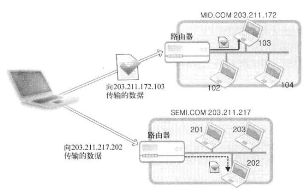

# TCP&IP网络编程笔记
[TOC]

## Part01 开始网络编程

### 第1章 理解网络编程和套接字

#### 1.1 理解网络编程和套接字

**网络编程中接收连接请求的套接字过程**：

1. 调用`socket()`创建套接字
2. 调用`bind()`函数分配IP地址和端口号
3. 调用`listen()`函数转为可接受请求状态
4. 调用`accept()`函数受理连接请求

##### socket()

 **函数原型**

 ```c
#include <sys/socket.h>
 
 int socket(int domain, int type, int protocol);
 ```

 **参数说明**

 1. **`int domain`（协议域）**
     指定套接字使用的协议族（地址族），常见值包括：

    - `AF_INET`：IPv4 协议（用于互联网通信）。

    - `AF_INET6`：IPv6 协议。                                                                

    - `AF_UNIX` 或 `AF_LOCAL`：本地通信（Unix 域套接字）。

    - `AF_PACKET`：底层数据包接口（用于抓包或自定义协议）。

 2. **`int type`（套接字类型）**
     指定套接字的类型，常见值包括：

    - `SOCK_STREAM`：面向连接的流式套接字（如 TCP）。

    - `SOCK_DGRAM`：无连接的数据报套接字（如 UDP）。

    - `SOCK_RAW`：原始套接字（用于自定义协议或访问底层网络层）。

 3. **`int protocol`（协议）**
     指定套接字使用的具体协议，通常设为 `0`，表示根据 `domain` 和 `type` 自动选择默认协议。例如：

    - `domain=AF_INET, type=SOCK_STREAM` 时，默认协议是 TCP。

    - `domain=AF_INET, type=SOCK_DGRAM` 时，默认协议是 UDP。


   如果需要显式指定协议，可以使用：

    - `IPPROTO_TCP`：TCP 协议。
    
    - `IPPROTO_UDP`：UDP 协议。

 **返回值**

 - **成功**：返回一个 **文件描述符**（非负整数），用于后续操作（如 `bind()`、`connect()`、`send()` 等）。
- **失败**：返回 `-1`，并设置 `errno` 以指示错误原因。

 **功能描述**

 - `socket` 函数创建一个套接字，套接字是网络通信的端点，用于实现进程间通信（IPC）或网络通信。
- 套接字描述符类似于文件描述符，可以用于后续的 I/O 操作。
---
##### bind()

 **函数原型**

 ```c
#include <sys/socket.h>
 
 int bind(int sockfd, struct sockaddr *myaddr, socklen_t addrlen);
 ```

 **参数说明**

 1. **`int sockfd`**
   - 要绑定的套接字文件描述符，通常由 `socket()` 函数创建。


2. **`struct sockaddr myaddr`**
   - 指向 `struct sockaddr` 的指针，包含了要绑定的地址和端口信息。

    - 实际使用时，通常使用 `struct sockaddr_in`（IPv4）或 `struct sockaddr_in6`（IPv6）结构体，然后强制转换为 `struct sockaddr*`。


3. **`socklen_t addrlen`**
   - `myaddr` 结构体的长度，通常使用 `sizeof(struct sockaddr_in)` 或 `sizeof(struct sockaddr_in6)`。
    - `socklen_t`是`unsigned int`类型


**返回值**

 - **成功**：返回 `0`。
- **失败**：返回 `-1`，并设置 `errno` 以指示错误原因。

 **功能描述**

 - `bind` 函数将套接字绑定到本地地址（IP 地址和端口号），以便其他进程可以通过该地址与套接字通信。
- 对于服务器程序，绑定地址是必须的，以便客户端能够连接到服务器。
 - 对于客户端程序，通常不需要显式绑定地址，系统会自动分配一个临时端口。
---
##### listen()

 **函数原型**

 ```c
#include <sys/socket.h>
 
 int listen(int sockfd, int backlog);
 ```

 **参数说明**

 1. **`sockfd`**
   - 要设置为监听状态的套接字文件描述符，通常由 `socket()` 创建并通过 `bind()` 绑定到本地地址和端口。


2. **`backlog`**

    - 等待连接队列的最大长度。

    - 当多个客户端同时请求连接时，未处理的连接请求会被放入队列，`backlog` 指定了队列的最大长度。

    - 如果队列已满，新的连接请求会被拒绝。

    - 通常设置为 `5` 到 `10`，具体值取决于服务器的负载能力。


**返回值**

 - **成功**：返回 `0`。
- **失败**：返回 `-1`，并设置 `errno` 以指示错误原因。

 **功能描述**

 - `listen` 函数将套接字设置为监听状态，使其能够接受客户端的连接请求。
- 当客户端发起连接请求时，请求会被放入等待连接队列。
 - 如果队列已满，新的连接请求会被拒绝。
---
##### accept()

 **函数原型**

 ```c
#include <sys/socket.h>
 
 int accept(int sockfd, struct sockaddr *addr, socklen_t *addrlen);
 ```

 **参数说明**

 1. **`sockfd`**
   - 监听套接字的文件描述符，通常由 `socket()` 创建并通过 `bind()` 和 `listen()` 设置为监听状态。


2. **`addr`**

    - 指向 `struct sockaddr` 的指针，用于存储客户端的地址信息（如 IP 地址和端口）。

    - 如果不需要客户端的地址信息，可以设置为 `NULL`。


3. **`addrlen`**

    - 指向 `socklen_t` 的指针，用于存储客户端地址结构体的长度。

    - 调用 `accept()` 前，需要将其初始化为 `sizeof(struct sockaddr)`。

    - 如果 `addr` 为 `NULL`，可以设置为 `NULL`。


**返回值**

 - **成功**：返回一个新的套接字文件描述符，用于与客户端通信。
- **失败**：返回 `-1`，并设置 `errno` 以指示错误原因。

 **功能描述**

 - `accept` 函数从等待连接队列中取出一个客户端连接请求，并创建一个新的套接字用于与客户端通信。
- 新的套接字描述符与原始的监听套接字不同，原始的监听套接字继续等待其他客户端连接。
 - 如果等待连接队列为空，`accept` 会阻塞（默认情况下），直到有新的连接请求到达。
---
##### 网络字节序转换函数

```c
#include <netinet/in.h>
unsigned long int htonl ( unsigned long int hostlong );
htonl 把unsigned long int类型从主机序转换到网络序
 
unsigned short int htons ( unsigned short int hostlong );
htons把unsigned short int类型从主机序转换到网络序
 
unsigned long int ntohl ( unsigned long int netlong );
ntohl 把unsigned long int类型从网络序转换到主机序　
 
unsigned short int ntohs ( unsigned short int netshort ); 
ntohs 把unsigned short int类型从网络序转换到主机序
```
---
#### 1.2 基于Linux的文件操作

**底层文件访问和文件描述符**

 此处的文件描述符是系统分配给文件或套接字的整数。

 <center>表1-1 分配给标准输出及标准错误的文件描述符</center>

| 文件描述符 | 对象                   |
| ----- | -------------------- |
| 0     | 标准输入：Standard Input  |
| 1     | 标准输出：Standard Output |
| 2     | 标准错误：Standard Error  |


 文件和套接字一般经过创建过程才会分配文件描述符。而表1-1中的3中输入输出对象即使未经过特殊的创建过程，程序开始运行后也会被自动分配文件描述符。

##### open()

 **`open()`-打开文件**

 **函数原型**

 ```c
 #include <sys/types.h>
 #include <sys/stat.h>
 #include <fcntl.h>
 
 int open(const char *path, int flag);
 ```

 **参数解释**

 1. **`const char *path`**
    - 这是一个字符串，表示要打开或创建的文件的路径。
    - 路径可以是绝对路径（如 `/home/user/file.txt`）或相对路径（如 `./file.txt`）。
 2. **`int flag`**
    - 这是一个整数值，用于指定文件的打开方式。它由以下标志（flags）按位或（`|`）组合而成：

 <center>表1-2 文件打开模式</center>

| 打开模式       | 含义            |
| ---------- | ------------- |
| `O_CREAT`  | 必要时创建文件       |
| `O_TRUNC`  | 删除全部现有数据      |
| `O_APPEND` | 维持现有数据，保存到其后面 |
| `O_RDONLY` | 只读打开          |
| `O_WRONLY` | 只写打开          |
| `O_RDWR`   | 读写打开          |


 3. **`mode_t mode`（可选）**

 - 当使用 `O_CREAT` 标志时，需要指定文件的权限模式（`mode`）。
 - 权限模式是一个八进制数，例如 `0644` 表示文件所有者有读写权限，其他用户只有读权限。

 **返回值**

 - 成功时，`open` 返回一个文件描述符（`file descriptor`），这是一个非负整数，用于后续的文件操作（如 `read`、`write`、`close` 等）。
 - 失败时，返回 `-1`，并设置 `errno` 以指示错误类型。

 **功能描述**

 - `open` 函数根据指定的路径和标志打开或创建一个文件，并返回一个文件描述符。
 - 文件描述符是一个用于标识打开文件的整数，后续的文件操作（如读写、关闭）都通过该描述符进行。

##### close()

 **`close()`-关闭文件**

 **函数原型**

 ```c
 #include <unistd.h>
 
 int close(int fd);
 ```

 **参数解释**

 1. **`int fd`**
    - 这是要关闭的文件描述符，通常是由 `open`、`pipe`、`socket` 等函数返回的。
    - 文件描述符是一个非负整数，用于标识打开的文件、管道、套接字等。

 **返回值**

 - **成功时**，`close` 返回 `0`。
 - **失败时**，返回 `-1`，并设置 `errno` 以指示错误类型。

 **功能描述**

 - `close` 函数用于关闭一个文件描述符，释放与之相关的系统资源。
 - 关闭文件描述符后，该描述符不再有效，后续尝试使用该描述符的操作会失败。
 - 如果文件描述符是最后一个引用某个文件的描述符，文件会被真正关闭，所有未写入的数据会被刷新到磁盘。

##### write()

 **`write()`-将数据写入文件**

 **函数原型**

 ```c
 #include <unistd.h>
 
 ssize_t write(int fd, const void *buf, size_t nbytes);
 ```

 **参数解释**

 1. **`int fd`**
    - 这是文件描述符，通常是由 `open`、`pipe`、`socket` 等函数返回的。
    - 文件描述符是一个非负整数，用于标识打开的文件、管道、套接字等。
 2. **`const void *buf`**
    - 这是一个指向要写入数据的缓冲区的指针。
    - 数据从该缓冲区中读取并写入到文件描述符指定的目标。
 3. **`size_t nbytes`**
    - 这是要写入的字节数。
    - 指定从 `buf` 中读取并写入的字节数量。

 **返回值**

 - 成功时，返回实际写入的字节数（`ssize_t`类型）。
   - 如果返回值小于 `nbytes`，可能是因为磁盘空间不足、文件大小限制或信号中断等原因。
 - **失败时**，返回 `-1`，并设置 `errno` 以指示错误类型。

 **类型说明**

 `size_t`是通过typedef声明的`unsigned int`类型。

 对于`ssize_t`来说，`size_t`前面多加的s代表signed，即`ssize_t`是通过typedef声明的`signed int`类型。

 **功能描述**

 - `write` 函数将数据从缓冲区 `buf` 写入到文件描述符 `fd` 指定的目标。
 - 写入的数据量可能小于 `nbytes`，具体取决于文件描述符的当前状态和可用空间。
 - 对于普通文件，`write` 会从当前文件位置指针处开始写入，写入完成后文件位置指针会更新。

##### read()

 **`read()`-读取文件数据**

 **函数原型**

 ```c
 #include <unistd.h>
 
 ssize_t read(int __fd, void *__buf, size_t __nbytes);
 ```

 **参数解释**

 1. **`int __fd`**
    - 这是文件描述符（File Descriptor），通常由 `open`、`pipe`、`socket` 等函数返回。
    - 文件描述符是一个非负整数，用于标识打开的文件、管道、套接字等。
 2. **`void *__buf`**
    - 这是一个指向缓冲区的指针，用于存储从文件描述符读取的数据。
    - 缓冲区的大小必须足够容纳读取的数据。
 3. **`size_t __nbytes`**
    - 这是要读取的字节数。
    - 指定从文件描述符中读取的最大字节数。

 **返回值**

 - 成功时：
   - 返回实际读取的字节数（`ssize_t` 类型）。
   - 如果返回值为 0，表示已到达文件末尾（EOF）。
 - 失败时：
   - 返回 `-1`，并设置 `errno` 以指示错误类型。

 **功能描述**

 - `read` 函数从文件描述符 `__fd` 中读取最多 `__nbytes` 字节的数据，并将其存储到缓冲区 `__buf` 中。
 - 读取的数据量可能小于 `__nbytes`，具体取决于文件描述符的当前状态和可用数据量。
 - 对于普通文件，`read` 会从当前文件位置指针处开始读取，读取完成后文件位置指针会更新。

#### 1.3 基于Windows平台的实现

##### WSAStartup()

 **Winsock的初始化**

 **函数原型**

 ```c
 #include <winsock2.h>
 
 int WSAStartup(WORD wVersionRequested, LPWSADATA lpWSAData);
 ```

 **参数解释**

 1. **`WORD wVersionRequested`**
    - 这是一个 16 位的整数，用于指定请求的 Winsock 版本。
    - 通常使用 `MAKEWORD(major, minor)` 宏来指定版本号，例如 `MAKEWORD(2, 2)` 表示请求 Winsock 2.2 版本。
 2. **`LPWSADATA lpWSAData`**
    - 这是一个指向 `WSADATA` 结构体的指针，用于接收 Winsock 库的详细信息。
    - `WSADATA` 结构体包含 Winsock 库的版本信息、实现细节等。

 **返回值**

 - **成功时**，返回 `0`。
 - **失败时**，返回非零值，表示错误代码。

 **功能描述**

 - `WSAStartup` 函数用于初始化 Winsock 库，必须在调用其他 Winsock 函数之前调用。
 - 它加载 Winsock 库并检查请求的版本是否可用。
 - 如果请求的版本不可用，`WSAStartup` 会返回错误代码，并且不会初始化 Winsock 库。

##### WSACleanup()

 **Winsock的注销**

 **函数原型**

 ```c
 #include <winsock2.h>
 
 int WSACleanup(void);
 ```

 **参数**

 - 无参数。

 **返回值**

 - **成功时**，返回 `0`。
 - **失败时**，返回 `SOCKET_ERROR`，并可以通过 `WSAGetLastError` 获取错误代码。

 **功能描述**

 - `WSACleanup` 函数用于清理和卸载 Winsock 库，释放 Winsock 库占用的系统资源。
 - 在调用 `WSAStartup` 初始化 Winsock 库后，必须在程序结束前调用 `WSACleanup`，以确保资源被正确释放。
 - 如果程序中有多个 `WSAStartup` 调用，`WSACleanup` 只有在最后一个 `WSAStartup` 对应的调用时才会真正卸载 Winsock 库。

#### 1.4 基于Windows的套接字相关函数及示例

##### socket()

 **函数原型**

 ```c
 #include <winsock2.h>
 
 SOCKET socket(int af, int type, int protocol);
 ```

 **参数解释**

 1. **`int af`**
    - 指定套接字的地址族（Address Family），常用的地址族包括：
      - **`AF_INET`**：IPv4 地址族。
      - **`AF_INET6`**：IPv6 地址族。
      - **`AF_UNIX`**：本地套接字（Unix 域套接字）。
      - **`AF_PACKET`**：底层数据包接口（用于网络数据包捕获）。
 2. **`int type`**
    - 指定套接字的类型，常用的类型包括：
      - **`SOCK_STREAM`**：面向连接的流套接字（如 TCP）。
      - **`SOCK_DGRAM`**：无连接的数据报套接字（如 UDP）。
      - **`SOCK_RAW`**：原始套接字（用于直接访问底层协议）。
 3. **`int protocol`**
    - 指定套接字使用的协议，通常设置为 `0`，表示使用默认协议。例如：
      - 对于 `AF_INET` 和 `SOCK_STREAM`，默认协议是 TCP。
      - 对于 `AF_INET` 和 `SOCK_DGRAM`，默认协议是 UDP。
      - 对于 `SOCK_RAW`，需要明确指定协议（如 `IPPROTO_ICMP`）。

 **返回值**

 - **成功时**，返回一个套接字描述符（`SOCKET` 类型），这是一个非负整数，用于后续的套接字操作（如 `bind`、`listen`、`accept`、`send`、`recv` 等）。
 - **失败时**，返回 `INVALID_SOCKET`，并可以通过 `WSAGetLastError` 获取错误代码。

 **功能描述**

 - `socket` 函数创建一个套接字，套接字是网络通信的端点，用于实现进程间通信（IPC）或网络通信。
 - 套接字描述符类似于文件描述符，可以用于后续的 I/O 操作。

##### bind()

 **函数原型**

 ```c
 #include <winsock2.h>
 
 int bind(SOCKET s, const struct sockaddr * name, int namelen);
 ```

 **参数解释**

 1. **`SOCKET s`**
    - 这是套接字描述符，通常由 `socket` 函数创建。
 2. **`const struct sockaddr *name`**
    - 这是一个指向 `sockaddr` 结构体的指针，包含要绑定的本地地址信息。
    - 通常使用 `struct sockaddr_in`（IPv4）或 `struct sockaddr_in6`（IPv6）来填充地址信息。
 3. **`int namelen`**
    - 这是地址结构体的长度，通常使用 `sizeof(struct sockaddr_in)` 或 `sizeof(struct sockaddr_in6)`。

 **地址结构体**

 - 对于 IPv4，使用`struct sockaddr_in`

   ```c
   struct sockaddr_in {
       short          sin_family;   // 地址族（如 AF_INET）
       unsigned short sin_port;     // 端口号（网络字节序）
       struct in_addr sin_addr;     // IP 地址（网络字节序）
       char           sin_zero[8];  // 填充字段
   };
   ```

 - 对于 IPv6，使用`struct sockaddr_in6`

   ```c
   struct sockaddr_in6 {
       short          sin6_family;   // 地址族（如 AF_INET6）
       unsigned short sin6_port;     // 端口号（网络字节序）
       unsigned long  sin6_flowinfo; // 流信息
       struct in6_addr sin6_addr;    // IPv6 地址（网络字节序）
       unsigned long  sin6_scope_id; // 范围 ID
   };
   ```

 **返回值**

 - **成功时**，返回 `0`。
 - **失败时**，返回 `SOCKET_ERROR`，并可以通过 `WSAGetLastError` 获取错误代码。

 **功能描述**

 - `bind` 函数将套接字绑定到本地地址（IP 地址和端口号），以便其他进程可以通过该地址与套接字通信。
 - 对于服务器程序，绑定地址是必须的，以便客户端能够连接到服务器。
 - 对于客户端程序，通常不需要显式绑定地址，系统会自动分配一个临时端口。

##### listen()

 **函数原型**

 ```c
 #include <winsock2.h>
 
 int listen(SOCKET s, int backlog);
 ```

 **参数解释**

 1. **`SOCKET s`**
    - 这是套接字描述符，通常由 `socket` 函数创建，并已通过 `bind` 函数绑定到本地地址。
 2. **`int backlog`**
    - 这是等待连接队列的最大长度，表示同时可以处理的未完成连接请求的数量。
    - 通常设置为一个正整数，例如 `5` 或 `10`，具体值取决于服务器的负载能力和需求。

 **返回值**

 - **成功时**，返回 `0`。
 - **失败时**，返回 `SOCKET_ERROR`，并可以通过 `WSAGetLastError` 获取错误代码。

 **功能描述**

 - `listen` 函数将套接字设置为监听状态，使其能够接受客户端的连接请求。
 - 当客户端发起连接请求时，请求会被放入等待连接队列。
 - 如果队列已满，新的连接请求会被拒绝。

 **等待连接队列**

 - **未完成连接队列（Incomplete Connection Queue）**：
    存储尚未完成三次握手的连接请求。
 - **已完成连接队列（Completed Connection Queue）**：
    存储已完成三次握手的连接请求，等待 `accept` 函数处理。

 `backlog` 参数通常指定已完成连接队列的最大长度，但具体实现可能有所不同。

##### accept()

 **函数原型**

 ```c
 #include <winsock2.h>
 
 int accept(SOCKET s, struct sockaddr *addr, int *addrlen);
 ```

 **参数解释**

 1. **`SOCKET s`**
    - 这是处于监听状态的套接字描述符，通常由 `socket` 函数创建，并通过 `bind` 和 `listen` 函数设置为监听状态。
 2. **`struct sockaddr *addr`**
    - 这是一个指向 `sockaddr` 结构体的指针，用于存储客户端的地址信息。
    - 通常使用 `struct sockaddr_in`（IPv4）或 `struct sockaddr_in6`（IPv6）来存储地址信息。
 3. **`int *addrlen`**
    - 这是一个指向整数的指针，用于指定地址结构体的长度。
    - 在调用 `accept` 之前，需要将 `*addrlen` 设置为地址结构体的长度（如 `sizeof(struct sockaddr_in)`）。
    - 在 `accept` 返回后，`*addrlen` 会被设置为实际存储的地址长度。

 **返回值**

 - **成功时**，返回一个新的套接字描述符，用于与客户端通信。
 - **失败时**，返回 `INVALID_SOCKET`，并可以通过 `WSAGetLastError` 获取错误代码。

 **功能描述**

 - `accept` 函数从等待连接队列中取出一个客户端连接请求，并创建一个新的套接字用于与客户端通信。
 - 新的套接字描述符与原始的监听套接字不同，原始的监听套接字继续等待其他客户端连接。
 - 如果等待连接队列为空，`accept` 会阻塞（默认情况下），直到有新的连接请求到达。

##### connect()

 **函数原型**

 ```c
 #include <winsock2.h>
 
 int connect(SOCKET s, const struct sockaddr *name, int namelen);
 ```

 **参数解释**

 1. **`SOCKET s`**
    - 这是套接字描述符，通常由 `socket` 函数创建。
 2. **`const struct sockaddr *name`**
    - 这是一个指向 `sockaddr` 结构体的指针，包含远程服务器的地址信息。
    - 通常使用 `struct sockaddr_in`（IPv4）或 `struct sockaddr_in6`（IPv6）来填充地址信息。
 3. **`int namelen`**
    - 这是地址结构体的长度，通常使用 `sizeof(struct sockaddr_in)` 或 `sizeof(struct sockaddr_in6)`。

 **返回值**

 - **成功时**，返回 `0`。
 - **失败时**，返回 `SOCKET_ERROR`，并可以通过 `WSAGetLastError` 获取错误代码。

 **功能描述**

 - `connect` 函数用于将套接字连接到指定的远程服务器地址。
 - 对于 TCP 套接字，`connect` 会发起三次握手，建立与服务器的连接。
 - 对于 UDP 套接字，`connect` 仅设置默认的目标地址，不会实际建立连接。

 **地址结构体**

 - 对于 IPv4，使用`struct sockaddr_in`

   ```c
   struct sockaddr_in {
       short          sin_family;   // 地址族（如 AF_INET）
       unsigned short sin_port;     // 端口号（网络字节序）
       struct in_addr sin_addr;     // IP 地址（网络字节序）
       char           sin_zero[8]; // 填充字段
   };
   ```

 - 对于 IPv6，使用`struct sockaddr_in6`

   ```c
   struct sockaddr_in6 {
       short          sin6_family;   // 地址族（如 AF_INET6）
       unsigned short sin6_port;     // 端口号（网络字节序）
       unsigned long  sin6_flowinfo; // 流信息
       struct in6_addr sin6_addr;    // IPv6 地址（网络字节序）
       unsigned long  sin6_scope_id; // 范围 ID
   };
   ```

##### closesocket()

 **函数原型**

 ```c
 #include <winsock2.h>
 
 int closesocket(SOCKET s);
 ```

 ### **参数解释**

 1. **`SOCKET s`**
    - 这是要关闭的套接字描述符，通常由 `socket`、`accept` 等函数创建。

 **返回值**

 - **成功时**，返回 `0`。
 - **失败时**，返回 `SOCKET_ERROR`，并可以通过 `WSAGetLastError` 获取错误代码。

 **功能描述**

 - `closesocket` 函数用于关闭套接字，释放套接字占用的系统资源。
 - 关闭套接字后，该套接字描述符不再有效，后续尝试使用该描述符的操作会失败。
 - 如果套接字是最后一个引用某个连接的描述符，连接会被真正关闭，所有未发送的数据会被丢弃。

#### 1.5 习题

(1) 套接字在网络编程中的作用是什么?为何称它为套接字?

套接字的作用

1. 网络通信的端点
   - 套接字是网络通信的端点，用于标识通信的两端（客户端和服务器）。
   - 它封装了IP地址和端口号，唯一标识一个网络连接。
2. 数据传输的通道
   - 套接字提供了数据传输的通道，应用程序可以通过套接字发送和接收数据。
   - 它支持多种协议，如TCP（面向连接）和UDP（无连接）
3. 抽象网络细节
   - 套接字隐藏了底层网络协议的复杂性（如数据报的分片、重组、路由等），使得开发者可以专注于应用程序的逻辑。
4. 支持多种通信模式
   - 套接字支持点对点通信（如TCP）、广播通信（如UDP）和多播通信。
5. 跨平台性
   - 套接字是跨平台的，基于套接字的程序可以在不同操作系统上运行

为何称它为套接字

1. 插头和插座的隐喻
   - 在电话系统中，插头（Plug）插入插座（Socket）后，双方才能建立连接并进行通信。
   - 在网络编程中，套接字就像插座，客户端和服务器通过套接字“插入”网络，建立连接并交换数据。
2. 端点的抽象
   - 套接字是网络通信的端点，类似于插座是电路的端点。
   - 它抽象了网络连接的细节，使得通信双方可以通过套接字进行交互。
3. 连接的建立
   - 套接字通过绑定IP地址和端口号，建立网络连接，类似于插座通过物理接口建立电路连接。

(2) 在服务器端创建套接字后，会依次调用listen函数和accept函数 。请比较并说明二者作用。

- `listen`负责将套接字设置为监听状态，并管理等待连接队列。
- `accept`负责接受客户端连接，并创建新的套接字用于通信。
- 二者共同协作，使服务器能够高效地处理多个客户端连接。

(3) Linux中，对套接字数据进行I/O时可以直接使用文件I/O相关函数;而在Windows中则不可以。原因为何?

Linux中可以直接使用I/O函数的原因

1. 一切皆文件
   - Linux遵循“一切皆文件”的设计哲学，套接字、管道、设备等都被抽象为文件描述符。
   - 套接字创建后，会返回一个文件描述符（如 `int sockfd = socket(...)`），这个描述符可以像普通文件一样被操作。
2. 统一的I/O接口
   - Linux提供了统一的I/O函数（如 `read`、`write`、`close`），这些函数可以用于文件、套接字、管道等多种类型的描述符。
   - 例如，可以使用`read(sockfd,buf,len)`从套接字读取数据，或使用`write(sockfd,buf,len)`向套接字写入数据。
3. 文件描述符的通用性
   - 在Linux中，文件描述符是一个通用的抽象，所有I/O操作都通过文件描述符进行，因此套接字I/O操作与文件I/O操作完全一致。

Windows中不能直接使用文件I/O函数的原因

1. 不同的设计理念
   - Windows没有“一切皆文件”的设计理念，套接字和文件是两种不同的对象，分别由不同的API管理。
   - 套接字在Windows中是通过`SOCKET`类型（本质上是一个句柄，`HANDLE`）表示的，而不是文件描述符。
2. 独立的套接字API
   - Windows提供专门的套接字API（如`recv`、`send`、`closesocket`），这些API与文件I/O函数（如`ReadFile`、`WriteFile`）是分离的。
3. 句柄的差异性
   - 在Windows中，文件句柄（`HANDLE`）和套接字句柄(`SOCKET`)是两种不同的类型，不能混用。
   - 文件I/O函数(如`ReadFile`、`WriteFile`)只能操作文件句柄，而不能操作套接字句柄。
4. 历史原因
   - Windows的套接字API是基于BSD套接字实现的，但与文件I/O系统是独立的，这种设计在早期Windows版本中就已经确立，并一直沿用至今。

(4) 创建套接字后一般会给它分配地址，为什么?为了完成地址分配需要调用哪个函数?

为什么分配地址

- 给套接字分配地址是为了标识通信端点、指定通信范围并确保端口可用。

完成地址分配调用的函数

- 调用`bind`函数可以将套接字与本地地址绑定。

(5) Linux中的文件描述符与Windows的句柄实际上非常类似。请以套接字为对象说明它们的含义 。

- Linux文件描述符和Windows句柄都是用于标识和操作资源的抽象概念，但在实现和使用方式上有所不同。
- Linux的文件描述符更加统一，可以用于操作多种资源,而Windows的句柄则根据资源类型使用不同的API。
- 在套接字编程中，Linux使用文件描述符，Windows使用句柄，开发者需要根据操作系统选择合适的API和操作方式。

(6) 底层文件I/O函数与ANSI标准定义的文件I/O函数之间有何区别?

- 底层函数性能更高、功能更丰富，但可移植性差。
- ANSI标准函数可移植性好、易用性高，但性能较低、功能有限。

(7) 参考本书给出的示例low_open.c和low_read-c，分别利用底层文件I/O和ANSI标准I/O编写文件复制程序。可任意指定复制程序的使用方法。

**底层文件I/O文件复制程序**

```c
/*low_copy.c*/
#include <stdio.h>
#include <stdlib.h>
#include <fcntl.h>
#include <unistd.h>
#define BUF_SIZE 1024
void error_handling(char* message);

int main(int argc, char *argv[])
{
    int src_fd, dst_fd;
    ssize_t num_read;
    char buf[BUF_SIZE];

    // 检查参数是否正确
    if (argc != 3) {
        fprintf(stderr, "Usage: %s <source> <destionation>\n", argv[0]);
        exit(1);
    }

    // 打开源文件
    src_fd = open(argv[1], O_RDONLY);
    if (src_fd == -1)
        error_handling("open() error for source file!");
    
    // 创建目标文件
    dst_fd = open(argv[2], O_WRONLY | O_CREAT | O_TRUNC, 0644);
    if (dst_fd == -1)
    error_handling("open() error for destination file!");

    while ((num_read = read(src_fd, buf, BUF_SIZE)) > 0) {
        if (write(dst_fd, buf, num_read) != num_read)
            error_handling("write() error!");
    }

    if (num_read == -1)
        error_handling("read() error!");

    // 关闭文件
    close(src_fd);
    close(dst_fd);

    printf("File copied successfully.\n");
    return 0;
}

void error_handling(char *message)
{
    fputs(message, stderr);
    fputc('\n', stderr);
    exit(1);
}
```

**使用示例**


---

**ANSI标准I/O编写文件复制程序**

```c
/*std_copy.c*/
#include <stdio.h>
#include <stdlib.h>

#define BUF_SIZE 1024

void error_handling(char *message);

int main(int argc, char *argv[])
{
    FILE *src_fp, *dst_fp;
    char buf[BUF_SIZE];
    size_t num_read;

    if (argc != 3) {
        fprintf(stderr, "Usage: %s <source> <destination>\n", argv[0]);
        exit(1);
    }

    src_fp = fopen(argv[1],"r");
    if (src_fp == NULL)
        error_handling("fopen() error for source file!");
    
    dst_fp = fopen(argv[2], "w");
    if (dst_fp == NULL)
        error_handling("fopen() error for destination file!");
    
    while ((num_read = fread(buf,1,BUF_SIZE,src_fp)) > 0) {
        if (fwrite(buf,1,num_read,dst_fp) != num_read)
            error_handling("fwrite() error!");
    }

    if (ferror(src_fp))
        error_handling("fread() error!");
    
    fclose(src_fp);
    fclose(dst_fp);

    printf("File copied successfully.\n");
    return 0;
}

void error_handling(char *message)
{
    fputs(message, stderr);
    fputc('\n', stderr);
    exit(1);
}
```

使用与底层的类似

---

### 第2章 套接字类型与协议设置

#### 2.1 套接字协议以及其数据传输特性

:small_orange_diamond:**关于协议(Protocol)**

  如果相隔很远的两人想展开对话，必须先决定说话方式。如果一方使用电话，那么另一方也只能使用电话，而不是书信。可以说，电话就是两人对话的协议。协议是对话中使用的通信规则，把上述概念拓展到计算机领域可整理为“计算机间对话必备通信规则”。

:small_orange_diamond:**创建套接字**

```c
#include <sys/socket.h>

int socket(int domain, int type. int protocol);
```

:small_orange_diamond:**协议族(Protocol Family)**

协议分类信息称为协议族，可分为如下几类：

 <center>表2-1 头文件sys/socket.h中声明的协议族</center>

| 名称          | 协议族            |
| ----------- | -------------- |
| `PF_INET`   | IPv4互联网协议族     |
| `PF_INET6`  | IPv6互联网协议族     |
| `PF_LOCAL`  | 本地通信的UNIX协议族   |
| `PF_PACKET` | 底层套接字的协议族      |
| `PF_IPX`    |  IPX Novell协议族 |


:small_orange_diamond:**套接字类型(Type)**

  套接字类型指的是套接字的数据传输方式，通过socket函数的第二个参数传递，只有这样才能决定创建的套接字的数据传输方式。尽管第一个参数决定了协议族，但无法同时决定数据传输方式，例如socket函数的第一个参数PF_INET协议族中也存在多种数据传输方式。

  以下是两种具有代表性的数据传输方式。

##### SOCK_STREAM

 **套接字类型1：面向连接的套接字(`SOCK_STREAM`)**

   如果向socket函数的第二个参数传递`SOCK_STREAM`，将创建面向连接的套接字。

   面向连接的套接字的传输方式特征：

 - 传输过程中数据不会消失。
 - 按序传输数据。
 - 传输的数据不存在数据边界（例如传输数据的计算机通过3次调用write函数传递了100字节的数据，但接受数据的计算机仅通过1次read函数调用就接受了全部100个字节）。

   收发数据的套接字内部有缓冲(buffer)，简言之就是字节数组。通过套接字传输的数据将保存到该数组。因此，收到数据不意味着马上调用read函数。只要不超过数组容量（就算缓冲区满了也不会丢失数据，因为传输端套接字将停止传输），则有可能在数据填充满缓冲后通过1次read函数调用读取全部，也有可能分成多次read函数调用进行读取。也就是说，在面向连接的套接字中，read函数和write函数的调用次数并无太大意义。

   并且，面向连接的套接字只能与另外一个同样特性的套接字连接。

   面向连接的套接字特性可总结为：“可靠的、按序传递的、基于字节的面向连接的数据传输方式的套接字。”

##### SOCK_DGRAM

 **套接字类型2：面向消息的套接字(`SOCK_DGRAM`)**

   如果向socket函数的第二个参数传递`SOCK_DGRAM`，则将创建面向消息的套接字。

   面向消息的套接字的传输方式特征：

 - 强调快速传输而非传输顺序。
 - 传输的数据可能丢失也可能损毁。
 - 传输的数据有数据边界。
 - 限制每次传输的数据大小。

   面向消息的套接字比面向连接的套接字具有更快的传输速度，但无法避免数据丢失或损毁。另外，每次传输的数据大小具有一定限制，并存在数据边界。存在数据边界意味着接收数据的次数应和传输次数相同。

   面向消息的套接字特性可总结为：“不可靠的、不按顺序传递的、以数据的高速传输为目的的套接字”

**协议的最终选择**

  socket函数中的第三个参数决定最终采用的协议。

  大部分情况下，传递前两个参数即可创建所需套接字，此时可以向第三个参数传递0，除非遇到同一协议族中存在多个数据传输方式相同的协议的情况。

  数据传输方式相同，但协议不同。此时需要通过第三个参数具体指定协议信息。

  参数`PF_INET`指IPv4网络协议族，`SOCK_STREAM`是面向连接的数据传输。满足这2个条件的协议只有`IPPROTO_TCP`。

  而`PF_INET`和`SOCK_DGRAM`唯一指定的套接字是UDP套接字。

#### 2.2 Windows平台下的实现及验证

**Windows操作系统的socket函数​**

```c
#include <winsock2.h>

SOCKET socket(int af, int type, int protocol);
```

  返回值类型为`SOCKET`，此结构体用来保存整数型套接字句柄值。实际上，socket函数返回整数型数据，因此可以通过int型变量接受，就像在Linux中一样。但考虑到以后的扩展性，定义为SOCKET数据类型。

  发生错误值返回`INVALID_SOCKET`，只需理解为提示错误的常数即可。其实际值为-1.

  应尽量使用`SOCKET`，`INVALID_SOCKET`而不是常数。

#### 2.3 习题

(1) 什么时协议？在收发数据中定义协议有何意义？

(2) 面向连接的TCP套接字传输特性有3点，请分别说明。

- 传输过程中数据不会消失，面向连接的TCP套接字是可靠的连接，会保证数据不丢失。
- 按序传输数据，数据按顺序传输。
- 传输的数据没有数据边界，即不会限制每次传递数据的大小，并且调用一次`read()`即可读取所有缓冲区中的数据。

(3) 下列哪些是面向消息的套接字的特性？

​    a. 传输数据可能丢失

​    b. 没有数据边界

​    c. 以快速传递为目标

​    d. 不限制每次传递数据的大小

​    e. 与面向连接的套接字不同，不存在连接的概念

​    a,b,c,e

(4) 下列数据适合用哪类套接字传输？并给出原因。

​    a. 演唱会现场直播的多媒体数据（面向消息的套接字，传输快，可保证数据实时传输，同时丢失较少）

​    b. 某人压缩过的文本文件（面向连接的套接字，传输可靠，可保证数据不丢失）

​    c. 网上银行用户与银行之间的数据传递（面向连接的套接字，传输可靠，可保证数据不丢失）

(5) 何种类型的套接字不存在数据边界？这类套接字接收数据时需要注意什么？

​    面向连接的套接字不存在数据边界。

(6) tcp_server.c和 tcp_client.c中需多次调用read函数读取服务器端调用1次write函数传递的字符串。更改程序，使服务器端多次调用(次数自拟)write函数传输数据，客户端调用1次read函数进行读取。为达到这一目的，客户端需延迟调用read函数，因为客户端要等待服务器端传输所有数据。Windows和Linux都通过下列代码延迟read或recv函数的调用。

```c
for(i=0; i<3000; i++)
	printf("Wait time %d \n" , i);
```

让CPU执行多余任务以延迟代码运行的方式称为"Busy Waiting"。使用得当即可推迟函数调用。

**Windows**

服务端


客户端


**Linux**

服务端


客户端


### 第3章 地址族与数据序列

#### 3.1 分配给套接字的IP地址与端口号

  IP时Internet Protocol（网络协议）的简写，是为收发完了过数据而分配给计算机的值。端口号并非赋予计算机的值，而是为区分程序中创建的套接字而分配给套接字的序号。

**网络地址（Internet Address）**

  为使计算机连接到完了过并收发数据，必须向其分配IP地址。IP地址分为两类。

- IPv4（Internet Protocol version 4） 4字节地址族
- IPv6（Internet Protocol Protocol version6） 16字节地址族

  IPv4与IPv6的差别主要是标识IP地址所用的字节数。

##### IPV4

   IPv4标准的4字节IP地址分为网络地址和主机（指计算机）地址，且分为A、B、C、D、E等类型。图3-1展示了IPv4地址族，一般不会使用已被预约了的E类地址，故省略。

 

 <center>图 3-1 IPv4地址族</center>

   网络地址（网络ID）是为区分网络而设置的一部分IP地址。假设向WWW.SEMI.COM公司传输数据，该公司内部构建了局域网，把所有计算机连接起来。因此，首先应向SEMI.COM网络传输数据，也就是说，并非一开始就浏览所有4字节IP地址，进而找到目标主机；而是仅浏览4字节IP地址的网络地址，先把数据传到SEMI.COM的网络（构成网络的路由器）接收到数据后，浏览传输数据的主机地址（主机ID）并将数据传给目标计算机。图3-2展示了数据传输过程。

 

 <center>图3-2 基于IP地址的数据传输过程</center>

   某主机向203.211.172.103和203.211.217.202传输数据，其中203.211.172和203.211.217为该网络的网络地址。所以，“向相应网络传输数据”实际上是向构成网络的路由器（Router）或交换机（Switch）传递数据，由接收数据的路由器根据数据中的主机地址向目标主机传递数据。

**用于区分套接字的端口号**

 IP用于区分计算机，只要由IP地址就能向目标主机传输数据，但仅凭这些无法传输给最终的应用程序。

 计算机中一般配有NIC（Network Interface Card，网络接口卡）数据传输设备。通过NIC向计算机内部传输数据时会用到IP。操作系统负责把传递到内部的数据适当分配给套接字，这时参考的就是NIC接收的数据内的端口号。

   

   <center>图3-3 数据分配过程</center>

 端口号就是在统一操作系统内为区分不同套接字而设置的，因此无法将1个端口号分配给不同套接字。端口号由16位组成，可分配的端口号范围时0-65535。但0-1023是知名端口（Well-known PORT），一般分配给特定应用程序，所以应当分配此范围之外的值。另外，虽然端口号不能重复，但TCP套接字和UDP套接字不会共用的端口号，诉讼一允许重复。例如：如果某TCP套接字使用9190号端口，则其它TCP套接字就无法使用该端口号，但UDP套接字可以使用。

#### 3.2 地址信息的表示

表示IPv4地址的结构体

##### sturct sockaddr_in

```c
struct sockaddr_in
{
    sa_family_t sin_family; // 地址族
    uint16_t    sin_port; // 16位TCP/UDP端口号
    struct      in_addr sin_addr; // 32位IP地址
    char        sin_zero[8]; // 不使用
}
```

##### sturct in_addr

```c
struct in_addr
{
    in_addr_t s_addr; // 32位IPv4地址
}
```

##### POSIX

 Portable Operating System Interface，可移植操作系统接口

 POSIX是位UNIX系列操作系统设立的标准，它定义了一些其他数据类型，如表3-1所示。

 <center>表3-1 POSIX中定义的数据类型</center>

| 数据类型名称        | 数据类型说明                              | 声明的头文件       |
| ------------- | ----------------------------------- | ------------ |
| `int8_t`      | signed 8-bit int                    | sys/types.h  |
| `uint8_t`     | unsigned 8-bit int(unsigned char)   | sys/types.h  |
| `int16_t`     | signed 16-bit int                   | sys/types.h  |
| `uint16_t`    | unsigned 16-bit int(unsigned short) | sys/types.h  |
| `int32_t`     | signed 32-bit int                   | sys/types.h  |
| `uint32_t`    | unsigned 32-bit int(unsigned long)  | sys/types.h  |
| `sa_family_t` | 地址族（address）                        | sys/socket.h |
| `socklen_t`   | 长度（length of struct）                | sys/socket.h |
| `in_addr_t`   | IP地址，声明为uint32_t                    | netinet/in.h |
| `in_port_t`   | 端口号，声明位uint16_t                     | netinet/in.h |


额外定义这些数据类型是为了未来的扩展。如果使用`int32_t`类型的数据，就能保证在任何时候都占用4字节，即使将来用64为表示int类型也是如此。

**结构体`sockaddr_in`的成员分析**
- 成员`sin_family`
  每种协议族使用的地址族均不同。比如，IPv4使用4字节地址族，IPv6使用16字节地址族。
<center>表3-2 地址族</center>

| 地址族        | 含义                 |
| ---------- | ------------------ |
| `AF_INET`  | IPv4网络协议中使用的地址族    |
| `AF_INET6` | IPv6网络协议中使用的地址族    |
| `AF_LOCAL` | 本地通信中采用的UNIX协议的地址族 |

- 成员`sin_port`
  该成员保留16位端口号，并以网络字节序保存。
- 成员`sin_addr`
  该成员保存32为IP地址信息，且也以网络字节序保存。
- 成员`sin_zero`
  无特殊含义。只是为使结构体`sockaddr_in`的大小与`sockaddr`结构体保持一致而插入的成员。必须填充为0，否则无法得到想要的结果。

#### 3.3 网络字节序与地址变换
  不同CPU中，4字节整数型值1在内存空间的保存方式是不同的。4字节整数型可用2进制表示如下。
  00000000 00000000 00000000 00000001
  有些CPU以这种顺序保存到内存，另外一些CPU则以倒序保存。
  00000001 00000000 00000000 00000000
  若不考虑这些就收发数据会发生问题，因为保存顺序的不同意味着对接受数据的解析顺序也不同。
**字节序（Order）与网络字节序**
  CPU向内存保存数据的方式有2种，这意味着CPU解析数据的方式也分2种。
  - 大端序（Big Endian）：高位字节存放到低位地址。
  - 小端序（Little Endian）：高位字节存放到高位地址。

  例：
  假设在0x20号开始的地址中保存4字节int类型数0x12345678。打断CPU保存方式如图3-4所示。
  
  <center>图3-4 大端序字节表示</center>

整数0x12345678中，0x12是最高位字节，0x78是最低位字节。因此，大端序中先保存最高位字
0x12（最高位字节0x12存放到低位地址）。小端序保存方式如图3-5所示。
  
   <center>图3-5 小端序字节表示</center>

 先保存的是最低为字节0x78。

> [!NOTE] 记忆技巧
> 可以把端理解为（分区上的）最低位字节，大端说明端上的是数据中的最高位字节，小端说明端上的是最低位字节。这样就可以判断CPU的字节序。

通过网络传输数据时采用网络字节序——统一为大端序。计算机在上传数据时需要先将数据转换为大端序，然后再发送， 在接收数据时会自动转为主机字节序。

**字节序转换（Endian Conversions）**
上面讲述了在填充`sockaddr_in`结构体前将数据转换成网络字节序的原因。接下来介绍帮助转换字节序的函数。
``` c
  unsigned short htons(unsigned short);
  unsigned short ntohs(unsigned short);
  unsigned long htonl(unsigned long);
  unsigned long ntohl(unsigned long);
```
通过函数名应该能掌握其功能，只需了解以下细节。
- htons中的h代表主机（host）字节序。
- htons中的n代表网络（network）字节序。
另外，s指的是`short`，l指的是`long`（Linux中long类型占用4个字节这很关键）。因此，htons是h、to、n、s的组合，也可以解释为“把short型数据从主机字节序转化为网络字节序”；ntohs可以解释为“把short型数据从主机字节序转化为主机字节序”。
通常，以s作为后缀的函数中，s代表2个字节short，因此用于端口号转换；以l作为后缀的函数中，l代表4个字节，因此用于IP地址转换。
注意：即使确认自己系统的主机序是大端序，最好也经过主机字节序转换为网络字节序的过程。

#### 3.4 网络地址的初始化与分配
对于IP地址的表示，我们熟悉的是淀粉十进制表示法，而非整数型数据表示法。幸运的是，有个函数会帮我们将字符串形式的IP地址转换成32为整数型数据。此函数在转换类型的同时进行完了过字节序转换。
``` c
#include <arpa/inet.h>

in_addr_t inet_addr(const char *string);
// 成功时返回32位大端序整数型值，失败时返回INADDR_NONE
```
如果向该函数传递类似“211.214.107.99”的点分十进制格式的字符串，它会将其转换成32位整数型数据（满足网络字节序）并返回。该函数的返回值类型in_addr_t在内部声明为32位整数型。
`inet_aton`函数与`inet_addr`函数在功能上完全相同，也将字符串形式IP地址转换成32位网络字节序整数返回。只不过该函数利用了`in_addr`结构体，且其使用频率更高。
``` c
#include <arpa/inet.h>

int inet_aton(const char *string, struct in_addr *addr);
// 成功时返回1（true），失败时返回0（false）。
// string：含有需要转换的IP地址信息和字符串地址值
// addr：将保存转换结果的in_addr结构体变量的地址值
```
实际编程中使用`inet_addr`函数时，需将转换后的IP地址信息代入`sockaddr_in`结构体中声明的`in_addr`结构体变量。而`inet_aton`函数不需要。原因在于，若传递`in_addr`结构体变量地址值。函数会自动把结果填入该结构体变量。
`inet_ntoa`与`inet_aton`的作用相反，此函数可以把网络字节序整数型IP地址转换成我们熟悉的字符串形式。
``` c
#include <arpa/inet.h>

char *inet_ntoa(struct in_addr adr);
```
该函数将通过参数传入的整数型IP地址转换位字符串格式并返回。但调用时需小心，返回值类型为char指针。返回字符串地址意味着已保存到内存空间，但该函数未向成需要要求分配内存，而是在内部申请了内存并保存了字符串。调用完该函数后，应立即将字符串信息复制到其他内存空间。因为，若再次调用`inet_ntoa`函数，则有可能覆盖之前保存到字符串信息。总之，再次调用`inet_ntoa`函数前返回的字符串地址值是有效的。若需要长期保存，则应将字符串复制到其他内存空间。

**网络地址初始化**
套接字创建过程中常见的网络地址信息初始化方法：
``` c
struct sockaddr_in addr; 
char *serv_ip = "211.217.168.13"; // 声明IP地址字符串
char *serv_port  = "9190";        // 声明端口号字符串
memset(&addr, 0, sizeof(addr));   // 结构体变量addr的所有成员初始化为0
addr.sin_family = AF_INET;        // 指定地址族
addr.sin_addr.s_addr = inet_addr(serv_ip); // 基于字符串的IP地址初始化
addr.sin_port = htos(atoi(serv_port));     // 基于字符串的端口号初始化
```
上述代码中，`memset`函数将每个字节初始化为同一值：第一个参数为结构体变量`addr`的地址值，即初始化对象`addr`；第二个参数为0，因此初始化为0；最后一个参数中传入`addr`的长度，因此`addr`的所有字节均初始化为0.这么做是为了将`sockaddr_in`结构体的成员`sin_zero`初始化为0.另外，最后一行代码调用的`atoi`函数把字符串类型转换成整数型。
代码中对IP地址和端口号进行了硬编码，一旦运行环境改变就得改变代码，这并不明智。
**客户端地址信息初始化**
服务端声明`sockaddr_in`结构体变量，将其初始化为赋予服务器端IP和套接字的端口号，然后调用`bind`函数；而客户端则声明`sockaddr_in`结构体，并初始化为要与之链接的服务器端套接字的IP和端口号，然后i盗用`connect`函数。
##### INADDR_ANY
每次创建服务器端套接字都要输入IP地址会有些繁琐，此时可如下初始化地址信息。
``` c
struct sockaddr_in addr; 
char *serv_port  = "9190";
memset(&addr, 0, sizeof(addr));
addr.sin_family = AF_INET;
addr.sin_addr.s_addr = inet_addrINADDR_ANY);
addr.sin_port = htos(atoi(serv_port));
```
与之前方式最大的区别在于，利用常数`INADDR_ANY`分配服务器端的IP地址。若采用这种方式，则可自动获取运行服务器端的计算机IP地址，不必亲自输入。而且，若同一计算机中已分配多个IP地址（多宿主（Multi-homed）计算机，一般路由器属于这一类），则只要端口号一致，就可以从不同IP地址接受数据。因此，服务器端中优先考虑这种方式。而客户端中除非带有一部分服务器端功能，否则不会采用。
**向套接字分配网络地址**
接下来把初始化的地址信息分配给套接字。`bind`函数负责这项操作。
``` c
#include <sys/socket.h>

int bind(int sockfd, struct sockaddr *myaddr, socklen_t addrlen);
// 成功时返回0，失败时返回1
// sockfd 要分配地址信息（IP地址和端口号）的套接字文件描述符
// myaddr 存有地址信息的结构体变量地址值
// addrlen 第二个结构体变量的长度
```
如果此函数调用成功，则将第二个参数指定的地址信息分配给第一个参数中的相应套接字。下面给出服务器端常见套接字初始化过程。
``` c
int serv_sock;
struct sockaddr_in serv_addr;
char *serv_port = "9190";

/* 创建服务器端套接字（监听套接字）*/
serv_sock = socket(PF_INET, SOCK_STREAM, 0);

/* 地址信息初始化 */
memset(&serv_addr, 0, sizeof(serv_addr));
serv_addr.sin_family = AF_INET;
serv_addr.sin_addr.s_addr = htonl(INADDR_ANY);
serv_addr.sin_port = htons(atoi(serv_port));

/* 分配地址信息 */
bind(serv_sock, (struct sockaddr *)&serv_addr, sizeof(serv_addr));
......
```
服务端的结构默认如上，当然还有未显示的异常处理代码。
#### 3.5 基于Windows的实现

**在Windows环境下向套接字分配网络地址**
Windows中向套接字分配网络地址的过程与Linux中完全相同，因为bind函数的含义、参数及返回类型完全一致。
``` c
SOCKET servSock;
struct sockaddr_in servAddr;
char *servPort = "9190";

/* 创建服务器端套接字 */
servSock = socket(PF_INET, SOCK_STREAM, 0);

/* 地址信息初始化 */
memset(&servAddr, 0, sizeof(servAddr));
servAddr.sin_family = AF_INET;
servAddr.sin_addr.s_addr = htonl(INADDR_ANY);
servAddr.sin_port = htons(atoi(serv_port));

/* 分配地址信息 */
bind(servSock, (struct sockaddr*)&servAddr, sizeof(servAddr));
......
```
#### WSAStringToAddress & WSAAddressToString
下面介绍Winsock2中增加的2个转换函数。它们在功能上与`inet_addr`和`inet_ntoa`完全相同，但优点在与支持多种协议，在IPv4和IPv6中均可适用。缺点就是这两个函数无法在Windows和Linux中切换，仅用于Windows。
##### WSAStringToAddress
``` c
#include <winsock2.h>

INT WSAStringToAddress (LPSTR AddressString, INT AddressFamily, LPWSAPROTOCOL_INFO lpProtocolInfo, LPSOCKADDR lpAddress, LPINT lpAddressLength);
// 成功时返回0，失败时返回SOCKET_ERROR。
// AddressString   含有IP和端口号的字符串地址值。
// AddressFamily   第一个参数中地址所属的地址族信息。
// lpProtocolInfo  设置协议提供者（Provider），默认为NULL。
// lpAddressLength 第四个参数中传递的结构体长度所在的变量地址值。
```
##### WSAAddressToString
``` c
#include <winsock2.h>

INT WSAAddressToString(LPSOCKADDR lpsaAddress, DWORD dwAddressLength, LPWSAPROTOCOL_INFO lpProtocolInfo, LPSTR lpszAddressString, LPDWORD lpdwAddressStringLength);
// 成功时返回0，失败时返回SOCKET_ERROR。
// lpsaAddress             需要转换的地址信息结构体变量地址值。
// dwAddressLength         第一个参数中结构体的长度。
// lpProtocolInfo          设置协议提供者（Provider），默认为NULL。
// lpszAddressString       保存转换结果的字符串地址值。
// lpdwAddressStringLength 第四个参数中存有地址信息的字符串长度
```
#### 3.6 习题
(1) IP地址族IPv4和IPv6有何区别？在何种背景下诞生了IPv6？
IPv4的地址长度为4字节，IPv6为16字节。
IPv6是为了应对2010年前后IP地址好景的问题而提出的标准。
(2) 通过IPv4网络ID、主机ID及路由器的关系说明向公司局域网中的计算机传输数据的过程。
- **网络ID**用于确定数据包应该发送到哪个网络。
- **主机ID**用于确定数据包应该发送到网络中的哪台设备。
- **路由器**用于在不同网络之间转发数据包，确保数据能够跨越多个网络到达目标设备。
假设有两台计算机，计算机A（IP地址为192.168.1.10）要向计算机B（IP地址为192.168.1.20）发送数据。
1. 计算机A首先通过子网掩码计算目标IP地址的网络ID，确认目标设备与自己在一个网络中，然后封装数据包，其中包含源IP地址和目标IP地址。
2. 计算机A通过ARP广播请求，询问IP地址为192.168.1.20的设备的MAC地址。
3. 计算机B收到ARP请求后，将自己的MAC地址发送给计算机A。
4. 计算机A将数据包封装成以太网帧，目标MAC地址为计算机B的MAC地址，然后通过路由器将数据包发送到计算机B。

(3) 套接字地址分为IP地址和端口号。为什么需要IP地址和端口号？或者说，通过IP可以区分哪些对象？通过端口号可以区分哪些对象？
IP地址是网络层的逻辑地址，用于唯一标识网络中的设备。通过IP地址可以区分网络中的设备，同时IP地址中的网络ID部分用于区分不同的网络。
端口号是传输层的逻辑标识符，用于标识设备上的具体应用程序或服务。通过端口号可以区分同一设备上的不同应用程序，同时还可以区分多线程或多进程的应用程序中的不同的连接。
总结如下：
- IP地址：用于找到目标设备。
- 端口号：用于找到目标设备上的具体应用程序。
(4) 请说明IP地址的分类方法，并据此说出下面这些IP地址的分类。
1. A类地址：第一个字节的取值范围是1-126
2. B类地址：第一个字节的取值范围是128-191
3. C类地址：第一个字节的取值范围是192-223
4. D类地址：第一个字节的取值范围是224-239
5. E类地址：第一个字节的取值范围是240-255

- 214.121.212.102 （C类地址）
- 120.101.122.89   （A类地址）
- 129.78.102.211   （B类地址）

(5) 计算机通过路由器或交换机连接到互联网。请说出路由器和交换机的作用。
路由器和交换机用于数据传输时计算目的主机的地址或者下一跳的地址并转发。
(6) 什么是知名端口？其取值范围是多少？知名端口中具有代表性的HTTP和FPT端口号各是多少？
- 知名端口：知名端口是预留给特定网络或服务的端口号。
- 取值范围：0~1023
- HTTP端口号：80
- FPT端口号：22

(7)向套接字分配地址的bind函数原型如下：
``` c
int bind(int sockfd, struct sockaddr *myaddr, socklen_t adrlen);
```
而调用时则用
``` c
bind(serv_sock, (struct sockaddr*)&serv_addr, sizeof(serv_addr));
```
此处serv_addr为sockaddr_in结构体变量。与函数原型不同，传入的是sockaddr_in结构体变量，请说明原因。
因为使用sockaddr_in结构体中声明的IP地址和端口号变量可以更容易的对IP地址和端口号进行绑定，而sockaddr未对这些变量进行声明，不易使用。
(8) 请解释大端序、小端序、网络字节序，并说明为何需要网络字节序。
大端序：大端序就是数据的高位字节存储于计算机时是置于低位地址的。
小端序：小端序就是数据的高位字节存储与计算机时是至于高位地址的。
网络字节序：网络字节序就是大端序。
原因：因为不同的CPU的字节序可能不同，若直接使用主机字节序传输数据可能会导致网络中不同数据的字节序不同，使用网络字节序将所有数据同化为大端序就可以避免这种情况，简化数据的传输转换过程。
(9) 大端序计算机希望把4字节整数型数据12传递到小端序计算机。请说出数据传输过程中发生的字节序变换过程。
1. 大端序计算机将数据发送到网络：数据字节序无变化。
2. 小端序计算机接收数据：数据由大端序变为小端序。

(10) 怎样表示回送地址？其含义是什么？如果向回送地址传输数据将发生什么情况？
回送地址可表示为127.0.0.0到127.255.255.255之间的地址块。
含义：
1. 本地测试：回送地址用于测试本地网络协议栈是否正常工作。
2. 隔离性：向回送地址发送的数据不会离开本地主机，也不会进入外部网络。
3. 通用性：所有支持TCP/IP协议的设备都支持回送地址。

向回送地址发送地址时，会发生以下情况：
1. 数据不离开主机：数据不会通过网络接口卡（NIC）发送到外部网络，而是在本地主机的网络协议栈内部处理。
2. 本地协议栈处理：数据会经过本地主机的TCP/IP协议栈，就好像数据是从外部网络接收到的一样。
3. 应用层接受：如果本地主机上由应用程序监听相应的端口，数据会被传递给应用程序。
4. 无网络延迟：由于数据不经过物理网络，传输速度非常快，几乎没有延迟。

### 第4章 基于TCP的服务器端/客户端（1）
#### 4.1 理解TCP和UDP
根据数据传输方式的不同，基于网络协议的套接字一般分为TCP套接字和UDP套接字。因为TCP套接字是面向连接的，因此又称基于流的套接字。
TCP是Transmission Control Protocol（传输控制协议）的简写，意为“对数据传输过程的控制”。因此，学习控制方法及范围有助于正确理解TCP套接字。

**TCP/IP协议栈**
TCP属于TCP/IP协议栈，如图4-1所示。

<center>图4-1 TCP/IP协议栈</center>
TCP/IP协议栈共分4层，数据收发分成了4个层次化过程。
各层可能通过操作系统等软件实现，也可能通过类似NIC的硬件设备实现。

> [!NOTE] OSI 7 Layer (层)
> 数据通信中使用的协议栈分为7层，此处分4层。一般掌握4层就足够了。
##### 链路层
接下来逐层了解TCP/IP协议栈，先讲解链路层。链路层是物理链接领域标准化的结果，也是最基本的领域，专门定义LAN、WAN、MAN等网络标准。若两台主机通过网络进行数据交换，则需要图4-2所示的物理连接，链路层就负责这些标准。

<center>图4-2 网络连接结构</center>

##### IP层
准备好物理连接后就要传输数据。IP层解决了数据传输的路径选择问题。
IP本身是面向消息的、不可靠的协议。每次传输数据会帮我们选择路径，但并不一致。如果传输中发生路径错误，则选择其他路径；但如果发生数据丢失或错误，则无法解决。换言之，IP协议无法应对数据错误。
##### TCP/UDP层
TCP和UDP层以IP层提供的路径信息为基础完成实际的数据传输，故该层又称传输层。现只解释TCP。
TCP可以保证可靠的数据传输，但它发送数据时以IP层为基础。TCP可以在数据交换过程中确认对方已收到数据，并重传丢失的数据，即便IP层不保证数据传输，这类通信也是可靠的。
##### 应用层
编写软件的过程中，需要根据程序特点决定服务器端和客户端之间的数据传输规则，这便是应用层协议。网络编程的大部分内容就是设计并实现应用层协议。
#### 4.2 实现基于TCP的服务器端/客户端

**TCP服务器端的默认函数调用顺序**
图4-3给出了TCP服务器端默认的函数调用顺序，绝大部分TCP服务器端都按照该顺序调用。

<center>图4-3 TCP服务器端函数调用顺序</center>
调用socket函数创建套接字，声明并初始化地址信息结构体变量，调用bind函数向套接字分配地址。这2个阶段之前都已讨论过，下面讲解之后的几个过程。

**进入等待连接请求状态**
我们已经调用bind函数给套接字分配了地址，接下来就要通过调用listen函数进入等待连接请求状态。只有调用了listen函数，客户端才能进入可发出连接请求的状态。换言之，这是客户端才能调用connect函数（若提前调用将发生错误）。
``` c
#include <sys/socket.h>

int listen(int sock, int backlog);
// 成功时返回0，失败时返回-1.
// sock    希望进入等待连接请求状态的套接字文件描述符，传递的描述符套接字参数成为服务器端套接字（监听套接字）。
// backlog 连接请求等待队列（Queue）的长度，若为5，则队列长度为5，表示最多使5个连接请求进入队列。
```

<center>图4-6 等待连接请求状态</center>

**受理客户端连接请求**
调用listen函数后，若有新的连接请求，则应按序受理。受理请求意味着进入可接受数据的状态。这种状态需要套接字来进行数据交换，此时就可以使用accept函数自动创建套接字。
``` c
#include <sys/socket.h>

int accept(int sock, struct sockaddr *addr, socklen_t *addrlen);
// 成功时返回创建的套接字文件描述符，失败时返回-1.
// sock 服务器套接字的文件描述符
// addr 保存发起连接请求的客户端地址信息的变量地址值，调用函数后传递来的地址变量参数填充客户端地址信息
// 第二个参数addr结构体的长度，但是存有长度的变量地址。函数调用完成后，该变量即被填入客户端地址长度。
```
accept函数受理连接请求等待队列二中待处理的客户端连接请求。 函数调用成功时，accept函数内部将产生用于数据I/O的套接字，并返回其文件描述符。需要强调的是，套接字是自动创建的，并自动与发起连接请求的客户端建立连接。图4-7展示了accept函数调用过程。

<center>图4-7 受理连接请求状态</center>

图4-7展示了“从等待队列中取出1个连接请求，创建套接字并完成连接请求”的过程。服务器端单独创建的套接字与客户端建立连接后进行数据交换。若等待队列为空，则accept函数不会返回，知道等待队列中出现新的客户端连接。

**TCP客户端的默认函数调用顺序**
创建套接字和请求连接就是客户端的全部内容，如图4-8所示。

<center>图4-9 TCP客户端函数调用顺序</center>

与服务器端相比，区别就在于“请求连接”，它是创建客户端套接字后向服务器端发起的连接请求。服务器端调用listen函数后创建连接请求等待队列，之后客户端即可请求连接。可以通过调用connect函数发起连接请求。
``` c
#include <sys/socket.h>

int connect(int sock, struct sockaddr *servaddr, socklen_t addrlen);
// 成功时返回0，失败时返回-1.
// sock 客户端套接字文件描述符
// servaddr 保存目标服务器端地址信息的变量地址值
// addrlen 以字节为单位传递已传递给第二个结构体参数servaddr的地址变量长度
```
客户端调用connect函数后，发生以下情况之一才会返回（完成函数调用）。
- 服务器端接受连接请求。
- 发生断网等异常情况而中断连接请求。

需要注意，所谓的“接受连接”并不意味着服务器端调用accept函数，其实是服务器把连接请求信息记录到等待队列。因此connect函数返回后并不立即进行数据交换。

**基于TCP的服务器端/客户端函数调用关系**
TCP的服务器端和客户端之间的函数调用关系如图4-9所示

<center>图4-10 函数调用关系</center>

图4-10的总体流程整理如下：服务器端创建套接字后连接调用bind、listen函数进入等待状态，客户端通过调用connect函数发起连接请求。需要注意的是，客户端只能等到服务器端调用listen函数后才能调用connect函数。同时要清楚，客户端调用connect函数前，服务器端有可能率先调用accept函数。当然，此时我服务器端在调用accept函数时进入阻塞状态，直到客户端调用connect函数为止。

#### 4.3 实现迭代服务器端/客户端

**实现迭代服务器端**
之前的Hello world服务器端处理完1个客户端连接请求即退出，连接请求等待队列实际没有太大意义。但这并非我们想象的服务器端。设置好等待队列的大小后，应向所有客户端提供服务。如果想继续受理后继的客户端连接请求，应怎样扩展代码？最简单的办法就是插入循环语句反复调用accept函数，如图4-10所示。

<center>图4-10 迭代服务器端的函数调用顺序</center>

在学完进程和线程之前，还无法编写同时服务多个客户端的服务器端。目前只能在close函数结束之后才能服务另一个客户端。

**迭代回升服务器端/客户端**
程序的基本运行方式：
1. 服务器端在同一时刻只与一个客户端相连，并提供回声服务。
2. 服务器端依次向5个客户端提供服务并退出。
3. 客户端接收用户输入的字符串并发送到服务器端。
4. 服务器端将接收的字符串数据传回客户端，即“回声”。
5. 服务器端与客户端之间的字符串回声一致执行到客户端输入Q为止。

**回声客户端存在的问题**
该客户端是基于TCP的，而TCP不存在数据边界，多次调用write函数传递的字符串有可能一次性传递到服务器端。此时客户端可能从服务器端收到多个字符串。
服务端希望通过调用1次write函数传输数据，但如果数据太大，操作系统就有可能把数据分成多个数据包发送到客户端。另外，在此过程中，客户端有可能在尚未收到全部数据包时就调用read函数。

#### 4.4 基于Windows的实现

#### 4.5 习题

### 第5章 基于TCP的服务器你/客户端（2）

#### 5.1 回声客户端的完美实现

#### 5.2 TCP原理
**TCP套接字中的I/O缓冲**
如前所述，TCP套接字的数据收发无边界。服务端即使调用1次write函数传输40字节的数据，客户端也有可能通过4次read函数调用每次读取10字节。但此处也有一些疑问，服务器端一次性传输了40字节，而客户端居然可以缓慢地分批接收。客户端接收10字节后，剩下的30字节在何处等候呢？
实际上，write函数调用后并非立即传输数据，read函数调用后也并非马上接收数据。更准确的说，如图5-1所示，write函数调用瞬间，数据将移至输出缓冲；read函数调用瞬间，从输入缓冲读取数据。

<center>图5-2 TCP套接字的I/O缓冲</center>

如图5-2所示，调用write函数时，数据将移到输出缓冲，在适当的时候（不管是分别传送还是一次性传送）传向对方的输入缓冲。这时对方将调用read函数从输入缓冲读取数据。这些I/O缓冲特性可整理如下。
- I/O缓冲在每个TCP套接字中单独存在。
- I/O缓冲在创建套接字时自动生成。
- 即使关闭套接字也会继续传递输出缓冲中遗留的数据。
- 关闭套接字将丢失输入缓冲中的数据。

**TCP内部工作原理1：与对方套接字的连接**
TCP套接字从创建到小时所经过程分如下3步。
- 与对方套接字建立连接。
- 与对方套接字进行数据交换。
- 断开与对方套接字的连接。

首先讲解与对方套接字建立连接的过程。连接过程中套接字之间的对话如下。
- `[Shake1]`套接字A：“你好，套接字B。我这儿由数据要传给你，建立连接吧。”
- `[Shake2]`套接字B：“好的，我这边已就绪。”
- `[Shake3]`套接字A：“谢谢你受理我的请求。”

TCP在实际通信过程中也会经过3此对话过程，因此，该过程又称Three-way handshaking（三次握手）。接下来给出连接过程中实际交换的信息格式，如图5-3所示。

<center>图5-2 TCP套接字的连接设置过程</center>
套接字是以全双工（Full-duplex）方式工作的。也就是说，它可以双向传递数据。因此，收发数据前需要做一些准备。首先，请求连接的主机A向主机B传递如下信息：
>`[SYN] SEQ: 1000, ACK: -`

该消息中SEQ为1000，ACK为空，而SEQ为1000的含义如下：
>现传递的数据包序号为1000，如果接收无误满清通知我向您传递1001号数据包。

这是首次请求连接时使用的消息，又称SYN。SYN是Synchronization的简写，表示收发数据前传输的同步消息，接下来主机B向A传递如下消息：
>`[SYN+ACK] SEQ: 2000, ACK: 1001`

此时SEQ为2000，ACK为1001，而SEQ为2000的含义如下：
>现传递的数据包序号为2000，如果接收无误，请通知我向您传递2001号数据包。

而ACK 1001的含义如下：
>刚才传输的SEQ为1000的数据包接收无误，现在请传递SEQ为1001的数据包。

对主机A首次传输的数据包的确认消息（ACK 1001）和为主机B传输数据做准备的同步消息（SEQ 2000）捆绑发送，因此，此种类型的消息又称SYN+ACK

收发数据前向数据包分配序号，并向对方通报此序号，这都是为防止数据丢失所做的准备。通过向数据包分配序号并确认，可以在数据丢失时马上查看并重传丢失的数据包。因此，TCP可以保证可靠的数据传输。最后观察主机A向主机B传输的消息：
>`[ACK] SEQ: 1001 ACK: 2001`

之前也讨论过，TCP连接过程中发送数据包时需分配序号。在之前的序号1000的基础上加1，也就是分配1001.此时该数据包传递如下消息：
>已正确收到传输的SEQ为2000的数据包，现在可以传输SEQ为2001的数据包

**TCP内部工作原理2： 与对方主机的数据交换**
通过第一步三次握手过程弯沉了数据交换准备，下面就正式开始收发数据，其默认方式如图5-3所示。

<center>图5-3 TCP套接字的数据交换过程</center>

图5-3给出了主机A分2次（分2个数据包）向主机B传递200字节的过程。首先，主机A通过1个数据包发送100个字节的数据，数据包的SEQ为1200。主机B为了确认这一点，向主机A发送ACK1301消息。
此时的ACK号为1301而非1201，原因在于ACK号的增量为传输的数据字节数。假设每次ACK号不加传输的字节数，这样虽然可以确认数据包的传输，但无法明确100字节全部正确传递还是丢失了一部分，比如只传递了80字节。因此按如下公式传递ACK消息：
>`ACK 号 -> SEQ号 + 成功传递的字节数 + 1`

与3次握手协议相同，最后加1是为了告知对方下次要传递的SEQ号。下面分析传输过程中数据包消失的情况，如图5-4所示。

<center>图5-4 TCP套接字数据传输中发生错误</center>
图5-4表示通过SEQ 1301数据包向主机B传递100字节数据。但中间发生了错误，主机B未收到。经过一段时间后，主机A仍未收到对于SEQ301的ACK确认，因此试着重传该数据包。为了完成数据包重传，TCP套接字启动计时器以等待ACK应答。若相应计时器发生超时（Time-out！）则重传。

**TCP的内部工作原理3：断开与套接字的连接**
TCP套接字的结束过程也非常优雅。如果对方还有数据需要传输时直接断掉连接会出现问题，所以断开连接时需要双方协商。断开连接时双方对话如下。
- 套接字A：“我希望断开连接。”
- 套接字B：“哦，是吗？请稍候。”
- ......
- 套接字B：“我也准备就绪，可以断开连接。”
- 套接字A：“好的，谢谢合作。”
先由套接字A向套接字B传递断开连接的消息，套接字B发出确认收到的消息，然后向套接字A传递可以断开连接的消息，套接字A同样发出确认消息，如图5-5所示。

<center>图5-5 TCP套接字断开连接过程</center>

图5-6数据包内的FIN表示断开连接。也就是说，双方各发送1一次FIN消息后断开连接。此过程经历4个阶段，因此又称四次握手（Four-way handshaking）。SEQ和ACK的含义与之前讲解的内容一致，故省略。图5-5中主机A传递了两次ACK 5001，其中第二次FIN数据包中的ACK 5001只是因为接收ACK消息后未接收到数据而重传的。

